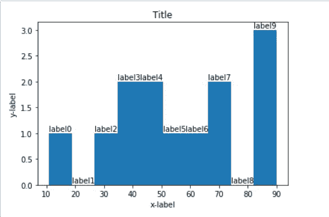

# 在 Matplotlib 中给直方图条添加标签

> 原文:[https://www . geesforgeks . org/add-labels-to-直方图-bar-in-matplotlib/](https://www.geeksforgeeks.org/adding-labels-to-histogram-bars-in-matplotlib/)

在本文中，我们将讨论如何在 [matplotlib](https://www.geeksforgeeks.org/python-introduction-matplotlib/) 中为直方图条添加标签。直方图用于使用条形显示连续数据。它看起来类似于条形图。它显示了属于该范围中提到的类别的元素的计数或频率，这意味着图形越高，该范围的频率越高。为了显示直方图及其标签，我们将使用 matplotlib。

**进场:**

*   我们导入 matplotlib 和 numpy 库。
*   使用 numpy 库创建一个数据集，这样我们就可以绘制它。
*   使用 matplotlib 库创建直方图。
*   要给出标签，请使用 set_xlabel()和 set_ylabel()函数。
*   我们为直方图中的每个条添加标签，为此，我们在每个条上循环，并使用 text()函数在其上添加文本。我们还会计算每个条形的高度和宽度，这样我们的标签就不会彼此重合。
*   使用 show()函数显示直方图。

**下面是代码实现:**

## 计算机编程语言

```
from matplotlib import pyplot as plt
import numpy as np

# Creating dataset
marks = np.array([70, 50, 40, 90, 55, 85, 74, 66, 33, 11, 45, 36, 89])

# Creating histogram
fig, ax = plt.subplots(1, 1)
ax.hist(marks)

# Set title
ax.set_title("Title")

# adding labels
ax.set_xlabel('x-label')
ax.set_ylabel('y-label')

# Make some labels.
rects = ax.patches
labels = ["label%d" % i for i in range(len(rects))]

for rect, label in zip(rects, labels):
    height = rect.get_height()
    ax.text(rect.get_x() + rect.get_width() / 2, height+0.01, label,
            ha='center', va='bottom')

# Show plot
plt.show()
```

**输出:**



**说明:**

首先在上面的代码中，我们使用 [np.array()](https://www.geeksforgeeks.org/numpy-array-creation/) 创建了一个数组。之后，我们使用 [hist()](https://www.geeksforgeeks.org/matplotlib-pyplot-hist-in-python/) 函数创建了一个直方图。为了给出标签，我们使用了 set_xlabel()和 set_ylabel()函数。为了给我们的图表命名，我们使用了 [set_title()](https://www.geeksforgeeks.org/matplotlib-axes-axes-set_title-in-python/) 函数。我们还为每个小节添加了标签，首先我们使用 get_height 函数来获取高度，然后我们使用 for 循环来循环每个小节，并使用 text()函数在其上添加文本。我们使用标签变量来存储变量的名称。最后，为了显示直方图，我们使用了 show()函数。