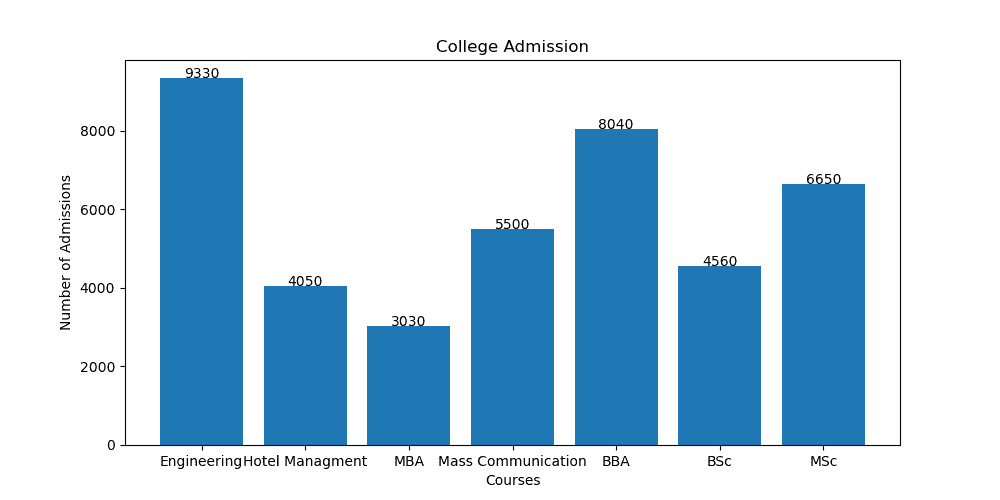
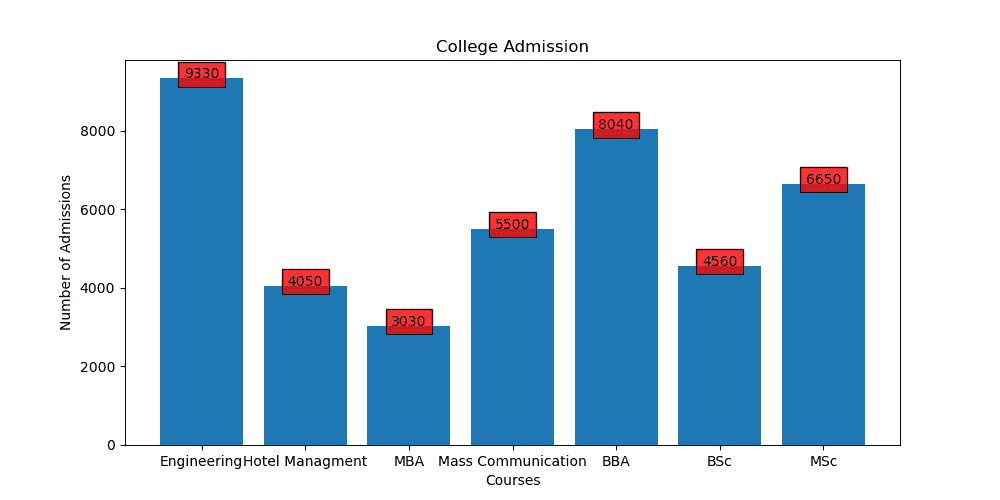
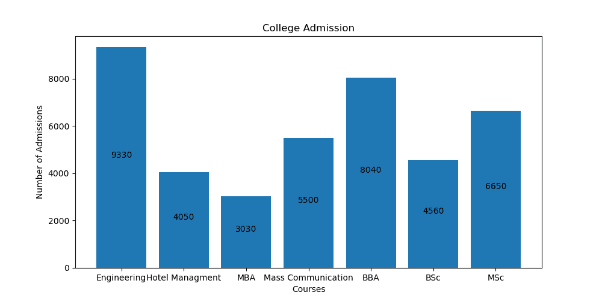
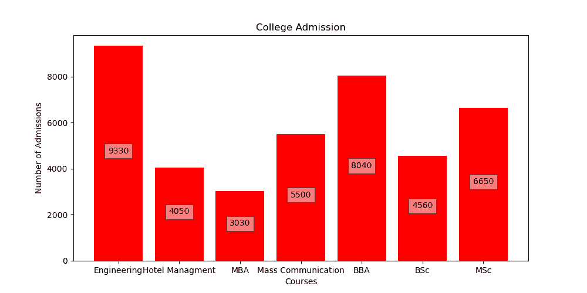

# 在 Matplotlib 条形图上添加数值标签

> 原文:[https://www . geesforgeks . org/add-value-labels-on-a-matplotlib-bar-chart/](https://www.geeksforgeeks.org/adding-value-labels-on-a-matplotlib-bar-chart/)

**先决条件:**T2【马特洛特利

在本文中，我们将在 Matplotlib 条形图上添加值标签。条形图是使用不同高度的条形对数据进行的图形显示。我们可以用这个条形图比较不同的数据。为了在 Python 中绘制数据，我们使用了 Matplotlib Library 提供的 bar()函数，在这种情况下，我们可以将数据作为参数传递给可视化，但是默认图表是在给定的数据上绘制的，在条形图的每个条上不包含任何值标签，因为默认条形图不包含条形图每个条的任何值标签，所以很难分析条形图的各个条所代表的确切值。

**为了绘制带有数值标签的条形图，我们主要使用 Matplotlib 库提供的两种方法。**

*   用于制作条形图

```
Syntax: plt.bar(x, height, color)
```

*   用于在条形图上添加文本

```
Syntax: plt.text(x, y, s, ha, Bbox)
```

我们将展示本文中使用的一些参数:

<figure class="table">

| **参数** | **描述** |
| x | 数据值绘制在绘图的 X 轴上。 |
| 高度 | 数据值绘制在绘图的 Y 轴上。 |
| 颜色 | 设置情节的颜色。 |
| x，y | 地块的坐标。 |
| s | 要显示的字符串。 |
| 哈 | 水平对齐。 |
| Bbox | 将矩形框放在文本周围。 |

</figure>

**所需步骤:**

*   导入库。
*   创建一个函数，它可以将 x 和 y 作为参数来添加值标签，现在在函数中，我们将运行 for 循环来计算 x 值的长度，我们可以使用 len()函数来计算长度，并在传递的变量中计算我们想要的长度。
*   现在使用 [*plt.text()*](https://www.geeksforgeeks.org/matplotlib-pyplot-text-function-in-python/) 函数向条形图添加值标签，在此过程中，x 和 y 坐标将是 I 和 y[i]，这只是条形图的高度，在此过程中，y[i]表示将显示在给定坐标上的字符串，即 I 和 y[i]。
*   为了在条形高度的中心添加值标签，我们只需将 y 坐标除以 2，即 y[i]//2。这样做，只要 For 循环运行 I 的每个值，我们就会得到每个条形的中心坐标。
*   有了这个，我们还可以设置参数 *ha* 和 *Bbox* ，它们是水平对齐的，当我们通过*ha =中心*和 Bbox 时，它们将值标签对齐在条的中心，Bbox 将值标签显示在覆盖的矩形框中。为此，我们必须使用 dict()创建一个字典，在这个过程中，facecolor 是我们想要的颜色，alpha 是我们想要设置的不透明度。
*   现在在创建函数之后，我们必须从程序开始运行的地方创建主函数。
*   创建或导入绘制条形图的数据。
*   给出图形尺寸，以便图形的值和标签清晰可见，并且不能重叠。您可以使用*PLT . fig()*函数进行相应设置，该函数将图形尺寸作为参数传递。
*   现在使用 *plt.bar()* 函数绘制条形图，在该函数中传递数据值，并根据您的需要设置相应的颜色，否则将显示默认颜色。
*   现在，在制作条形图之后，调用我们为添加值标签而创建的函数。
*   设置图表/绘图的标题、X 轴标签和 Y 轴标签。
*   现在使用 *plt.show()* 功能可视化该图。

**示例 1:在** **默认设置的条形图上添加数值标签。**

## 计算机编程语言

```
# importing library
import matplotlib.pyplot as plt

# function to add value labels
def addlabels(x,y):
    for i in range(len(x)):
        plt.text(i,y[i],y[i])

if __name__ == '__main__':
    # creating data on which bar chart will be plot
    x = ["Engineering", "Hotel Managment", "MBA",
         "Mass Communication", "BBA", "BSc", "MSc"]
    y = [9330, 4050, 3030, 5500,
         8040, 4560, 6650]

    # making the bar chart on the data
    plt.bar(x, y)

    # calling the function to add value labels
    addlabels(x, y)

    # giving title to the plot
    plt.title("College Admission")

    # giving X and Y labels
    plt.xlabel("Courses")
    plt.ylabel("Number of Admissions")

    # visualizing the plot
    plt.show()
```

**输出:**


上面的图是在默认设置上绘制的，从上图中我们可以观察到，每个小节的值标签都添加在顶部，但是它们稍微出现在小节顶部的右侧，并且在 X 轴上，一些课程的名称是重叠的。

**示例 2:在条形图上的每个条形中心添加数值标签。**

## 计算机编程语言

```
# importing library
import matplotlib.pyplot as plt

# function to add value labels
def addlabels(x,y):
    for i in range(len(x)):
        plt.text(i, y[i], y[i], ha = 'center')

if __name__ == '__main__':

    # creating data on which bar chart will be plot
    x = ["Engineering", "Hotel Managment",
         "MBA", "Mass Communication", "BBA",
         "BSc", "MSc"]
    y = [9330, 4050, 3030, 5500,
         8040, 4560, 6650]

    # setting figure size by using figure() function 
    plt.figure(figsize = (10, 5))

    # making the bar chart on the data
    plt.bar(x, y)

    # calling the function to add value labels
    addlabels(x, y)

    # giving title to the plot
    plt.title("College Admission")

    # giving X and Y labels
    plt.xlabel("Courses")
    plt.ylabel("Number of Admissions")

    # visualizing the plot
    plt.show()
```

**输出:**



在上面的图中，我们可以观察到值标签在每个条的中心顶部对齐，在 X 轴上，重叠的课程名称也分别显示。

为了在中心对齐数值标签，我们在 plt.text()函数中只传递了一个参数，即“*ha =‘中心*”，这是文本的水平对齐，为了单独显示课程名称，我们在制作条形图之前添加了 plt.figure()函数，其中我们传递了图形大小作为参数，其余代码相同。

**例 3:通过将数值标签放入矩形框中来添加数值标签。**

## 计算机编程语言

```
# importing library
import matplotlib.pyplot as plt

# function to add value labels
def addlabels(x,y):
    for i in range(len(x)):
        plt.text(i, y[i], y[i], ha = 'center',
                 Bbox = dict(facecolor = 'red', alpha =.8))

if __name__ == '__main__':

    # creating data on which bar chart will be plot
    x = ["Engineering", "Hotel Managment",
         "MBA", "Mass Communication", "BBA", "BSc", "MSc"]
    y = [9330, 4050, 3030, 5500, 8040, 4560, 6650]

    # setting figure size by using figure() function 
    plt.figure(figsize = (10,5))

    # making the bar chart on the data
    plt.bar(x, y)

    # calling the function to add value labels
    addlabels(x, y)

    # giving title to the plot
    plt.title("College Admission")

    # giving X and Y labels
    plt.xlabel("Courses")
    plt.ylabel("Number of Admissions")

    # visualizing the plot
    plt.show()
```

**输出:**



在上面的例子中，我们已经添加了包含在矩形框中的值标签，为此，在 plt.text()函数中，我们必须传递参数 Bbox，在其中我们必须创建字典，在该字典中，我们可以给出我们选择的 facecolor 和 alpha，它们给出了我们可以相应设置的框的不透明度。

**例 4:在条形图各条高度的中心添加数值标签。**

## 计算机编程语言

```
# importing library
import matplotlib.pyplot as plt

# function to add value labels
def addlabels(x,y):
    for i in range(len(x)):
        plt.text(i, y[i]//2, y[i], ha = 'center')

if __name__ == '__main__':

    # creating data on which bar chart will be plot
    x = ["Engineering", "Hotel Managment", "MBA",
         "Mass Communication", "BBA", "BSc", "MSc"]

    y = [9330, 4050, 3030, 5500,
         8040, 4560, 6650]

    # setting figure size by using figure() function 
    plt.figure(figsize = (10,5))

    # making the bar chart on the data
    plt.bar(x, y)

    # calling the function to add value labels
    addlabels(x, y)

    # giving title to the plot
    plt.title("College Admission")

    # giving X and Y labels
    plt.xlabel("Courses")
    plt.ylabel("Number of Admissions")

    # visualizing the plot
    plt.show()
```

**输出:**



在上面的例子中，为了在每个条的高度中心添加值标签，我们刚刚在 for 循环内部的 plt.text()函数中将 y 坐标除以 2。

**例 5:在条形图各条高度的中心添加矩形框中覆盖的数值标签。**

## 计算机编程语言

```
# importing library
import matplotlib.pyplot as plt

# function to add value labels
def addlabels(x,y):
    for i in range(len(x)):
        plt.text(i, y[i]//2,y[i], ha = 'center',
                 Bbox = dict(facecolor = 'white', alpha = .5))

if __name__ == '__main__':

    # creating data on which bar chart will be plot
    x = ["Engineering", "Hotel Managment", "MBA",
         "Mass Communication", "BBA", "BSc", "MSc"]
    y = [9330, 4050, 3030, 5500,
         8040, 4560, 6650]

    # setting figure size by using figure() function 
    plt.figure(figsize = (10,5))

    # making the bar chart on the data with color red
    plt.bar(x, y, color = 'red')

    # calling the function to add value labels
    addlabels(x, y)

    # giving title to the plot
    plt.title("College Admission")

    # giving X and Y labels
    plt.xlabel("Courses")
    plt.ylabel("Number of Admissions")

    # visualizing the plot
    plt.show()
```

**输出:**



在上面的示例中，我们做了与示例 3 中相同的事情，但是唯一的区别是我们将 y 的坐标除以 2，这样值标签应该显示在条形图高度的中心，并且我们通过在 plt.bar()函数中传递 color 参数将条形图的颜色更改为红色。