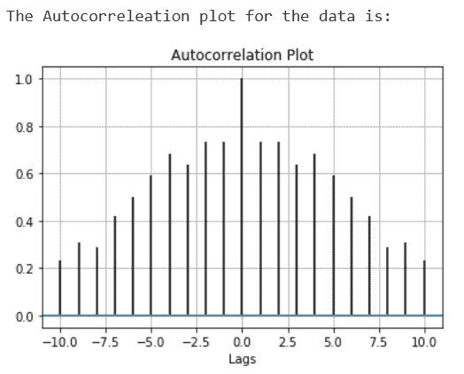
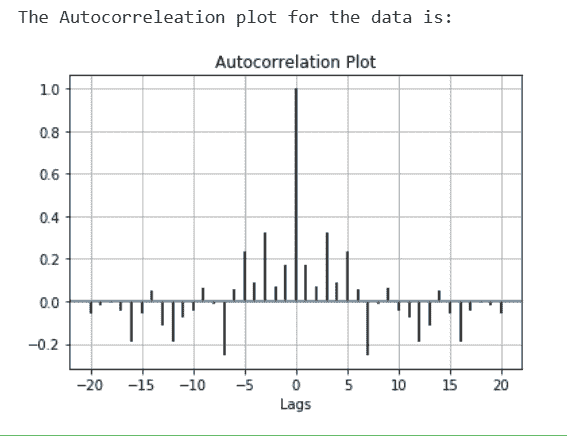

# 使用 Matplotlib 的自相关图

> 原文:[https://www . geeksforgeeks . org/自相关-绘图-使用-matplotlib/](https://www.geeksforgeeks.org/autocorrelation-plot-using-matplotlib/)

**自相关图**是检查数据集中随机性的常用工具。这种随机性是通过计算不同时滞下数据值的自相关来确定的。

**自相关图特征:**

*   它将一组当前值与一组过去值进行比较，并找出它们是否相关。
*   它是一个时间序列数据与另一个时间序列数据的相关性，具有时滞。
*   从+1 到-1 不等。
*   +1 的自相关表示如果时间序列 1 的值增加，时间序列 2 也与时间序列 1 的变化成比例增加。
*   自相关值为-1 表明，如果时间序列 1 的值增加，时间序列 2 将与时间序列 1 的变化成比例减少。

**自相关的应用:**

*   模式识别。
*   信号检测。
*   信号处理。
*   估计音高。
*   股票的技术分析。

## 绘制自相关图

要绘制自相关图，我们可以使用 matplotlib，并使用 matplotlib.pyplot.acorr()函数轻松绘制。

> **语法:** matplotlib.pyplot.acorr(x，* data = None，**kwargs)
> **参数:**
> 
> *   **‘x’:**这个参数是标量的序列。
> *   **“去趋势”:**该参数为可选参数。它的默认值是 mlab.detrend_none。
> *   **“赋范”:**该参数也是可选参数，包含 bool 值。其默认值为“真”。
> *   **“usev lines”:**该参数也是可选参数，包含 bool 值。其默认值为“真”。
> *   **“maxlags”:**该参数也是可选参数，包含整数值。它的默认值是 10。
> *   **“线型”:**该参数也是可选参数，用于绘制数据点，仅当 usevlines 为 False 时使用。
> *   **“标记”:**该参数也是可选参数，包含字符串。它的默认值是“o”。
> 
> **返回:**(滞后，c，行，b)
> 其中:
> 
> *   滞后是长度为 2`maxlags+1 的滞后向量。
> *   c 是 2`maxlags+1 自相关向量。
> *   line 是由 plot 返回的 Line2D 实例。
> *   b 是 x 轴。

**例 1:**

## 蟒蛇 3

```
# Importing the libraries.
import matplotlib.pyplot as plt
import numpy as np

# Data for which we plot Autocorrelation.
data = np.array([12.0, 24.0, 7., 20.0,
                 7.0, 22.0, 18.0,22.0,
                 6.0, 7.0, 20.0, 13.0,
                 8.0, 5.0, 8])

# Adding plot title.
plt.title("Autocorrelation Plot")

# Providing x-axis name.
plt.xlabel("Lags")

# Plotting the Autocorrelation plot.
plt.acorr(data, maxlags = 10)

# Displaying the plot.
print("The Autocorrelation plot for the data is:")
plt.grid(True)

plt.show()
```

**输出:**



**例 2:**

## 蟒蛇 3

```
# Importing the libraries.
import matplotlib.pyplot as plt
import numpy as np

# Setting up the rondom seed for
# fixing the random state.
np.random.seed(42)

# Creating some random data.
data = np.random.randn(25)

# Adding plot title.
plt.title("Autocorrelation Plot")

# Providing x-axis name.
plt.xlabel("Lags")

# Plotting the Autocorrelation plot.
plt.acorr(data, maxlags = 20)

# Displaying the plot.
print("The Autocorrelation plot for the data is:")
plt.grid(True)

plt.show()
```

**输出:**

