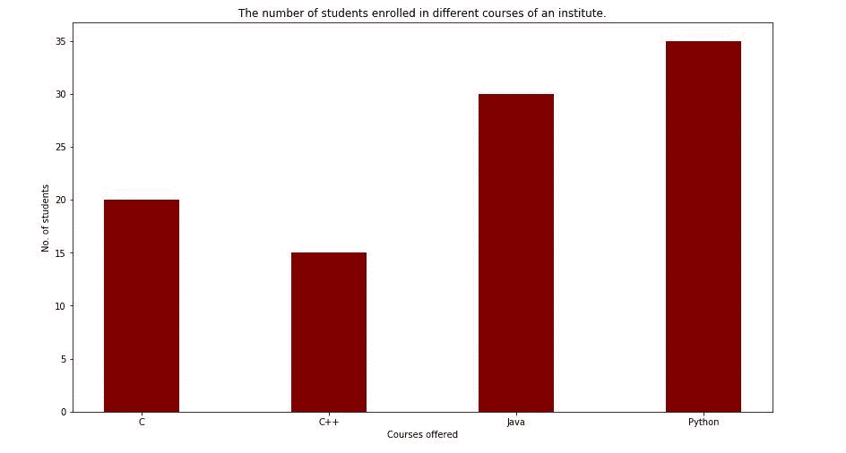
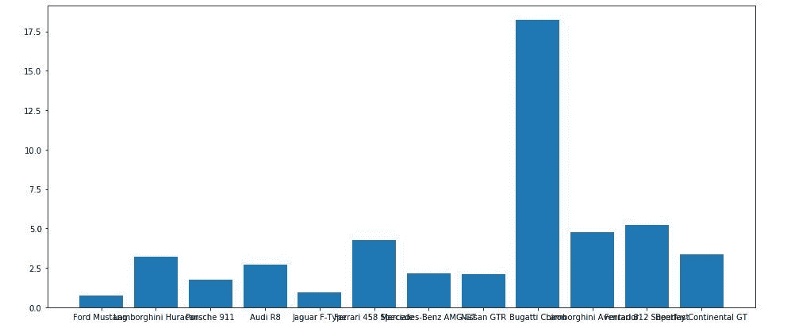
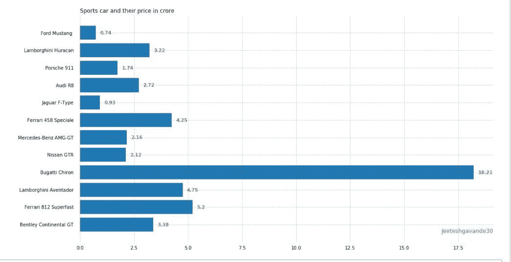
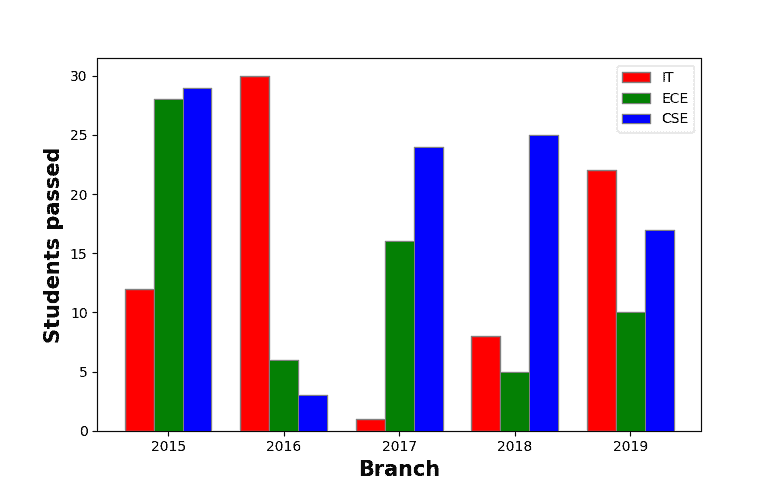
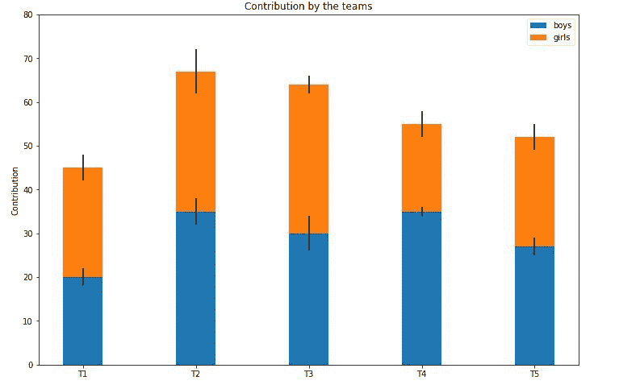

# Matplotlib 中的条形图

> 原文:[https://www.geeksforgeeks.org/bar-plot-in-matplotlib/](https://www.geeksforgeeks.org/bar-plot-in-matplotlib/)

条形图或条形图是一种用矩形条表示数据类别的图形，矩形条的长度和高度与它们所表示的值成比例。条形图可以水平或垂直绘制。条形图描述了离散类别之间的比较。图中的一个轴代表被比较的特定类别，而另一个轴代表对应于这些类别的测量值。

## 创建条形图

Python 中的 **matplotlib** API 提供了 bar()函数，可以在 MATLAB 风格的使用中使用，也可以作为面向对象的 API 使用。与轴一起使用的 bar()函数的语法如下

```
plt.bar(x, height, width, bottom, align)
```

该函数根据给定的参数创建一个以矩形为边界的条形图。下面是条形图的一个简单示例，它表示一个学院不同课程的注册学生数量。

## 蟒蛇 3

```
import numpy as np
import matplotlib.pyplot as plt

# creating the dataset
data = {'C':20, 'C++':15, 'Java':30,
        'Python':35}
courses = list(data.keys())
values = list(data.values())

fig = plt.figure(figsize = (10, 5))

# creating the bar plot
plt.bar(courses, values, color ='maroon',
        width = 0.4)

plt.xlabel("Courses offered")
plt.ylabel("No. of students enrolled")
plt.title("Students enrolled in different courses")
plt.show()
```

**输出-**



在这里，条形图(路线、数值、颜色= '褐红色')用于指定将路线列作为 X 轴，数值作为 Y 轴绘制条形图。颜色属性用于设置条形的颜色(本例中为栗色)。plt.xlabel(“提供的课程”)和 plt.ylabel(“注册的学生”)用于标记相应的轴。plt.title()用于制作图表的标题。plt.show()用于使用前面的命令将图表显示为输出。

#### 自定义条形图

## 蟒蛇 3

```
import pandas as pd
from matplotlib import pyplot as plt

# Read CSV into pandas
data = pd.read_csv(r"cars.csv")
data.head()
df = pd.DataFrame(data)

name = df['car'].head(12)
price = df['price'].head(12)

# Figure Size
fig = plt.figure(figsize =(10, 7))

# Horizontal Bar Plot
plt.bar(name[0:10], price[0:10])

# Show Plot
plt.show()
```

**输出:**



在上面的条形图中可以观察到，X 轴刻度相互重叠，因此无法正确看到。因此，通过旋转 X 轴刻度，可以清楚地看到它。这就是为什么需要自定义条形图的原因。

## 蟒蛇 3

```
import pandas as pd
from matplotlib import pyplot as plt

# Read CSV into pandas
data = pd.read_csv(r"cars.csv")
data.head()
df = pd.DataFrame(data)

name = df['car'].head(12)
price = df['price'].head(12)

# Figure Size
fig, ax = plt.subplots(figsize =(16, 9))

# Horizontal Bar Plot
ax.barh(name, price)

# Remove axes splines
for s in ['top', 'bottom', 'left', 'right']:
    ax.spines[s].set_visible(False)

# Remove x, y Ticks
ax.xaxis.set_ticks_position('none')
ax.yaxis.set_ticks_position('none')

# Add padding between axes and labels
ax.xaxis.set_tick_params(pad = 5)
ax.yaxis.set_tick_params(pad = 10)

# Add x, y gridlines
ax.grid(b = True, color ='grey',
        linestyle ='-.', linewidth = 0.5,
        alpha = 0.2)

# Show top values
ax.invert_yaxis()

# Add annotation to bars
for i in ax.patches:
    plt.text(i.get_width()+0.2, i.get_y()+0.5,
             str(round((i.get_width()), 2)),
             fontsize = 10, fontweight ='bold',
             color ='grey')

# Add Plot Title
ax.set_title('Sports car and their price in crore',
             loc ='left', )

# Add Text watermark
fig.text(0.9, 0.15, 'Jeeteshgavande30', fontsize = 12,
         color ='grey', ha ='right', va ='bottom',
         alpha = 0.7)

# Show Plot
plt.show()
```

**输出:**



有更多自定义可用于条形图。

## 多条形图

当一个变量发生变化时，在数据集之间进行比较时，使用多个条形图。我们可以很容易地将它转换为堆叠区域条形图，其中每个子组一个接一个地显示。可以通过改变条的厚度和位置来绘制。下面的条形图显示了工程系通过的学生人数:

## 蟒蛇 3

```
import numpy as np
import matplotlib.pyplot as plt

# set width of bar
barWidth = 0.25
fig = plt.subplots(figsize =(12, 8))

# set height of bar
IT = [12, 30, 1, 8, 22]
ECE = [28, 6, 16, 5, 10]
CSE = [29, 3, 24, 25, 17]

# Set position of bar on X axis
br1 = np.arange(len(IT))
br2 = [x + barWidth for x in br1]
br3 = [x + barWidth for x in br2]

# Make the plot
plt.bar(br1, IT, color ='r', width = barWidth,
        edgecolor ='grey', label ='IT')
plt.bar(br2, ECE, color ='g', width = barWidth,
        edgecolor ='grey', label ='ECE')
plt.bar(br3, CSE, color ='b', width = barWidth,
        edgecolor ='grey', label ='CSE')

# Adding Xticks
plt.xlabel('Branch', fontweight ='bold', fontsize = 15)
plt.ylabel('Students passed', fontweight ='bold', fontsize = 15)
plt.xticks([r + barWidth for r in range(len(IT))],
        ['2015', '2016', '2017', '2018', '2019'])

plt.legend()
plt.show()
```

**输出:**



## 堆积条形图

堆叠条形图表示一个在另一个之上的不同组。条形的高度取决于组结果组合的结果高度。它从底部到值，而不是从零到值。下面的条形图代表了男孩和女孩在团队中的贡献。

## 蟒蛇 3

```
import numpy as np
import matplotlib.pyplot as plt

N = 5

boys = (20, 35, 30, 35, 27)
girls = (25, 32, 34, 20, 25)
boyStd = (2, 3, 4, 1, 2)
girlStd = (3, 5, 2, 3, 3)
ind = np.arange(N)  
width = 0.35 

fig = plt.subplots(figsize =(10, 7))
p1 = plt.bar(ind, boys, width, yerr = boyStd)
p2 = plt.bar(ind, girls, width,
             bottom = boys, yerr = girlStd)

plt.ylabel('Contribution')
plt.title('Contribution by the teams')
plt.xticks(ind, ('T1', 'T2', 'T3', 'T4', 'T5'))
plt.yticks(np.arange(0, 81, 10))
plt.legend((p1[0], p2[0]), ('boys', 'girls'))

plt.show()
```

**输出-**

