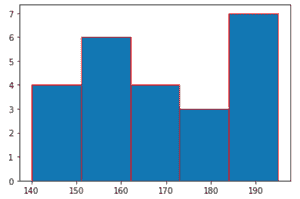
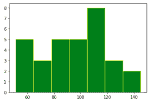
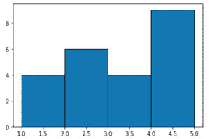
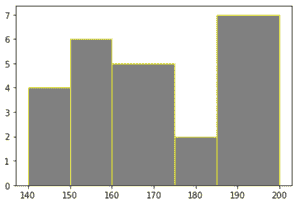
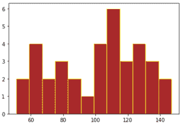

# Matplotlib 直方图中的仓位大小

> 原文:[https://www . geesforgeks . org/bin-size-in-matplotlib-直方图/](https://www.geeksforgeeks.org/bin-size-in-matplotlib-histogram/)

**先决条件:**T2【马特洛特利

直方图是用户给出的数据分布的图形表示。它的外观类似于条形图，只是它是连续的。

柱状图的塔或条被称为箱。每个箱的高度显示该数据中有多少值落入该范围。

> 每个箱的宽度=(数据的最大值–数据的最小值)/箱的总数

直方图中要创建的箱数的默认值是 10。但是，我们可以使用 *matplotlib.pyplot.hist()中的参数 bin 来更改 bin 的大小。*

### 方法 1:

我们可以在箱中传递一个整数，说明要在直方图中创建多少个箱/塔，然后相应地改变每个箱的宽度。

**例 1 :**

## 蟒蛇 3

```
import matplotlib.pyplot as plt

height = [189, 185, 195, 149, 189, 147, 154, 
          174, 169, 195, 159, 192, 155, 191, 
          153, 157, 140, 144, 172, 157, 181, 
          182, 166, 167]

plt.hist(height, edgecolor="red", bins=5)
plt.show()
```

**输出:**



这里，箱= 5，即要创建的箱的数量是 5。将面元设置为整数会创建大小或宽度相等的面元。随着料箱尺寸的改变，料箱宽度也会相应地改变，如下所示:

宽度=(195–140)/5 = 11

**例 2 :**

## 蟒蛇 3

```
import matplotlib.pyplot as plt

values = [87, 53, 66, 61, 67, 68, 62,
          110, 104, 61, 111, 123, 117,
          119, 116, 104, 92, 111, 90,
          103, 81, 80, 101, 51, 79, 107,
          110, 129, 145, 139, 110]

plt.hist(values, bins=7, edgecolor="yellow", color="green")
plt.show()
```

**输出:**



在上图中，每个仓的宽度为:

宽度=(145–51)/7 = 13.4

### **方法二:**

我们还可以在参数箱中传递一系列 int 或 float。其中序列的元素是仓的边/边界。在这种方法中，每个料箱的料箱宽度可能不同。

假设一个序列[1，2，3，4，5]被分配给仓，那么所产生的仓的数量将是 4，即第一个仓将是[1，2](包括 1，但不包括 2)第二个仓将是[2，3](包括 2，但不包括 3)第三个仓将是[3，4](包括 3，但不包括 4)。然而，在最后一个箱[4，5]中，包括 4 和 5。

因此，所有的箱子都是半开的[a，b]，但是最后一个箱子是关闭的[a，b]。在这种情况下，每个箱子的宽度是相等的。

如果分配给仓的序列的每个元素之间的差异不相等，那么每个仓的宽度是不同的，因此仓宽度取决于序列。

**例 1 :** 等仓宽

## 蟒蛇 3

```
import matplotlib.pyplot as plt

marks = [1, 2, 3, 2, 1, 2, 3, 2, 
         1, 4, 5, 4, 3, 2, 5, 4, 
         5, 4, 5, 3, 2, 1, 5]

plt.hist(marks, bins=[1, 2, 3, 4, 5], edgecolor="black")
plt.show()
```

**输出:**



**例 2 :** 不等仓宽

## 蟒蛇 3

```
import matplotlib.pyplot as plt

data = [189, 185, 195, 149, 189, 147,
        154, 174, 169, 195, 159, 192,
        155, 191, 153, 157, 140, 144, 
        172, 157, 181, 182, 166, 167]

plt.hist(data, bins=[140, 150, 160, 175, 185, 200],
         edgecolor="yellow", color="grey")

plt.show()
```

**输出:**



### 方法 3:

为了在面元参数中传递一个序列，我们还可以对均匀分布的面元使用范围函数。在范围()内，起点是数据的最小值，终点是数据的最大值+前面提到的面元宽度，如在范围()内，不包括终点，步长是面元宽度。

由于步长在范围()内是固定的，因此我们在直方图中得到大小相等的面元。

**示例:**

## 蟒蛇 3

```
import matplotlib.pyplot as plt

data = [87, 53, 66, 61, 67, 68, 62, 110,
        104, 61, 111, 123, 117, 119, 116,
        104, 92, 111, 90, 103, 81, 80, 101,
        51, 79, 107, 110, 129, 145, 128, 
        132, 135, 131, 126, 139, 110]

binwidth = 8
plt.hist(data, bins=range(min(data), max(data) + binwidth, binwidth),
         edgecolor="yellow", color="brown")

plt.show()
```

**输出:**

