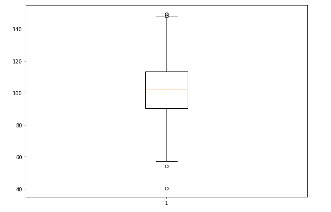
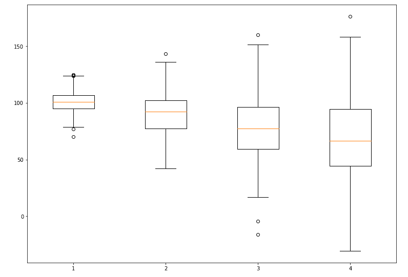
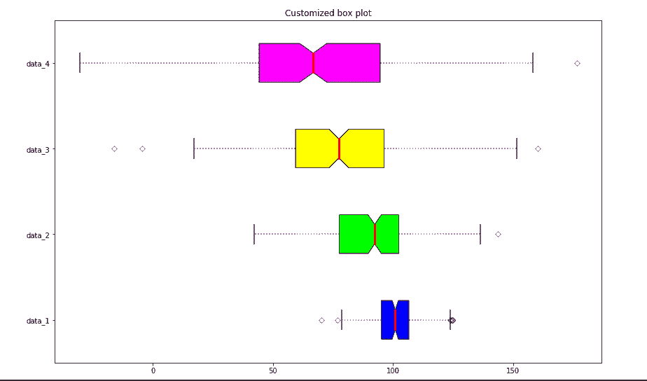

# 使用 Matplotlib 在 Python 中绘制方框图

> 原文:[https://www . geesforgeks . org/box-plot-in-python-using-matplotlib/](https://www.geeksforgeeks.org/box-plot-in-python-using-matplotlib/)

创建**方框图**也称为**触须图**以显示具有最小、第一四分位数、中值、第三四分位数和最大值等属性的数据值集合的概要。在方框图中，从第一个四分位数到第三个四分位数创建了一个方框，在中间位置也有一条穿过方框的垂直线。这里，x 轴表示要绘制的数据，而 y 轴表示频率分布。

### 创建方框图

matplotlib 库的 [matplotlib.pyplot](https://www.geeksforgeeks.org/pyplot-in-matplotlib/) 模块提供了 boxplot()函数，借助该函数我们可以创建 box plot。

**语法:**

> matplotlib.pyplot.boxplot(数据，凹口=无，垂直=无，patch _ artist =无，宽度=无)

**参数:**

<figure class="table">

| 属性 | 价值 |
| --- | --- |
| 数据 | 要绘制的数组或数组序列 |
| 等级 | 可选参数接受布尔值 |
| 绿色 | 对于水平和垂直绘图，可选参数分别接受布尔值 false 和 true |
| 引导程序 | 可选参数接受 int 指定凹口方框图周围的间隔 |
| 用户媒体 | 可选参数接受与数据兼容的数组或数组维数序列 |
| 位置 | 可选参数接受数组并设置框的位置 |
| 宽度 | 可选参数接受数组并设置框的宽度 |
| 补丁 _ 艺术家 | 具有布尔值的可选参数 |
| 标签 | 字符串序列为每个数据集设置标签 |
| 平均线 | 可选具有布尔值尝试将均值线呈现为框的全宽 |
| 命令 | 可选参数设置箱线图的顺序 |

</figure>

给 ax.boxplot()方法的数据值可以是 Numpy 数组或 Python 列表或数组元组。让我们通过使用 numpy.random.normal()创建一些随机数据来创建箱线图，它以平均值、标准偏差和所需的值数作为参数。

**示例:**

## 蟒蛇 3

```py
# Import libraries
import matplotlib.pyplot as plt
import numpy as np

# Creating dataset
np.random.seed(10)
data = np.random.normal(100, 20, 200)

fig = plt.figure(figsize =(10, 7))

# Creating plot
plt.boxplot(data)

# show plot
plt.show()
```

**输出:**



### 自定义方框图

matplotlib.pyplot.boxplot()为 boxplot 提供了无限的定制可能性。notch = True 属性为方块图创建 notch 格式，patch_artist = True 用颜色填充方块图，我们可以为不同的方块设置不同的颜色。vert = 0 属性创建水平方框图。标签采用与数字数据集相同的尺寸。

**例 1:**

## 蟒蛇 3

```py
# Import libraries
import matplotlib.pyplot as plt
import numpy as np

# Creating dataset
np.random.seed(10)

data_1 = np.random.normal(100, 10, 200)
data_2 = np.random.normal(90, 20, 200)
data_3 = np.random.normal(80, 30, 200)
data_4 = np.random.normal(70, 40, 200)
data = [data_1, data_2, data_3, data_4]

fig = plt.figure(figsize =(10, 7))

# Creating axes instance
ax = fig.add_axes([0, 0, 1, 1])

# Creating plot
bp = ax.boxplot(data)

# show plot
plt.show()
```

**输出:**



**示例 2:** 让我们尝试用一些定制来修改上面的图:

## 蟒蛇 3

```py
# Import libraries
import matplotlib.pyplot as plt
import numpy as np

# Creating dataset
np.random.seed(10)
data_1 = np.random.normal(100, 10, 200)
data_2 = np.random.normal(90, 20, 200)
data_3 = np.random.normal(80, 30, 200)
data_4 = np.random.normal(70, 40, 200)
data = [data_1, data_2, data_3, data_4]

fig = plt.figure(figsize =(10, 7))
ax = fig.add_subplot(111)

# Creating axes instance
bp = ax.boxplot(data, patch_artist = True,
                notch ='True', vert = 0)

colors = ['#0000FF', '#00FF00',
          '#FFFF00', '#FF00FF']

for patch, color in zip(bp['boxes'], colors):
    patch.set_facecolor(color)

# changing color and linewidth of
# whiskers
for whisker in bp['whiskers']:
    whisker.set(color ='#8B008B',
                linewidth = 1.5,
                linestyle =":")

# changing color and linewidth of
# caps
for cap in bp['caps']:
    cap.set(color ='#8B008B',
            linewidth = 2)

# changing color and linewidth of
# medians
for median in bp['medians']:
    median.set(color ='red',
               linewidth = 3)

# changing style of fliers
for flier in bp['fliers']:
    flier.set(marker ='D',
              color ='#e7298a',
              alpha = 0.5)

# x-axis labels
ax.set_yticklabels(['data_1', 'data_2',
                    'data_3', 'data_4'])

# Adding title
plt.title("Customized box plot")

# Removing top axes and right axes
# ticks
ax.get_xaxis().tick_bottom()
ax.get_yaxis().tick_left()

# show plot
plt.show(bp)
```

**输出:**

