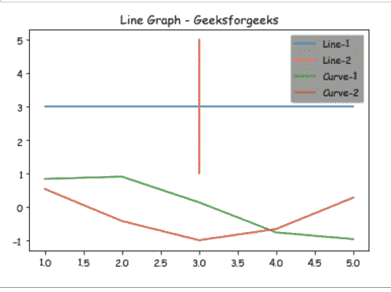
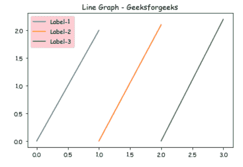

# 使用 MatplotLib 中的 facecolor 更改图例背景

> 原文:[https://www . geesforgeks . org/change-legend-background-using-face color-in-matplotlib/](https://www.geeksforgeeks.org/change-legend-background-using-facecolor-in-matplotlib/)

在本文中，我们将了解如何使用 MatplotLib 更改图形中图例的背景颜色，这里我们将举两个不同的例子来展示图形中图例的不同背景颜色。

**要求:**

```py
pip install matplotlib
```

**进场:**

*   导入所需模块。
*   创建数据。
*   更改图例的背景颜色。
*   通常绘制数据。
*   显示图。

**实施:**

**例 1:**

在这个例子中，我们将在 matplotlib 的帮助下绘制不同的线条，并使用 *facecolor* 参数到 *plt.legend()* 来指定图例背景颜色。

## 蟒蛇 3

```py
# importing package 
import matplotlib.pyplot as plt 
import numpy as np 

# create data 
X = [1,2,3,4,5] 
Y = [3,3,3,3,3] 

# plot lines 
plt.plot(X, Y, label = "Line-1") 
plt.plot(Y, X, label = "Line-2") 
plt.plot(X, np.sin(X), label = "Curve-1") 
plt.plot(X, np.cos(X), label = "Curve-2") 

#Change the background color of a  legend.
plt.legend(facecolor="gray")
plt.title("Line Graph - Geeksforgeeks")

plt.show()
```

**输出:**



**例 2:**

在本例中，我们将在 matplotlib 的帮助下绘制一条垂直线，并使用 *facecolor* 参数到 *plt.legend()* 来指定图例背景颜色。

## 蟒蛇 3

```py
# importing package 
import matplotlib.pyplot as plt 

#Create data and plot lines.
plt.plot([0, 1], [0, 2.0], label='Label-1')
plt.plot([1, 2], [0, 2.1], label='Label-2')
plt.plot([2, 3], [0, 2.2], label='Label-3')

#Change the background color of a  legend.
plt.legend(facecolor="pink")
plt.title("Line Graph - Geeksforgeeks")

plt.show()
```

**输出:**

