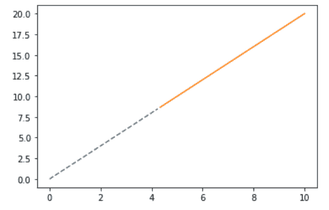
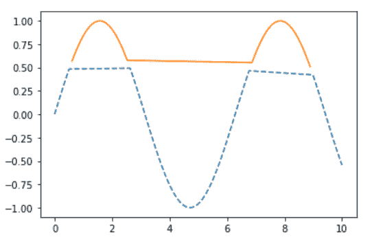
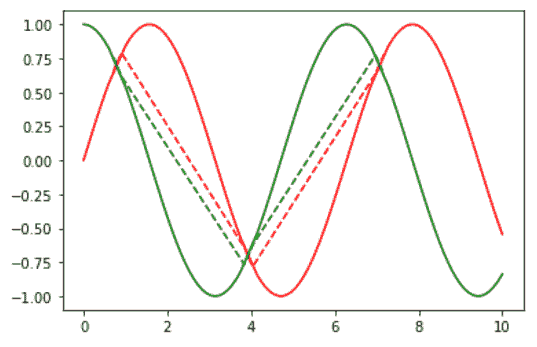

# 更改中间图

中 matplotlib 线条样式

> 原文:[https://www . geesforgeks . org/change-matplotlib-line-style-in-mid-graph/](https://www.geeksforgeeks.org/change-matplotlib-line-style-in-mid-graph/)

**先决条件:**T2【马特洛特利

在本文中，我们将学习如何使用 Python 中的 matplotlib 来更改中间图形中的线条样式。

*   [**Matplotlib**](https://www.geeksforgeeks.org/python-introduction-matplotlib/)**:**这是一个巨大的 Python 可视化库，用于数组的 2D 图。Matplotlib 可能是一个多平台数据可视化库，构建在 NumPy 数组上，旨在与更广泛的 SciPy 堆栈一起工作。它是由约翰·亨特在 2002 年推出的。
*   **线条样式:**线条样式是描述以何种样式或风格绘制线条的特征。下图显示了必须作为输入参数提供的键以及它将产生的线条样式:


**进场:**

1.  导入 matplotlib.pyplot 库和其他数据(可选)
2.  导入或创建一些数据
3.  用不同的线条风格画一个曲线图。

**例 1:**

在这个例子中，我们将使用上面提到的简单步骤，形成一个具有两种不同线条样式的图形。

## 蟒蛇 3

```
# importing packages
import matplotlib.pyplot as plt
import numpy as np

# create data
x = np.linspace(0, 10, 100)
y = 3 * x + 2

below = y < 15
above = y >= 15

# Plot lines below as dotted-------
plt.plot(x[below], y[below], '--')

# Plot lines above as solid________
plt.plot(x[above], y[above], '-')

plt.show()
```

**输出:**



**例 2 :**

在这个例子中，我们将使用上面提到的简单步骤，在一个正弦函数中形成一个具有两种不同线条样式的图形。

## 蟒蛇 3

```
# importing packages
import matplotlib.pyplot as plt
import numpy as np

# create data
x = np.linspace(0, 10, 100)
y = np.sin(x)

below = y < .5
above = y >= .5

# Plot lines below as dotted-------
plt.plot(x[below], y[below], '--')

# Plot lines above as solid_______
plt.plot(x[above], y[above], '-')

plt.show()
```

**输出:**



**例 3 :**

这类似于上面的例子，用额外的余弦函数在中间图中显示线条样式的不同特征。

## 蟒蛇 3

```
# importing packages
import matplotlib.pyplot as plt
import numpy as np

# create data
x = np.linspace(0, 10, 100)
y1 = np.sin(x)
y2 = np.cos(x)

below = abs(y1-y2) < .2
above = abs(y1-y2) >= .2

# Plot lines below as dotted-------
plt.plot(x[below], y1[below], 'r--')

# Plot lines below as dotted-------
plt.plot(x[below], y2[below], 'g--')

# Plot lines above as solid_______
plt.plot(x[above], y1[above], 'r-')

# Plot lines above as solid_______
plt.plot(x[above], y2[above], 'g-')

plt.show()
```

**输出:**

