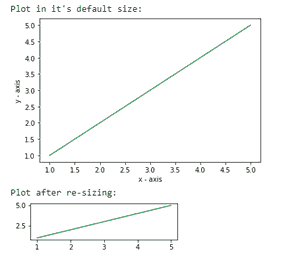
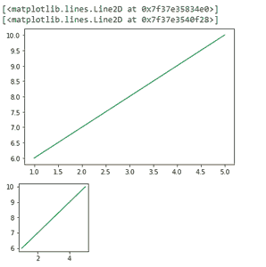
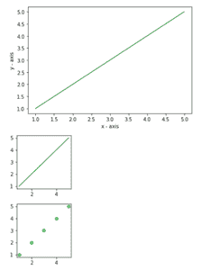

# 在 Matplotlib–Python 中更改绘图大小

> 原文:[https://www . geesforgeks . org/change-plot-size-in-matplotlib-python/](https://www.geeksforgeeks.org/change-plot-size-in-matplotlib-python/)

**先决条件:**T2【马特洛特利

图是直观地表示数据并以漂亮的方式总结数据的有效方式。然而，如果没有有效地绘制，它似乎很复杂。在 python 中，matplotlib 提供了几个用于数据表示的库。

在制作一个情节时，优化它的大小对我们来说很重要。以下是根据我们的要求尺寸改变默认绘图大小或调整给定绘图大小的各种方法。

**方法 1:** *使用 set_figheight()和 set_figwidth()*

要更改绘图的高度和宽度，使用 set_figheight 和 set_figwidth

## 蟒蛇 3

```py
# importing the matplotlib library
import matplotlib.pyplot as plt

# values on x-axis
x = [1, 2, 3, 4, 5]
# values on y-axis
y = [1, 2, 3, 4, 5]

# naming the x and y axis
plt.xlabel('x - axis')
plt.ylabel('y - axis')

# plotting a line plot with it's default size
print("Plot in it's default size: ")
plt.plot(x, y)
plt.show()

# plotting a line plot after changing it's width and height
f = plt.figure()
f.set_figwidth(4)
f.set_figheight(1)

print("Plot after re-sizing: ")
plt.plot(x, y)
plt.show()
```

**输出:**



**方法二:** *使用 figsize*

figsize()接受两个参数-宽度和高度(以英寸为单位)。默认情况下，宽度和高度的值分别为 6.4 和 4.8。

**语法:**

> plt.figure(figsize=(x，y))

其中，x 和 y 分别是以英寸为单位的宽度和高度。

## 蟒蛇 3

```py
import matplotlib.pyplot as plt

# values on x and y axis
x = [1, 2, 3, 4, 5]
y = [6, 7, 8, 9, 10]

# plot in it's default size
display(plt.plot(x, y))

# changing the size of figure to 2X2
plt.figure(figsize=(2, 2))
display(plt.plot(x, y))
```

**输出:**



屏幕快照输出

**方法 3:** *更改默认参数*

我们可以根据自己的需要，通过设置数字来永久更改数字的默认大小。

## 蟒蛇 3

```py
# importing the matplotlib library
import matplotlib.pyplot as plt

# values on x-axis
x = [1, 2, 3, 4, 5]
# values on y-axis
y = [1, 2, 3, 4, 5]

# naming the x axis
plt.xlabel('x - axis')
# naming the y axis
plt.ylabel('y - axis')

# plotting a line plot with it's default size
plt.plot(x, y)
plt.show()

# changing the rc parameters and plotting a line plot
plt.rcParams['figure.figsize'] = [2, 2]

plt.plot(x, y)
plt.show()

plt.scatter(x, y)
plt.show()
```

**输出:**

