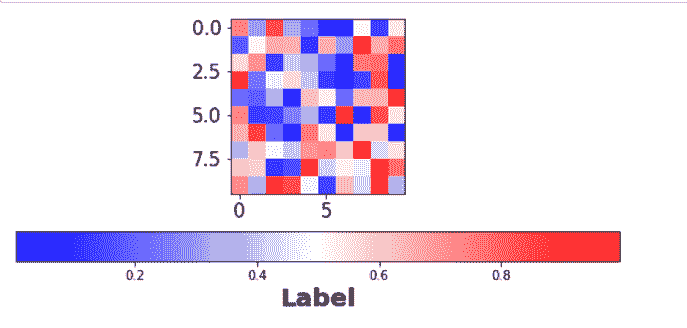
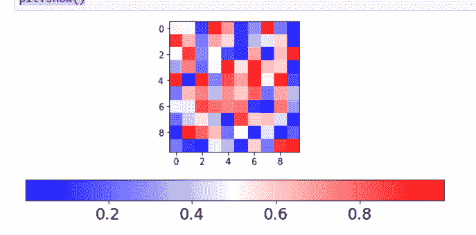
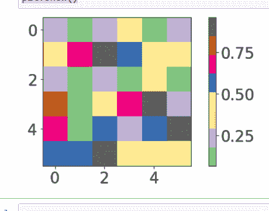

# 使用 Python 中的 Matplotlib 更改颜色条的标签大小和刻度标签大小

> 原文:[https://www . geeksforgeeks . org/change-label-size-tick-label-size-of-color bar-using-matplotlib-in-python/](https://www.geeksforgeeks.org/change-the-label-size-and-tick-label-size-of-colorbar-using-matplotlib-in-python/)

在本文中，我们将学习如何使用 Python 在 Matplotlib 中更改 colorbar 的标签大小和刻度标签大小。

标签是一种分配名称的方式，可以应用于图中的任何节点。它们只是一个名字，所以标签要么存在，要么不存在。正确标记图形有助于识别 x 轴和 y 轴。每个刻度线代表连续刻度上单位的指定值或分类刻度上类别的值。图中标出了 X 轴和 Y 轴。

这里我们将讨论如何更改颜色条的标签大小和刻度标签大小，使用不同的示例使其更加清晰。

**语法:**

> **#更改标签尺寸**
> 
> im.figure.axes[0]。tick_params(axis="both "，labelsize=21)
> 
> *   轴= x、y 或两者都有。
> *   labelsize = int
> 
> **#更改颜色条的刻度标签尺寸**
> 
> im.figure.axes[1]。tick_params(axis= "，labelsize=21)
> 
> *   轴= x、y 或两者都有。
> *   labelsize = int

**示例 1:** 在本例中，我们借助方法**更改 Plotly Express 中的标签大小。tick _ params(axis =“both”，labelsize=21)** ，通过传递参数 axis 值作为 axis，标签大小作为 21。

## 蟒蛇 3

```
# importing libraries
import numpy as np
import matplotlib as mpl
import matplotlib.pyplot as plt

# setup data
a = np.random.rand(10, 10)
im = plt.imshow(a, cmap="bwr")
cb = plt.colorbar(im, orientation='horizontal')

# change the label size
im.figure.axes[0].tick_params(axis="both", labelsize=21)

plt.show()
```

**输出:**



**示例 2:** 在本例中，我们借助方法**更改 Plotly Express 中的标签大小。tick _ params(axis =“x”，labelsize=18)** ，通过传递参数 axis 值为 x，标签大小为 18。

## 蟒蛇 3

```
# importing libraries
import numpy as np
import matplotlib as mpl
import matplotlib.pyplot as plt

# setup data
a = np.random.rand(10, 10)
im = plt.imshow(a, cmap="bwr")
cb = plt.colorbar(im, orientation='horizontal')

# change the tick label size of colorbar
im.figure.axes[1].tick_params(axis="x", labelsize=18)

plt.show()
```

**输出:**



**示例 3:** 在本例中，我们借助方法**更改 Plotly Express 中的标签大小。tick _ params(axis =“y”，labelsize=21)** ，绕过参数 axis 值为 y，标签尺寸为 21。

## 蟒蛇 3

```
# importing libraries
import numpy as np
from matplotlib import pyplot as plt

# setup data
plt.rcParams["figure.figsize"] = [7.00, 3.50]
plt.rcParams["figure.autolayout"] = True
data = np.random.rand(6, 6)
im = plt.imshow(data, interpolation="nearest", cmap="Accent")
cbar = plt.colorbar(im)

# change the label size
im.figure.axes[0].tick_params(axis="both", labelsize=21)

# change the tick label size of colorbar
im.figure.axes[1].tick_params(axis="y", labelsize=21)

plt.show()
```

**输出:**

