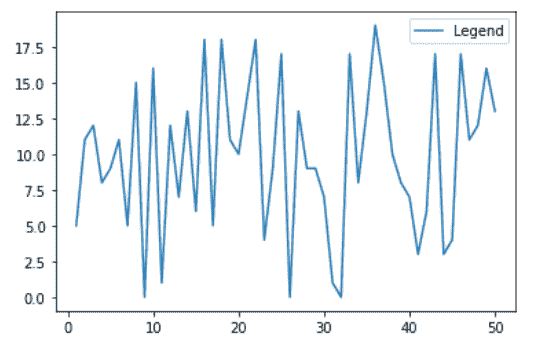
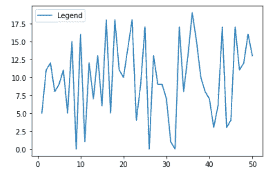
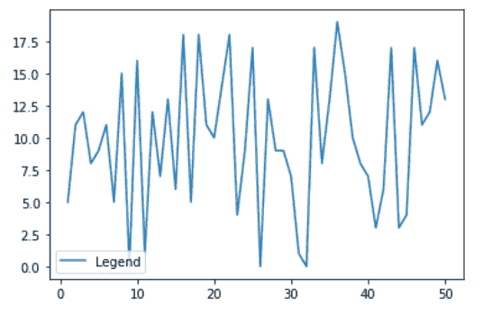
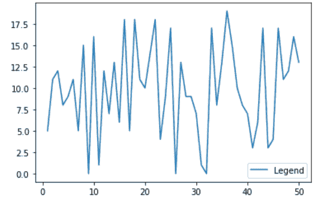

# 更改 Matplotlib 中的图例位置

> 原文:[https://www . geesforgeks . org/change-the-legend-position-in-matplotlib/](https://www.geeksforgeeks.org/change-the-legend-position-in-matplotlib/)

在本文中，我们将学习如何在 [Matplotlib](https://www.geeksforgeeks.org/python-introduction-matplotlib/) 中更改图例位置。让我们讨论一些概念:

*   Matplotlib 是一个巨大的 Python 可视化库，用于数组的 2D 图。Matplotlib 可能是一个多平台数据可视化库，构建在 NumPy 数组上，旨在与更广泛的 SciPy 堆栈一起工作。它是由约翰·亨特在 2002 年推出的。
*   图例是描述图形元素的区域。在 matplotlib 库中，有一个名为 legend()的函数，用于在轴上放置图例。
*   图例()中的 Loc 属性用于指定图例的位置。loc 的默认值是 loc=“最佳”(左上角)。最好的字符串是右上、左上、左下、右下、右下、左中、右中、下中、上中和中，将图例放在轴/图形的相应角落。

<figure class="table">

| **位置字符串** | **位置字符串** |
| 最好的 | Zero |
| 右上方 | one |
| 左上角 | Two |
| 左下角 | three |
| 右下角 | four |
| 对吧 | five |
| 中间偏左 | six |
| 中间偏右 | seven |
| 下死点 | eight |
| 上中心 | nine |
| 中心 | Ten |

</figure>

**进场:**

1.  汇入资源库(Matplotlib)
2.  导入/创建数据。
3.  绘制图表。
4.  添加图例。
5.  使用锁定设置图例的位置。

**例 1:**

## 蟒蛇 3

```py
# importing packages
import numpy as np
import matplotlib.pyplot as plt

# create data
x = np.linspace(1, 50, 50)
np.random.seed(1)
y = np.random.randint(0, 20, 50)

# plot graph
plt.plot(x, y)

# add legend
plt.legend(['Legend'])
plt.show()
```

**输出:**



**无设定地点的传说(最佳)**

**例 2:**

## 蟒蛇 3

```py
# importing packages
import numpy as np
import matplotlib.pyplot as plt

# create data
x = np.linspace(1, 50, 50)
np.random.seed(1)
y = np.random.randint(0, 20, 50)

# plot graph
plt.plot(x, y)

# add legend and set position to upper left
plt.legend(['Legend'], loc='upper left')
plt.show()
```

**输出:**



**左上角图例**

**例 3:**

## 蟒蛇 3

```py
# importing packages
import numpy as np
import matplotlib.pyplot as plt

# create data
x = np.linspace(1, 50, 50)
np.random.seed(1)
y = np.random.randint(0, 20, 50)

# plot graph
plt.plot(x, y)

# add legend and set position to lower left i.e; 4
plt.legend(['Legend'], loc=4)
plt.show()
```

**输出:**



**左下角传说**

**例 4:**

## 蟒蛇 3

```py
# importing packages
import numpy as np
import matplotlib.pyplot as plt

# create data
x = np.linspace(1, 50, 50)
np.random.seed(1)
y = np.random.randint(0, 20, 50)

# plot graph
plt.plot(x, y)

# add legend and set position to lower right
plt.legend(['Legend'], loc='lower right')
plt.show()
```

**输出:**



**右下角传说**