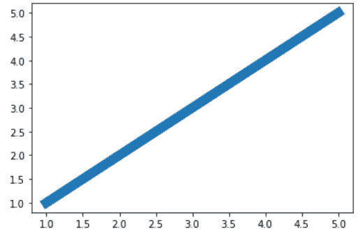
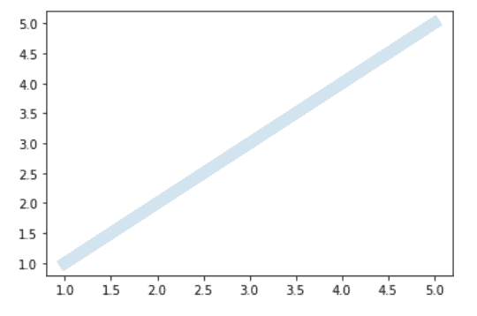

# 更改 Matplotlib 中的线条不透明度

> 原文:[https://www . geesforgeks . org/change-the-line-opacity-in-matplotlib/](https://www.geeksforgeeks.org/change-the-line-opacity-in-matplotlib/)

在本文中，我们将学习如何在 [Matplotlib](https://www.geeksforgeeks.org/python-introduction-matplotlib/) 中创建线条不透明度。让我们讨论一些概念:

*   折线图或折线图可能是一种将信息显示为由线段连接的一系列称为“标记”的知识点的图表。折线图通常用来寻找不同轴上两个数据集之间的关系；作为例子 X，y
*   Matplotlib 允许您使用 alpha 属性来调整图表的透明度。
*   默认情况下，alpha=1。
*   如果你想形成更透明的图表，那么你将使阿尔法但 1，如 0.5 或 0.25。
*   如果你想让曲线图不那么透明，那么你可以让 alpha 大于 1。这巩固了图表情节，使其不那么透明，更厚和密集，所以说。

**进场:**

1.  汇入资源库(Matplotlib)
2.  导入/创建数据。
3.  用不透明度绘制图形(线)。

**例 1:(带不透明度的简单线图)**

## 蟒蛇 3

```py
# importing libraries
import matplotlib.pyplot as plt

# create data
x = [1, 2, 3, 4, 5]
y = x

# plot the graph
plt.plot(x, y, linewidth=10, alpha=0.2)
plt.show()
```

**输出:**



**正常视图(无α或α= 1)**



**编辑视图(α= 0.2)**

**例 2:(不透明度不同的线)**

## 蟒蛇 3

```py
# importing libraries
import matplotlib.pyplot as plt
import numpy as np

# create data
x = np.array([-2, -1, 0, 1, 2])
y1 = x*0
y2 = x*x
y3 = -x*x

# plot the graph
plt.plot(x, y2, alpha=0.2)
plt.plot(x, y1, alpha=0.5)
plt.plot(x, y3, alpha=1)
plt.legend(["op = 0.2", "op = 0.5", "op = 1"])
plt.show()
```

**输出:**


**例 3:(多不透明度多线图)**

## 蟒蛇 3

```py
# importing libraries
import matplotlib.pyplot as plt
import numpy as np

# create data
x = [1, 2, 3, 4, 5]

# plot
for i in range(10):
    plt.plot([1, 2.8], [i]*2, linewidth=5, color='red', alpha=0.1*i)
    plt.plot([3.1, 4.8], [i]*2, linewidth=5, color='green', alpha=0.1*i)
    plt.plot([5.1, 6.8], [i]*2, linewidth=5, color='yellow', alpha=0.1*i)
    plt.plot([7.1, 8.8], [i]*2, linewidth=5, color='blue', alpha=0.1*i)

for i in range(10):
    plt.plot([1, 2.8], [-i]*2, linewidth=5, color='red', alpha=0.1*i)
    plt.plot([3.1, 4.8], [-i]*2, linewidth=5, color='green', alpha=0.1*i)
    plt.plot([5.1, 6.8], [-i]*2, linewidth=5, color='yellow', alpha=0.1*i)
    plt.plot([7.1, 8.8], [-i]*2, linewidth=5, color='blue', alpha=0.1*i)

plt.show()
```

**输出:**

