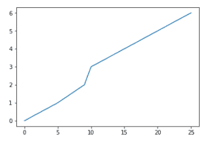
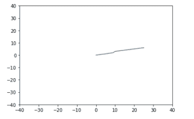

# 更改 Matplotlib 图形的 x 或 y 间隔

> 原文:[https://www . geesforgeks . org/change-the-x-or-y-interval-of-a-matplotlib-figure/](https://www.geeksforgeeks.org/change-the-x-or-y-interval-of-a-matplotlib-figure/)

使用 [Matplotlib](https://www.geeksforgeeks.org/python-introduction-matplotlib/) 中的 [matplotlib.pyplot.xlim()](https://www.geeksforgeeks.org/matplotlib-pyplot-xlim-in-python/) 和 [matplotlib.pyplot.ylim()](https://www.geeksforgeeks.org/matplotlib-pyplot-ylim-in-python/) 来更改 x 或 y 范围是非常容易的。matplotlib 库 pyplot 模块中的这个函数用于获取或设置当前轴的 x 轴极限/ y 轴极限，并返回新的 x 轴极限/y 轴极限的元组。

> **语法:**matplotlib . pyplot . xlim(* args，**kwargs)
> 
> **参数:**
> 
> * args:
> 
> *   **左侧:**此参数用于将 xlim/ylim 设置为左侧。
> *   **右侧:**此参数用于将 xlim/ylim 设置为右侧。
> 
> ****kwargs:** 这是用于控制标签外观的文本属性。

**例 1:** 不使用 matplotlib . pyplot . xlim()/matplotlib . pyplot . ylim()函数。

## 蟒蛇 3

```py
import numpy as np
import matplotlib.pyplot as plt

x = [0, 5, 9, 10, 15, 20, 25]
y = [0, 1, 2, 3, 4, 5, 6]

plt.plot(x, y)
plt.show()
```

**输出:**



**示例 2:** 使用 matplotlib . pyplot . xlim()/matplotlib . pyplot . ylim()函数。

## 蟒蛇 3

```py
import numpy as np
import matplotlib.pyplot as plt

x = [0,5,9,10,15,20,25]
y = [0,1,2,3,4,5,6]
plt.xlim([-40, 40])
plt.ylim([-40, 40])

plt.plot(x,y)
plt.show()
```

**输出:-**

