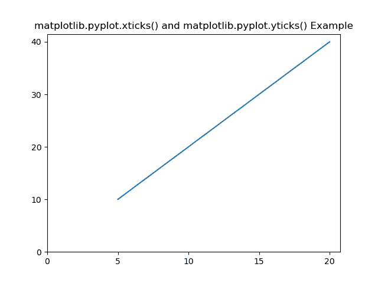
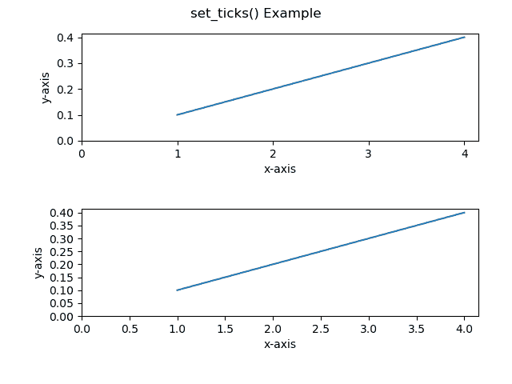
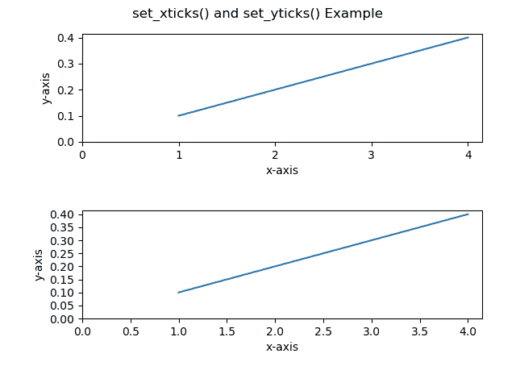

# 更改 Matplotlib 图形的 x 或 y 刻度

> 原文:[https://www . geesforgeks . org/change-the-x-or-y-ticks-of-a-matplotlib-figure/](https://www.geeksforgeeks.org/change-the-x-or-y-ticks-of-a-matplotlib-figure/)

[**Matplotlib**](https://www.geeksforgeeks.org/python-introduction-matplotlib/) 是 Python 中可视化数据的绘图库，灵感来源于 MATLAB，意思是使用的术语(轴、图形、绘图)将与 MATLAB 中使用的术语相似。[**【Pyplot】**](https://www.geeksforgeeks.org/pyplot-in-matplotlib/)是 Matplotlib 库中的一个模块，是 Matplotlib 模块的类壳接口。

有许多方法可以改变 Matplotlib 图的轴的刻度间隔。这里讨论一些最简单的方法。

### **方法 1:**[xtpicks()](https://www.geeksforgeeks.org/matplotlib-pyplot-xticks-in-python/)和 [yticks()](https://www.geeksforgeeks.org/matplotlib-pyplot-yticks-in-python/)

**xtpicks()**和 **yticks()** 函数以列表对象作为参数。列表中的元素表示显示刻度的相应操作的位置。我们也可以使用这些函数设置轴的刻度标签，但是，这里我们将只关注更改轴的刻度间隔。要了解这些功能的更多信息，请点击[xtpicks()](https://www.geeksforgeeks.org/matplotlib-pyplot-xticks-in-python/)和 [yticks()](https://www.geeksforgeeks.org/matplotlib-pyplot-yticks-in-python/) 。

**语法:**

> 对于 x 轴:matplotlib . pyplot . xtpicks()
> 
> 对于 y 轴:matplotlib.pyplot.yticks()

为了创建记号列表，我们将使用 numpy.arange(start，stop，step)，start 作为记号的起始值，stop 作为非包含性的结束值，step 作为记号之间的整数空间。

下面的例子说明了 matplotlib . pyplot . xtpicks()和 matplotlib.pyplot.yticks()方法:

**示例:**

## 蟒蛇 3

```
#  Code to change the interval of ticks of axes using xticks() and yticks()

# Importing libraries
import matplotlib.pyplot as plt
import numpy as np

#Creating x-value and y-value of data
x = [5, 10, 15, 20]
y = [10, 20, 30, 40]

# Plotting the data
plt.plot(x, y)

# Setting the interval of ticks of x-axis to 5.
listOf_Xticks = np.arange(0, 25, 5)
plt.xticks(listOf_Xticks)

# Setting the interval of ticks of y-axis to 10.
listOf_Yticks = np.arange(0, 50, 10)
plt.yticks(listOf_Yticks)

# Giving title to the plot
plt.title('matplotlib.pyplot.xticks() and matplotlib.pyplot.yticks() Example')

plt.show()
```

**输出:**



这里我们可以看到 x 轴上的刻度范围是[0，25]，间隔为 5，y 轴上的刻度范围是[0，50]，间隔为 10。这就是我们所设置的 np.arange()的参数。

**注意:**上述函数(即 xticks()和 yticks())对 AxesSubplot 对象不起作用。为此，以下方法将起作用。

### 方法 2 : [set_ticks()](https://www.geeksforgeeks.org/matplotlib-axis-axis-set_ticks-function-in-python/)

与上述方法类似， **set_ticks()** 也以列表对象为自变量，其元素表示轴上 ticks 的位置。

**语法:**

> **x 轴:**
> 
> axessubplot . xaxis . set _ ticks()
> 
> **对于 y 轴:**
> 
> axessubplot . yaxis . set _ ticks()

**注意:**此方法对 matplotlib.pyplot 对象不起作用。

以下示例说明了 AxesSubplot.xaxis.set_ticks()和 AxesSubplot.yaxis.set_ticks()方法:

**示例:**

## 蟒蛇 3

```
#  Code to change the interval of ticks of axes
# using set_ticks() method

# Importing libraries
import matplotlib.pyplot as plt
import numpy as np

# Creating x-value and y-value of data
x = [1, 2, 3, 4]
y = [0.1, 0.2, 0.3, 0.4]

# Creating a subplot with 2 row and 1 column
fig, (axes1, axes2) = plt.subplots(2, 1)

# Plotting first axes object i.e. axes1 and labeling
# its x and y axes
axes1.plot(x, y)
axes1.set_ylabel('y-axis')
axes1.set_xlabel('x-axis')

# Setting the interval of ticks of x-axis to 1 and of y-axis
# to 0.1 of first axes i.e. axes1.
axes1.xaxis.set_ticks(np.arange(0, 5, 1))
axes1.yaxis.set_ticks(np.arange(0, 0.5, 0.1))

# Plotting first axes object i.e. axes1 and labeling its
# x and y axes
axes2.plot(x, y)
axes2.set_ylabel('y-axis')
axes2.set_xlabel('x-axis')

# Setting the interval of ticks of x-axis to 0.5 and
# of y-axis to 0.05 of second axes i.e. axes2.
axes2.xaxis.set_ticks(np.arange(0, 4.5, 0.5))
axes2.yaxis.set_ticks(np.arange(0, 0.45, 0.05))

# Giving title to the figure object i.e. fig
fig.suptitle('set_ticks() Example')
fig.tight_layout(pad=3.0)

plt.show()
```

**输出:**



### 方法三:[设置 _ xtpicks()](https://www.geeksforgeeks.org/matplotlib-axes-axes-set_xticks-in-python/)和[设置 _yticks()](https://www.geeksforgeeks.org/matplotlib-axes-axes-set_yticks-in-python/)

**set _ xtpicks()**和 **set_yticks()** 函数以列表对象作为参数。列表中的元素表示显示刻度的相应操作的位置。

**语法:**

> **x 轴:**
> 
> axsexbplot . set _ xts()轴
> 
> **对于 y 轴:**
> 
> axessubplot . set _ yticks()

注意:此方法不适用于 matplotlib.pyplot 对象。

下面的例子说明了 AxesSubplot.set _ xticks()和 AxesSubplot.set_yticks()方法:

**示例:**

## 蟒蛇 3

```
#  Code to change the interval of ticks of axes
# using set_xticks() and set_yticks() methods

# Importing libraries
import matplotlib.pyplot as plt
import numpy as np

#Creating x-value and y-value of data
x = [1, 2, 3, 4]
y = [0.1, 0.2, 0.3, 0.4]

# Creating a subplot with 2 row and 1 column
fig, (axes1, axes2) = plt.subplots(2, 1)

# Plotting first axes object i.e. axes1 and
# labeling its x and y axes
axes1.plot(x, y)
axes1.set_ylabel('y-axis')
axes1.set_xlabel('x-axis')

# Setting the interval of ticks of x-axis to 1 and of
# y-axis to 0.1 of first axes i.e. axes1.
axes1.set_xticks(np.arange(0, 5, 1))
axes1.set_yticks(np.arange(0, 0.5, 0.1))

# Plotting first axes object i.e. axes1 and labeling
# its x and y axes
axes2.plot(x, y)
axes2.set_ylabel('y-axis')
axes2.set_xlabel('x-axis')

# Setting the interval of ticks of x-axis to 0.5 and
# of y-axis to 0.05 of second axes i.e. axes2.
axes2.set_xticks(np.arange(0, 4.5, 0.5))
axes2.set_yticks(np.arange(0, 0.45, 0.05))

#Giving title to the figure object i.e. fig
fig.suptitle('set_xticks() and set_yticks() Example')
fig.tight_layout(pad=3.0)

plt.show()
```

**输出:**

