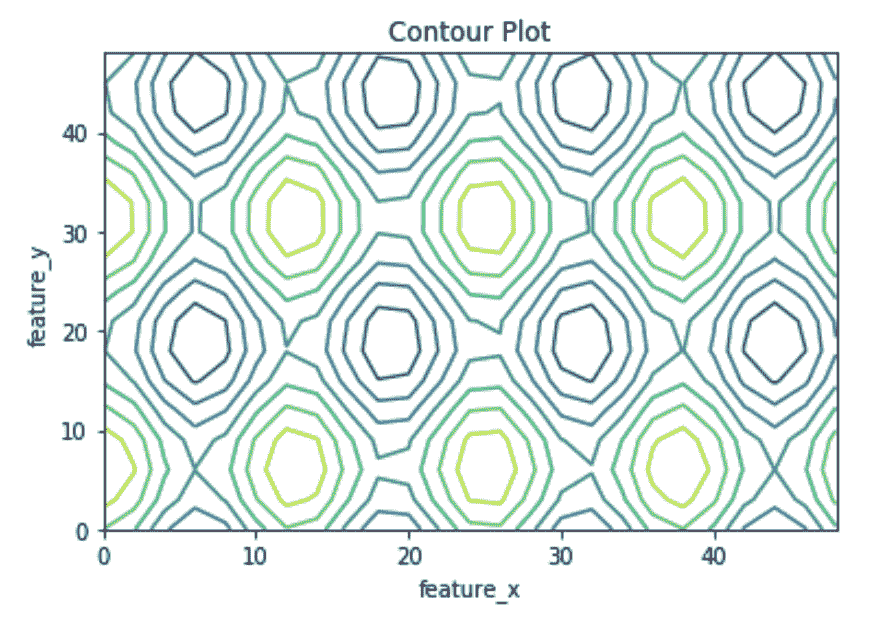
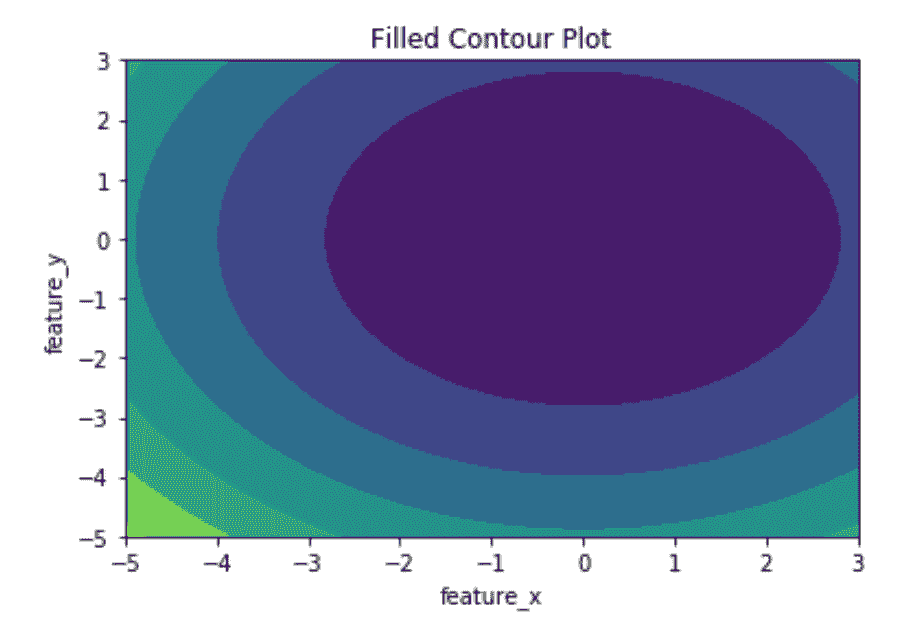

# 使用 Matplotlib–Python 绘制等高线图

> 原文:[https://www . geeksforgeeks . org/等高线图-使用-matplotlib-python/](https://www.geeksforgeeks.org/contour-plot-using-matplotlib-python/)

等高线图也称为水平图，是一种在二维空间中进行多元分析和可视化三维图的工具。如果我们将 X 和 Y 视为我们想要绘制的变量，那么响应 Z 将被绘制为 X-Y 平面上的切片，因此轮廓有时被称为 *Z 切片或等响应。*

等高线图被广泛用于可视化密度，海拔或山的高度，以及在气象部门。由于如此广泛的使用`matplotlib.pyplot`提供了一种方法`contour`，使我们可以轻松绘制等高线图。

## matplotlib.pyplot.contour

当 **Z = f(X，Y)** 即 Z 随着输入 X 和 Y 的变化而变化时，**matplotlib . pyplot . contour()**通常是有用的。也可以使用`contourf()`来绘制填充轮廓。

> **语法:**matplotlib . pyplot . contour([X，Y，] Z，[levels]，**kwargs)
> 
> **参数:**
> **X，Y:** 具有与 Z 或一维阵列相同形状的二维 numpy 阵列，使得 len(X)==M 和 len(Y)==N(其中 M 和 N 是 Z 的行和列)
> **Z:** 绘制轮廓的高度值。形状为(M，N)
> **级:**确定轮廓线/区域的数量和位置。
> 
> **返回:**四通道

下面的例子说明了 matplotlib.pyplot 中的`matplotlib.pyplot.contour()`函数:

**示例#1:** 使用仅绘制等高线的`contour()`绘制等高线。

```
# Implementation of matplotlib function
import matplotlib.pyplot as plt
import numpy as np

feature_x = np.arange(0, 50, 2)
feature_y = np.arange(0, 50, 3)

# Creating 2-D grid of features
[X, Y] = np.meshgrid(feature_x, feature_y)

fig, ax = plt.subplots(1, 1)

Z = np.cos(X / 2) + np.sin(Y / 4)

# plots contour lines
ax.contour(X, Y, Z)

ax.set_title('Contour Plot')
ax.set_xlabel('feature_x')
ax.set_ylabel('feature_y')

plt.show()
```

**输出:**


**示例#2:** 使用绘制填充轮廓的`contourf()`绘制轮廓。

```
# Implementation of matplotlib function
import matplotlib.pyplot as plt
import numpy as np

feature_x = np.linspace(-5.0, 3.0, 70)
feature_y = np.linspace(-5.0, 3.0, 70)

# Creating 2-D grid of features
[X, Y] = np.meshgrid(feature_x, feature_y)

fig, ax = plt.subplots(1, 1)

Z = X ** 2 + Y ** 2

# plots filled contour plot
ax.contourf(X, Y, Z)

ax.set_title('Filled Contour Plot')
ax.set_xlabel('feature_x')
ax.set_ylabel('feature_y')

plt.show()
```

**输出:**
