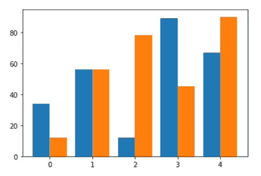
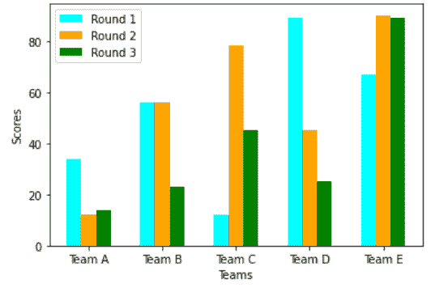
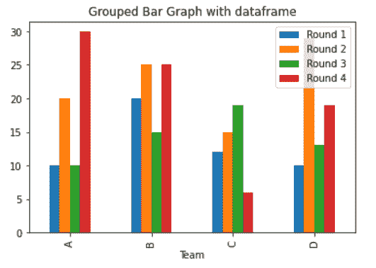

# 在 Matplotlib 中创建分组条形图

> 原文:[https://www . geesforgeks . org/create-a-group-bar-plot-in-matplotlib/](https://www.geeksforgeeks.org/create-a-grouped-bar-plot-in-matplotlib/)

在本文中，我们将学习如何在 [Matplotlib](https://www.geeksforgeeks.org/python-introduction-matplotlib/) 中创建分组条形图。让我们讨论一些概念:

*   Matplotlib 是一个巨大的 Python 可视化库，用于数组的 2D 图。Matplotlib 可能是一个多平台数据可视化库，构建在 [NumPy](https://www.geeksforgeeks.org/python-numpy/) 数组上，旨在与更广泛的 SciPy 堆栈一起工作。它是由约翰·亨特在 2002 年推出的。
*   条形图或条形图可以是用矩形条表示知识类别的图形，矩形条的长度和高度与它们所表示的值成比例。条形图通常水平或垂直绘制。
*   条形图是比较一维或二维分类数据的好方法。通常，比较两个维度的值更有趣，为此，需要一个分组条形图。

**进场:**

1.  汇入资源库(Matplotlib)
2.  导入/创建数据。
3.  以分组方式绘制条形图。

**示例 1:(简单分组条形图)**

## 蟒蛇 3

```py
# importing package
import matplotlib.pyplot as plt
import numpy as np

# create data
x = np.arange(5)
y1 = [34, 56, 12, 89, 67]
y2 = [12, 56, 78, 45, 90]
width = 0.40

# plot data in grouped manner of bar type
plt.bar(x-0.2, y1, width)
plt.bar(x+0.2, y2, width)
```

**输出:**



**示例 2:(包含 2 个以上数据的分组条形图)**

## 蟒蛇 3

```py
# importing package
import matplotlib.pyplot as plt
import numpy as np

# create data
x = np.arange(5)
y1 = [34, 56, 12, 89, 67]
y2 = [12, 56, 78, 45, 90]
y3 = [14, 23, 45, 25, 89]
width = 0.2

# plot data in grouped manner of bar type
plt.bar(x-0.2, y1, width, color='cyan')
plt.bar(x, y2, width, color='orange')
plt.bar(x+0.2, y3, width, color='green')
plt.xticks(x, ['Team A', 'Team B', 'Team C', 'Team D', 'Team E'])
plt.xlabel("Teams")
plt.ylabel("Scores")
plt.legend(["Round 1", "Round 2", "Round 3"])
plt.show()
```

**输出:**



**示例 3:(使用** [**数据框**](https://www.geeksforgeeks.org/python-pandas-dataframe/) **绘制的分组条形图)**

## 蟒蛇 3

```py
# importing package
import matplotlib.pyplot as plt
import pandas as pd

# create data
df = pd.DataFrame([['A', 10, 20, 10, 30], ['B', 20, 25, 15, 25], ['C', 12, 15, 19, 6],
                   ['D', 10, 29, 13, 19]],
                  columns=['Team', 'Round 1', 'Round 2', 'Round 3', 'Round 4'])
# view data
print(df)

# plot grouped bar chart
df.plot(x='Team',
        kind='bar',
        stacked=False,
        title='Grouped Bar Graph with dataframe')
```

**输出:**

