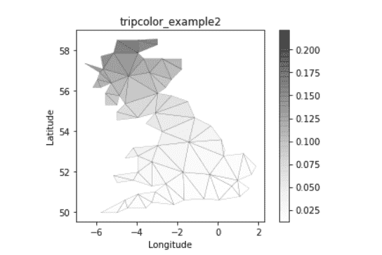

# 使用 Matplotlib

在 Python 中创建非结构化三角形网格的伪彩色图

> 原文:[https://www . geeksforgeeks . org/create-a-psycolor-plot-of-a-unstructured-trial-grid-in-python-using-matplotlib/](https://www.geeksforgeeks.org/create-a-pseudocolor-plot-of-an-unstructured-triangular-grid-in-python-using-matplotlib/)

[**Matplotlib**](https://www.geeksforgeeks.org/python-matplotlib-an-overview/) 是一个可以进行数据可视化的 Python 模块；并以饼图、直方图、条形图等形式对数据进行图形化分析。它还具有生成类似 MATLAB 的框架的能力。

## 非结构化三角形网格

非结构化三角形网格包含 **n 点**点和 **n 点**三角形，这些三角形可以由用户指定，也可以使用**德劳奈三角剖分**自动生成。

> **语法:**matplotlib . tri . triangle(x，y，triangles=None，mask=None)
> 
> **参数:**
> 
> *   ***x，y :*** 指定网格点的坐标。
> *   ***三角形:*** *【可选】*形状的整数数组(n_tri，3)
> *   ***遮罩:*** *【可选】*它指定哪些三角形被遮罩掉。

## 创建非结构化三角形网格的伪彩色图

我们可以使用 pyplot 库的 **tripcolor()** 函数绘制一个伪彩色的非结构化三角形网格。

> **语法:**matplotlib . pyplot . tripcolor(* args，cmap=None，alpha=1.0，edgecolors=None，facecolors=None，shading='flat '，norm=None，vmax=None，vmin=None，**kwargs)
> 
> **参数:**
> 
> 1.  **cmap :** 可以是 None，也可以是 matplotlib，matplotlib 有很多内置的 colormaps 可以通过 matplotlib.cm.get_cmap 访问
> 2.  **α:**可以是无，也可以是 0 到 1 之间的α值。
> 3.  **边缘颜色 ：**
>     *   如果为“无”，则边缘将不可见。
>     *   “脸”代表与脸相同的颜色。
>     *   颜色序列将设置颜色。
> 4.  **面色:**提到字体
> 5.  **底纹:**可以是“平”也可以是“古罗”
> 6.  **常态**:如果其无默认为常态()。
> 7.  **vimax :** 可以是无，也可以是标量值。
> 8.  **vimin :** 可以是无，也可以是标量值。( *vimax 和 vimin 与归一化数据*结合使用)

**例 1 :**

```
import matplotlib.pyplot as plt
import matplotlib.tri as tri
import numpy as np
import math

# Creating a Triangulation without 
# specifying the triangles results in the
# Delaunay triangulation of the points.

# First create the x and y coordinates of the points.
angles = 36
n_radii = 8
min_radius = 0.25
radii = np.linspace(min_radius, 0.95, n_radii)

angles1 = np.linspace(0, 2 * math.pi, angles, endpoint = False)
angles1 = np.repeat(angles1[..., np.newaxis], n_radii, axis = 1)
angles1[:, 1::2] += math.pi / angles

x = (radii * np.cos(angles1)).flatten()
y = (radii * np.sin(angles1)).flatten()
z = (np.cos(radii)*np.cos(angles1 * 3.0)).flatten()

# Create  Delaunay triangulation.
triang = tri.Triangulation(x, y)

# Mask off unwanted triangles.
x1 = x[triang.triangles].mean(axis = 1)
y1 = y[triang.triangles].mean(axis = 1)
mask = np.where(x1 * x1 + y1 * y1 < min_radius * min_radius, 1, 0)
triang.set_mask(mask)

# Illustrate shading.
plt.figure()
plt.gca().set_aspect('equal')

tri = plt.tripcolor(triang, z,
                    shading ='gouraud',
                    cmap = plt.cm.rainbow,
                    alpha = 0.5,
                    edgecolors ='k')

plt.title('tripcolor_example1')
plt.colorbar(tri)
```

**输出:**


**例 2 :**

```
xy = np.asarray([
    [-0.101, 0.872], [-0.080, 0.883], [-0.069, 0.888], [-0.054, 0.890],
    [-0.045, 0.897], [-0.057, 0.895], [-0.073, 0.900], [-0.087, 0.898],
    [-0.090, 0.904], [-0.069, 0.907], [-0.069, 0.921], [-0.080, 0.919],
    [-0.073, 0.928], [-0.052, 0.930], [-0.048, 0.942], [-0.062, 0.949],
    [-0.054, 0.958], [-0.069, 0.954], [-0.087, 0.952], [-0.087, 0.959],
    [-0.080, 0.966], [-0.085, 0.973], [-0.087, 0.965], [-0.097, 0.965],
    [-0.097, 0.975], [-0.092, 0.984], [-0.101, 0.980], [-0.108, 0.980],
    [-0.104, 0.987], [-0.102, 0.993], [-0.115, 1.001], [-0.099, 0.996],
    [-0.101, 1.007], [-0.090, 1.010], [-0.087, 1.021], [-0.069, 1.021],
    [-0.052, 1.022], [-0.052, 1.017], [-0.069, 1.010], [-0.064, 1.005],
    [-0.048, 1.005], [-0.031, 1.005], [-0.031, 0.996], [-0.040, 0.987],
    [-0.045, 0.980], [-0.052, 0.975], [-0.040, 0.973], [-0.026, 0.968],
    [-0.020, 0.954], [-0.006, 0.947], [ 0.003, 0.935], [ 0.006, 0.926],
    [ 0.005, 0.921], [ 0.022, 0.923], [ 0.033, 0.912], [ 0.029, 0.905],
    [ 0.017, 0.900], [ 0.012, 0.895], [ 0.027, 0.893], [ 0.019, 0.886],
    [ 0.001, 0.883], [-0.012, 0.884], [-0.029, 0.883], [-0.038, 0.879],
    [-0.057, 0.881], [-0.062, 0.876], [-0.078, 0.876], [-0.087, 0.872],
    [-0.030, 0.907], [-0.007, 0.905], [-0.057, 0.916], [-0.025, 0.933],
    [-0.077, 0.990], [-0.059, 0.993]])
x, y = np.rad2deg(xy).T

triangles = np.asarray([
    [67, 66,  1], [65,  2, 66], [ 1, 66,  2], [64,  2, 65], [63,  3, 64],
    [60, 59, 57], [ 2, 64,  3], [ 3, 63,  4], [ 0, 67,  1], [62,  4, 63],
    [57, 59, 56], [59, 58, 56], [61, 60, 69], [57, 69, 60], [ 4, 62, 68],
    [ 6,  5,  9], [61, 68, 62], [69, 68, 61], [ 9,  5, 70], [ 6,  8,  7],
    [ 4, 70,  5], [ 8,  6,  9], [56, 69, 57], [69, 56, 52], [70, 10,  9],
    [54, 53, 55], [56, 55, 53], [68, 70,  4], [52, 56, 53], [11, 10, 12],
    [69, 71, 68], [68, 13, 70], [10, 70, 13], [51, 50, 52], [13, 68, 71],
    [52, 71, 69], [12, 10, 13], [71, 52, 50], [71, 14, 13], [50, 49, 71],
    [49, 48, 71], [14, 16, 15], [14, 71, 48], [17, 19, 18], [17, 20, 19],
    [48, 16, 14], [48, 47, 16], [47, 46, 16], [16, 46, 45], [23, 22, 24],
    [21, 24, 22], [17, 16, 45], [20, 17, 45], [21, 25, 24], [27, 26, 28],
    [20, 72, 21], [25, 21, 72], [45, 72, 20], [25, 28, 26], [44, 73, 45],
    [72, 45, 73], [28, 25, 29], [29, 25, 31], [43, 73, 44], [73, 43, 40],
    [72, 73, 39], [72, 31, 25], [42, 40, 43], [31, 30, 29], [39, 73, 40],
    [42, 41, 40], [72, 33, 31], [32, 31, 33], [39, 38, 72], [33, 72, 38],
    [33, 38, 34], [37, 35, 38], [34, 38, 35], [35, 37, 36]])

xmid = x[triangles].mean(axis = 1)
ymid = y[triangles].mean(axis = 1)
x0 = -8
y0 = 70
zfaces = np.exp(-0.01 * ((xmid - x0) * (xmid - x0) + (ymid - y0) * (ymid - y0)))

fig3, ax3 = plt.subplots()
ax3.set_aspect('equal')

tpc = ax3.tripcolor(x, y, triangles,
                    facecolors = zfaces,
                    cmap ='Greys', 
                    edgecolors ='k',
                    shading = 'flat',
                    alpha = 0.5)

ax3.set_title('tripcolor_example2')
ax3.set_xlabel('Longitude')
ax3.set_ylabel('Latitude')

fig3.colorbar(tpc)
```

**输出:**

