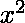

# 在 Matplotlib 中创建多个按钮

> 原文:[https://www . geesforgeks . org/create-multi-button-in-matplotlib/](https://www.geeksforgeeks.org/create-multiple-buttons-in-matplotlib/)

我们都非常清楚，Python 为我们提供了一个非常漂亮的库，名为 Matplotlib，它支持许多方法，我们可以使用这些方法绘制图表并可视化数据。很多时候，我们都希望我们的情节看起来有吸引力，同时变得互动。为此，可以在 matplotlib 图中添加按钮，用于触发一些点击事件，并使我们的图具有交互性。

在本文中，我们将阅读关于使用按钮小部件在 Matplotlib 中创建多个按钮的内容。当点击这些按钮时，我们将使用它们来创建某些事件(这里绘制不同的图形)。最初，我们将绘制 **y=x** 的图形，然后制作三个不同的按钮，分别为**上一个**、**下一个**和**主页**。

*   当点击主页按钮时，初始页面将显示 y = x 的图形。
*   单击“上一页”按钮时，将显示 y= 的图形。
*   单击“下一步”按钮时，将显示 y = 2x 的图形。

## 计算机编程语言

```py
import numpy as np
import matplotlib.pyplot as plt
from matplotlib.widgets import Button

# Generating x and y-values
x = np.arange(0, 1, 0.02)
y = x

fig, ax = plt.subplots()
plt.subplots_adjust(left=0.1, bottom=0.3)
p, = plt.plot(x, y, color='red')
ax.title.set_text('Graph for y = x')

# Home button
axButn1 = plt.axes([0.1, 0.1, 0.1, 0.1])
btn1 = Button(
  axButn1, label="Home", color='pink', hovercolor='tomato')

# To plot a graph for y = x
def plot1(event):
    p.set_xdata(x)
    p.set_ydata(x)
    ax.title.set_text('Graph for y = x')
    plt.draw()

btn1.on_clicked(plot1)

# Previous button
axButn2 = plt.axes([0.3, 0.1, 0.1, 0.1])
btn2 = Button(
  axButn2, label="Prev", color='pink', hovercolor='tomato')

# To plot a graph for y = x**2
def plot2(event):
    p.set_xdata(x)
    p.set_ydata(x**2)
    ax.title.set_text('Graph for y = x**2')
    plt.draw()

btn2.on_clicked(plot2)

# Next button
axButn3 = plt.axes([0.5, 0.1, 0.1, 0.1])
btn3 = Button(
  axButn3, label="Next", color='pink', hovercolor='tomato')

# To plot a graph for y = 2x
def plot3(event):
    p.set_xdata(x)
    p.set_ydata(2*x)
    ax.title.set_text('Graph for y = 2x')
    plt.draw()

btn3.on_clicked(plot3)
plt.show()
```