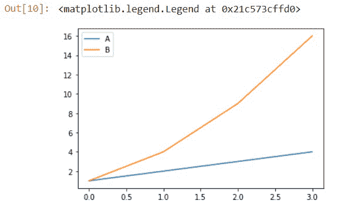
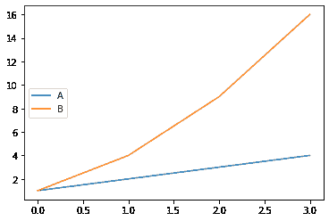
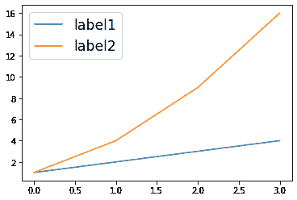
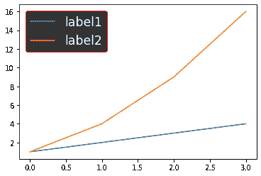
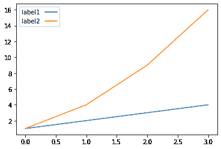
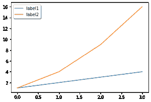
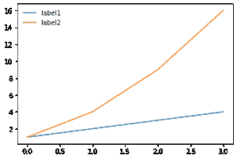
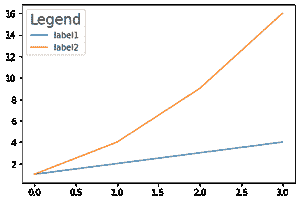

# 带 Matplotlib 的自定义传说

> 原文:[https://www . geesforgeks . org/custom-legends-with-matplotlib/](https://www.geeksforgeeks.org/custom-legends-with-matplotlib/)

在本文中，您将学习在 matplotlib 中自定义图例。matplotlib 是一个流行的数据可视化库。它是 python 中的一个绘图库，并且有它的数字扩展 NumPy。

图例是描述图形各个部分的图形区域。图表可以很简单。但加上标题、X 标签、Y 标签、图例会更清晰。通过查看名称，我们可以很容易地猜测图形代表什么以及它代表什么类型的数据。

让我们首先看看如何在 matplotlib 中创建一个传奇。

> **语法:**图例(*args，**kwargs)

这可以称为:

> **图例()- >** 自动检测显示哪个元素。它通过显示所有标有 label 关键字参数的图来实现这一点。
> 
> **图例(标签)- >** 图例上显示的 X 的名称和 Y 的名称
> 
> **图例(手柄、标签)—>**应添加到图例中的线条列表。同时使用手柄和标签可以完全控制图例中应该显示的内容。图例和手柄的长度应该相同。

## 蟒蛇 3

```py
# importing library
import matplotlib.pyplot as plt

# plotting values
a = [1, 2, 3, 4]
b = [1, 4, 9, 16]

# PLotting using matplotlib
plt.plot(a, label="A")
plt.plot(b, label="B")

# Creating legend
plt.legend()
```

**输出:**



神话；传奇

## 自定义图例

图例为图表增添了意义。添加字体、位置等，使图例更加清晰易读。现在，让我们看一些示例程序来定制剧情的图例。

### **位置**

有时候传说可能在，也可能不在合适的地方。在 matplotlib 中，我们还可以添加我们想要放置它的位置。有了这种灵活性，我们可以将图例放置在不覆盖地块的地方，因此地块看起来会更干净整洁。

> 语法:图例(loc=)

它可以按如下方式传递:

> **【左上】【右上】【左下】【右下】** **- >** 它被放置在剧情对应的角落。
> 
> **【上中】【下中】【中左】【中右】- >** 放在对应边的中心。
> 
> **‘中心’->**它被放置在剧情的正中心。
> 
> **【最佳】- >** 没有艺术家的重叠

例如，

## 蟒蛇 3

```py
# importing library
import matplotlib.pyplot as plt

# plotting values
a = [1, 2, 3, 4]
b = [1, 4, 9, 16]

# PLotting using matplotlib
plt.plot(a, label="A")
plt.plot(b, label="B")

# Creating legend
# Adding the location
plt.legend(loc='center left')
```

**输出:**



中间偏左

### 字体大小

为了使图例更有吸引力，我们还可以更改图例的字体大小，通过将参数字体大小传递给函数，我们可以更改图例框内的字体大小，就像绘图标题一样。

> **语法:**图例(fontsize= ")
> 
> 可以传递为，‘xx-small’‘x-small’‘small’‘中’‘large’‘x-large’‘xx-large’

**示例:**

## 蟒蛇 3

```py
# importing library
import matplotlib.pyplot as plt

# plotting values
a = [1, 2, 3, 4]
b = [1, 4, 9, 16]

# PLotting using matplotlib
plt.plot(a, label="label1")
plt.plot(b, label="label2")

# Creating legend
plt.legend(fontsize='xx-large')
```

**输出:**



更改字体大小

### 传说的颜色

有时候我们能感觉到，如果传奇盒子里填充一些颜色，让它更有吸引力，让传奇从剧情中脱颖而出，那就太好了。Matplotlib 也涵盖了这一点，它让我们通过更改背景、文本甚至图例的边缘颜色来更改图例的主题。-+

> **语法:**
> 
> 图例(labelcolor=)
> 
> **labelcolor** 用于改变文字的颜色。
> 
> 传说(facecolor= ")
> 
> **facecolor** 用于更改图例的背景颜色。
> 
> 图例（边缘颜色="）
> 
> **边缘颜色**用于改变图例的边缘颜色

**示例:**

## 蟒蛇 3

```py
# importing library
import matplotlib.pyplot as plt

# plotting values
a = [1, 2, 3, 4]
b = [1, 4, 9, 16]

# PLotting using matplotlib
plt.plot(a, label="label1")
plt.plot(b, label="label2")

# Creating legend
# Adding color to the legend
plt.legend(labelcolor='white', facecolor='black',
           edgecolor='red', fontsize='xx-large')
```

**输出:**



改变传说的颜色。

在上面的示例中，您可以清楚地看到哪些关键字参数为图例赋予了颜色。

### 标记属性

如果你看到图例框，

> **语法:**
> 
> 图例(markerfirst = bool，默认值:True)

默认情况下，标记放在第一位，标签放在第二位。标记第一个参数用于更改标记的位置。如果设置为假，标记和标签位置将被交换。

**示例:**

## 蟒蛇 3

```py
# importing library
import matplotlib.pyplot as plt

# plotting values
a = [1, 2, 3, 4]
b = [1, 4, 9, 16]

# PLotting using matplotlib
plt.plot(a, label="label1")
plt.plot(b, label="label2")

# Creating legend
plt.legend(markerfirst=False)
```

**输出:**



markerfirst = False

### 改变外观

我们可以让图例具有一些基本的 CSS 属性，比如添加阴影、添加框架和使角变圆，如果您不想用框架覆盖绘图中的那些小细节，还可以让我们为图例框添加透明度。

> **影子** - >这个说法给出了传说背后的影子。
> 
> **框架** - >将框架赋予传说。
> 
> **fancybox** - >赋予传奇圆形边缘。
> 
> **框架 alpha** - >为传说背景赋予透明度。

#### 添加阴影和圆角:

## 蟒蛇 3

```py
# importing library
import matplotlib.pyplot as plt

# plotting values
a = [1, 2, 3, 4]
b = [1, 4, 9, 16]

# PLotting using matplotlib
plt.plot(a, label="label1")
plt.plot(b, label="label2")

# Creating legend
# Adding shadow and fancybox to the legend
plt.legend(shadow=True, fancybox=True)
```

**输出:**



阴影和幻想盒

#### 移除图例框的框架:

## 蟒蛇 3

```py
#importing library
import matplotlib.pyplot as plt

#plotting values
a = [1,2,3,4]
b = [1,4,9,16]

#PLotting using matplotlib
plt.plot(a, label="label1")
plt.plot(b, label="label2")

#Creating legend
#removing frame
plt.legend(frameon = False)
```

**输出:**



移除框架

### 传说的标题

向图例添加标题将是添加到图例框的一个重要方面。title 参数让我们为图例指定一个标题，title_size 让我们为标题指定一个特定的字体大小。

> **语法:**
> 
> 图例(title= "，title_fontsize= ")

*   **标题**给出了传说的标题
*   **title_fontize** 给标题赋予大小。

它可以是，' xx-small '，' x-small '，' small '，'中型'，'大型'，' x-large '，' xx-large '

**示例:**

## 蟒蛇 3

```py
# importing library
import matplotlib.pyplot as plt

# plotting values
a = [1, 2, 3, 4]
b = [1, 4, 9, 16]

# PLotting using matplotlib
plt.plot(a, label="label1")
plt.plot(b, label="label2")

# Creating legend
# giving title and fontsize
plt.legend(title="Legend", title_fontsize='xx-large')
```

**输出:**



传说的标题