# 使用 Matplotlib 和 Seaborn 的 Python 数据可视化

> 原文:[https://www . geesforgeks . org/data-visualization-in-python-use-matplotlib-and-seaborn/](https://www.geeksforgeeks.org/data-visualisation-in-python-using-matplotlib-and-seaborn/)

有时，浏览一组数据点并从中建立见解似乎更容易，但通常这个过程可能不会产生好的结果。由于这个过程，可能会有很多东西没有被发现。此外，现实生活中使用的大多数数据集太大，无法手动进行任何分析。这基本上就是数据可视化介入的地方。

数据可视化是一种更简单的呈现数据的方式，无论它有多复杂，都可以借助图形表示来分析变量之间的趋势和关系。

以下是数据可视化的优势

*   更简单地表示强制数据
*   突出好的和坏的表演领域
*   探索数据点之间的关系
*   识别数据模式，即使是较大的数据点

在构建可视化时，将下面提到的几点牢记在心总是一个很好的做法

*   在构建可视化时，确保形状、颜色和大小的适当使用
*   使用坐标系统的图更明显
*   关于数据类型的合适图的知识使信息更加清晰
*   标签、标题、图例和指针的使用将无缝信息传递给更广泛的受众

## Python 库

有很多 python 库可以用来构建可视化，比如 *matplotlib、vispy、bokeh、seaborn、pygal、leaf、plotly、袖扣*和 *networkx* 。在众多的可视化工具中， *matplotlib* 和 *seaborn* 似乎被广泛用于基础到中级的可视化。

### Matplotlib

这是一个神奇的 Python 可视化库，用于数组的 2D 图。这是一个多平台数据可视化库，构建在 *NumPy* 数组上，旨在与更广泛的 *SciPy* 堆栈一起工作。它是由约翰·亨特在 2002 年推出的。让我们试着了解一下 *matplotlib* 的一些好处和特点

*   它基于 *numpy* ，速度快，效率高，也更容易构建
*   从一开始就经历了开源社区的许多改进，因此有了更好的具有高级特性的库
*   良好维护的高质量图形可视化输出吸引了大量用户
*   基本图表和高级图表都可以非常容易地构建
*   从用户/开发人员的角度来看，由于它有大量的社区支持，解决问题和调试变得更加容易

### 希伯恩

这个图书馆最初是在斯坦福大学构思和建造的，位于 matplotlib 的顶部。从某种意义上说，它有一些 *matplotlib* 的味道，而从可视化的角度来看，它比 *matplotlib* 好得多，并且还增加了一些功能。以下是它的优点

*   内置主题有助于更好的可视化
*   统计功能有助于更好地了解数据
*   更好的美学和内置情节
*   包含有效示例的有用文档

## 可视化的本质

根据用于绘制可视化的变量的数量和变量的类型，可以有不同类型的图表，我们可以使用这些图表来理解这种关系。根据变量的数量，我们可以

*   *单变量*图(仅涉及一个变量)
*   *二元*图(需要多个变量)

一个单变量*图可以是一个连续变量，以了解变量的分布和分布，而对于一个离散变量，它可以告诉我们计数*

类似地，连续变量的*二元*图可以显示相关性等基本统计量，因为连续变量与离散变量的对比可以引导我们得出非常重要的结论，例如理解分类变量不同级别的数据分布。也可以在两个离散变量之间建立一个*二元*图。

## 箱线图

方框图，也称为方框和触须图，方框和触须清晰地显示在下图中。在测量数据分布时，这是一个非常好的视觉表示。清晰地绘制出中值、异常值和四分位数。理解数据分布是导致更好的模型构建的另一个重要因素。如果数据有异常值，建议使用箱线图来识别它们并采取必要的措施。

> **语法:**seaborn . box plot(x =无，y =无，色相=无，数据=无，顺序=无，色相 _ 顺序=无，方向=无，颜色=无，调色板=无，饱和度=0.75，宽度=0.8，减淡=真，飞度=5，线宽=无，whis=1.5，ax =无，**kwargs)
> 
> **参数:**
> **x，y，色相:**用于绘制长格式数据的输入。
> **数据:**用于绘图的数据集。如果 x 和 y 不存在，这被解释为宽形。
> **颜色:**所有元素的颜色。
> 
> **返回:**返回绘制了绘图的坐标轴对象。

方框和胡须图显示了数据是如何分布的。图表中通常包含五条信息

1.  最小值显示在图表的最左边，左边“须”的末端
2.  第一个四分之一，Q1，是盒子的最左边(左须)
3.  中间值显示为方框中心的一条线
4.  第三个四分位数，Q3，显示在方框的最右侧(右侧须)
5.  最大值在盒子的最右边

从下面的图示和图表中可以看出，可以为一个或多个变量绘制箱线图，为我们的数据提供非常好的见解。

箱线图的表示。


代表多变量分类变量的箱线图

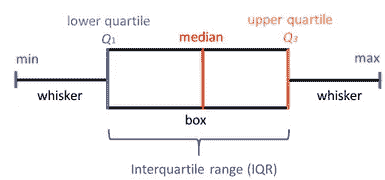

代表多变量分类变量的箱线图

## 蟒蛇 3

```py
# import required modules
import matplotlib as plt
import seaborn as sns

# Box plot and violin plot for Outcome vs BloodPressure
_, axes = plt.subplots(1, 2, sharey=True, figsize=(10, 4))

# box plot illustration
sns.boxplot(x='Outcome', y='BloodPressure', data=diabetes, ax=axes[0])

# violin plot illustration
sns.violinplot(x='Outcome', y='BloodPressure', data=diabetes, ax=axes[1])
```

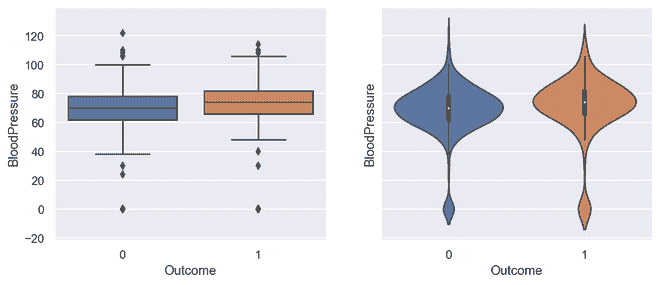

方框图和小提琴图的输出

## 蟒蛇 3

```py
# Box plot for all the numerical variables
sns.set(rc={'figure.figsize': (16, 5)})

# multiple box plot illustration
sns.boxplot(data=diabetes.select_dtypes(include='number'))
```

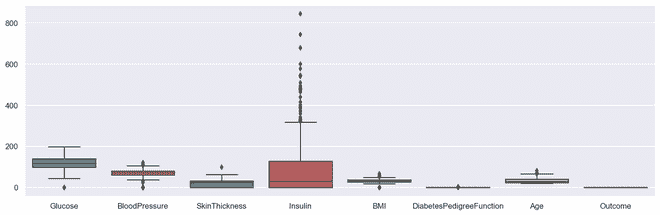

输出多方框图

## 散点图

散点图或散点图是一种*二元*图，其构建方式与线图更相似。折线图使用 X-Y 轴上的一条线来绘制连续函数，而散点图依靠点来表示单个数据。这些图对于观察两个变量是否相关非常有用。散点图可以是二维或三维的。

> ***语法:** seaborn .散点图(x =无，y =无，色相=无，样式=无，大小=无，数据=无，调色板=无，色相 _ 顺序=无，色相 _ 范数=无，大小=无，大小 _ 顺序=无，大小 _ 范数=无，标记=真，样式 _ 顺序=无，x _ bins =无，y _ bins =无，单位=无，估计器=无，ci=95，n_boot=1000，alpha='auto '，x _ jitter =无*
> 
> ***数据**:数据帧，其中每一列是一个变量，每一行是一个观察值。*
> 
> ***大小**:分组变量，会产生不同大小的点。*
> 
> ***样式**:分组变量，会产生带有不同标记的点。*
> 
> ***调色板**:分组变量，会产生带有不同标记的点。*
> 
> ***标记**:确定如何为不同级别绘制标记的对象。*
> 
> ***阿尔法**:点的比例不透明度。*
> 
> ***返回:**该方法返回绘制了绘图的坐标轴对象。*

### 散点图的优点

*   显示变量之间的相关性
*   适合大型数据集
*   更容易找到数据集群
*   更好地表示每个数据点

## 蟒蛇 3

```py
# import module
import matplotlib.pyplot as plt

# scatter plot illustration
plt.scatter(diabetes['DiabetesPedigreeFunction'], diabetes['BMI'])
```

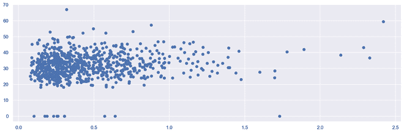

输出 2D 散点图

## 蟒蛇 3

```py
# import required modules
from mpl_toolkits.mplot3d import Axes3D

# assign axis values
x = [1, 2, 3, 4, 5, 6, 7, 8, 9, 10]
y = [5, 6, 2, 3, 13, 4, 1, 2, 4, 8]
z = [2, 3, 3, 3, 5, 7, 9, 11, 9, 10]

# adjust size of plot
sns.set(rc={'figure.figsize': (8, 5)})
fig = plt.figure()
ax = fig.add_subplot(111, projection='3d')
ax.scatter(x, y, z, c='r', marker='o')

# assign labels
ax.set_xlabel('X Label'), ax.set_ylabel('Y Label'), ax.set_zlabel('Z Label')

# display illustration
plt.show()
```


输出三维散点图

## 柱状图

直方图显示数据计数，因此类似于条形图。直方图还可以告诉我们数据分布与正态曲线有多接近。在制定统计方法时，有一个正态或接近正态分布的数据是非常重要的。但是，直方图本质上是*单变量*，条形图*双变量*。

条形图将实际计数与类别进行对比，例如，条形图的高度表示该类别中的项目数量，而直方图则在*栏*中显示相同的分类变量。

面元是构建直方图时不可或缺的一部分，它们控制一个范围内的数据点。作为一个被广泛接受的选择，我们通常将 bin 限制在 5-20 的大小，然而这完全由存在的数据点控制。

## 蟒蛇 3

```py
# illustrate histogram
features = ['BloodPressure', 'SkinThickness']
diabetes[features].hist(figsize=(10, 4))
```

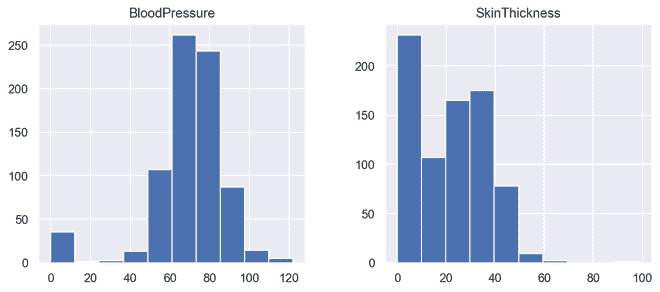

输出直方图

## 计数图

计数图是分类变量和连续变量之间的图。在这种情况下，连续变量是分类出现的次数，或者简单地说是频率。从某种意义上说，计数图可以说与直方图或条形图紧密相连。

> **语法:** seaborn.countplot(x=None，y=None，色相=None，数据=None，顺序=None，色相 _ 顺序=None，方向=None，颜色=None，调色板=None，饱和度=0.75，减淡=True，ax=None，**kwargs)
> **参数:**该方法接受以下描述的参数:
> 
> *   **x，y:** 该参数取数据或向量数据中变量的名称，可选，用于绘制长格式数据的输入。
> *   **色调:**(可选)该参数取颜色编码的列名。
> *   **数据:**(可选)此参数采用数据框、数组或数组列表、数据集进行绘图。如果 x 和 y 不存在，这被解释为宽形。否则它应该是长格式的。
> *   **顺序，hue_order :** (可选)此参数采用字符串列表。在中绘制分类级别的顺序，否则级别是从数据对象中推断出来的。
> *   **方向:**(可选)此参数取“v”|“h”，图的方向(垂直或水平)。这通常是从输入变量的数据类型中推断出来的，但是可以用来指定“分类”变量是数字还是绘制宽格式数据。
> *   **颜色:**(可选)此参数采用 matplotlib 颜色、所有元素的颜色或渐变调色板的种子。
> *   **调色板:**(可选)该参数采用调色板名称、列表或字典颜色，用于色调变量的不同级别。应该是 color_palette()可以解释的东西，或者是将色调级别映射到 matplotlib 颜色的字典。
> *   **饱和度:**(可选)此参数取浮点值，原始饱和度的比例绘制颜色。较大的色标通常使用稍微不饱和的颜色会更好看，但是如果您希望绘图颜色与输入颜色规格完全匹配，请将该值设置为 1。
> *   **闪避:**(可选)此参数取 bool 值，当使用色相嵌套时，元素是否要沿分类轴偏移。
> *   **ax :** (可选)此参数取 matplotlib Axes，Axes 对象来绘制地块，否则使用当前 Axes。
> *   **kwargs :** 此参数接受键、值映射，其他关键字参数传递到 matplotlib.axes.Axes.bar()。
> 
> **返回:**返回绘制了绘图的坐标轴对象。

它只是根据某一类类别显示一个项目的出现次数。在 python 中，我们可以使用 *seaborn* 库创建一个库。 *Seaborn* 是 Python 中的一个模块，构建在 *matplotlib* 之上，用于视觉上吸引人的统计图。

## 蟒蛇 3

```py
# import required module
import seaborn as sns

# assign required values
_, axes = plt.subplots(nrows=1, ncols=2, figsize=(12, 4))

# illustrate count plots
sns.countplot(x='Outcome', data=diabetes, ax=axes[0])
sns.countplot(x='BloodPressure', data=diabetes, ax=axes[1])
```

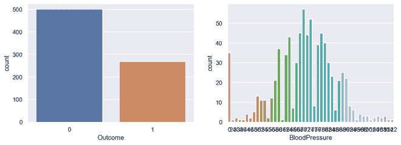

输出计数图

## 相关图

相关图是一种多变量分析，可以很方便地查看与数据点的关系。散点图有助于理解一个变量对另一个变量的影响。相关性可以定义为一个变量对另一个变量的影响。

可以计算两个变量之间的相关性，也可以是一对多的相关性，如下图所示。相关性可以是正的、负的或中性的，并且相关性的数学范围是从-1 到 1。理解相关性可能对模型构建阶段有非常重要的影响，同时也理解模型输出。

## 蟒蛇 3

```py
# Finding and plotting the correlation for
# the independent variables

# import required module
import seaborn as sns

# adjust plot
sns.set(rc={'figure.figsize': (14, 5)})

# assign data
ind_var = ['CRIM', 'ZN', 'INDUS', 'CHAS', 'NOX', 'RM',
           'AGE', 'DIS', 'RAD', 'TAX', 'PTRATIO', 'B', 'LSTAT']

# illustrate heat map.
sns.heatmap(diabetes.select_dtypes(include='number').corr(),
            cmap=sns.cubehelix_palette(20, light=0.95, dark=0.15))
```

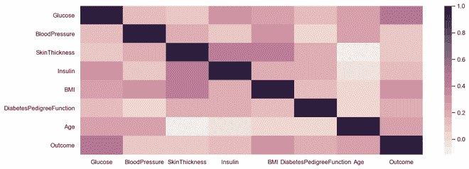

输出相关图

## 热图

热图是多变量数据表示。热图显示中的颜色强度成为理解数据点影响的重要因素。热图更容易理解，也更容易解释。当使用可视化进行数据分析时，借助图表传达所需的信息非常重要。

> **语法:**
> 
> seaborn.heatmap( *data* ， *** ， *vmin=None* ， *vmax=None* ， *cmap=None* ， *center=None* ， *robust=False* ， *annot=None* ， *fmt='.2g'* ， *annot_kws=None* ，
> 
> **参数:**该方法接受以下描述的参数:
> 
> *   **x，y:** 该参数取数据或向量数据中变量的名称，可选，用于绘制长格式数据的输入。
> *   **色调:**(可选)该参数取颜色编码的列名。
> *   **数据:**(可选)此参数采用数据框、数组或数组列表、数据集进行绘图。如果 x 和 y 不存在，这被解释为宽形。否则它应该是长格式的。
> *   **颜色:**(可选)此参数采用 matplotlib 颜色、所有元素的颜色或渐变调色板的种子。
> *   **调色板:**(可选)该参数采用调色板名称、列表或字典颜色，用于色调变量的不同级别。应该是 color_palette()可以解释的东西，或者是将色调级别映射到 matplotlib 颜色的字典。
> *   **ax :** (可选)此参数取 matplotlib Axes，Axes 对象来绘制地块，否则使用当前 Axes。
> *   **kwargs :** 此参数接受键、值映射，其他关键字参数传递到 matplotlib.axes.Axes.bar()。
> 
> **返回:**返回绘制了绘图的坐标轴对象。

## 蟒蛇 3

```py
# import required module
import seaborn as sns
import numpy as np

# assign data
data = np.random.randn(50, 20)

# illustrate heat map
ax = sns.heatmap(data, xticklabels=2, yticklabels=False)
```

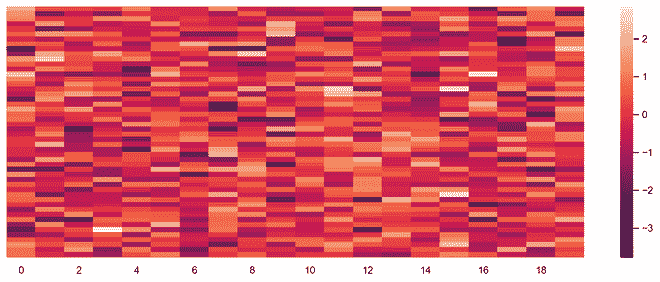

输出热图

## 圆形分格统计图表

饼图是一种单变量分析，通常用于显示百分比或比例数据。变量中每个类的百分比分布在饼图的相应部分旁边。可以用来构建饼图的 python 库是 *matplotlib* 和 *seaborn。*

> ***语法:** matplotlib.pyplot.pie(数据，分解=无，标签=无，颜色=无，自动扫描=无，阴影=假)*
> 
> ***参数:***
> ***数据**表示待标绘的数据值数组，每个切片的分数面积用**数据/和(data)** 表示。如果 sum(data) <为 1，则数据值直接返回分数区域，因此生成的饼图将具有大小为 1-sum(data)的空楔形。*
> ***标签**是设置每个楔子标签的字符串序列列表。*
> ***颜色**属性用于为楔形提供颜色。*
> ***autoct**是一个字符串，用于用它们的数值来标记楔子。*
> ***阴影**用于创建楔形阴影。*

下面是饼图的优点

*   对大数据点进行更简单的可视化汇总
*   不同班级的效果和规模很容易理解
*   百分点用于表示数据点中的类别

## 蟒蛇 3

```py
# import required module
import matplotlib.pyplot as plt

# Creating dataset
cars = ['AUDI', 'BMW', 'FORD', 'TESLA', 'JAGUAR', 'MERCEDES']
data = [23, 17, 35, 29, 12, 41]

# Creating plot
fig = plt.figure(figsize=(10, 7))
plt.pie(data, labels=cars)

# Show plot
plt.show()
```

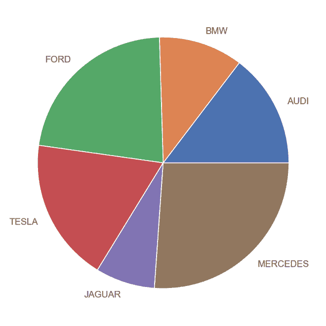

输出饼图

## 蟒蛇 3

```py
# Import required module
import matplotlib.pyplot as plt
import numpy as np

# Creating dataset
cars = ['AUDI', 'BMW', 'FORD', 'TESLA', 'JAGUAR', 'MERCEDES']
data = [23, 17, 35, 29, 12, 41]

# Creating explode data
explode = (0.1, 0.0, 0.2, 0.3, 0.0, 0.0)

# Creating color parameters
colors = ("orange", "cyan", "brown", "grey", "indigo", "beige")

# Wedge properties
wp = {'linewidth': 1, 'edgecolor': "green"}

# Creating autocpt arguments
def func(pct, allvalues):
    absolute = int(pct / 100.*np.sum(allvalues))
    return "{:.1f}%\n({:d} g)".format(pct, absolute)

# Creating plot
fig, ax = plt.subplots(figsize=(10, 7))
wedges, texts, autotexts = ax.pie(data, autopct=lambda pct: func(pct, data), explode=explode, labels=cars,
                                  shadow=True, colors=colors, startangle=90, wedgeprops=wp,
                                  textprops=dict(color="magenta"))

# Adding legend
ax.legend(wedges, cars, title="Cars", loc="center left",
          bbox_to_anchor=(1, 0, 0.5, 1))
plt.setp(autotexts, size=8, weight="bold")
ax.set_title("Customizing pie chart")

# Show plot
plt.show()
```

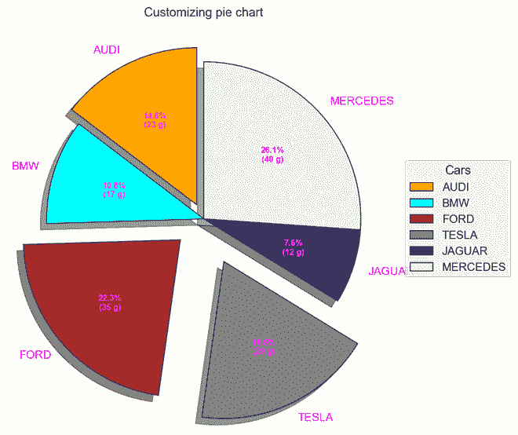

输出

## 误差线

误差线可以定义为一条通过图上一个点的线，平行于其中一个轴，表示该点相应坐标的不确定性或误差。这些类型的图非常便于理解和分析偏离目标的情况。一旦发现错误，就很容易导致对导致错误的因素进行更深入的分析。

*   数据点偏离阈值的情况很容易被捕获
*   轻松捕捉较大数据集的偏差
*   它定义了底层数据

## 蟒蛇 3

```py
# Import required module
import matplotlib.pyplot as plt
import numpy as np

# Assign axes
x = np.linspace(0,5.5,10)
y = 10*np.exp(-x)

# Assign errors regarding each axis
xerr = np.random.random_sample(10)
yerr = np.random.random_sample(10)

# Adjust plot
fig, ax = plt.subplots()
ax.errorbar(x, y, xerr=xerr, yerr=yerr, fmt='-o')

# Assign labels
ax.set_xlabel('x-axis'), ax.set_ylabel('y-axis')
ax.set_title('Line plot with error bars')

# Illustrate error bars
plt.show()
```

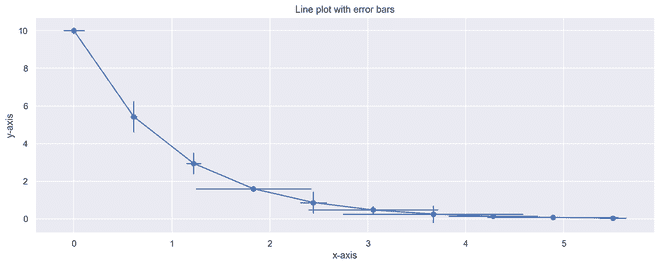

输出误差图