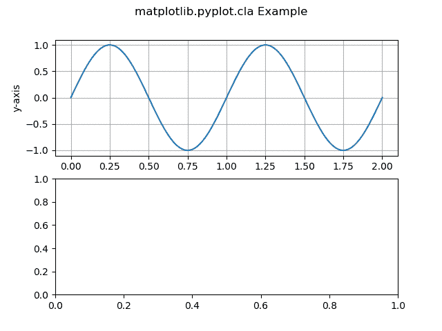

# Matplotlib

中 cla()、clf()和 close()方法的区别

> 原文:[https://www . geeksforgeeks . org/cla-clf-和-close-methods-in-matplotlib/](https://www.geeksforgeeks.org/difference-between-cla-clf-and-close-methods-in-matplotlib/)

**先决条件** : [马特洛特利](https://www.geeksforgeeks.org/python-introduction-matplotlib/)

Matplotlib 是 Python 中的一个库。它是 Numpy 库的数学扩展。它是一个全面的库，用于在 Python 中创建静态、动画和交互式可视化。 [Pyplot](https://www.geeksforgeeks.org/pyplot-in-matplotlib/) 是一个基于状态的 Matplotlib 模块接口。Pyplot 可以创建多种类型的绘图，如折线图、条形图、直方图等。

cla()、clf()和 close()是 Matplotlib 的不同方法/函数。它们之间的区别如下:

[**【cla()**](https://www.geeksforgeeks.org/matplotlib-pyplot-cla-in-python/)**:**matplotlib 库的 pyplot 模块中的这个方法用于清除当前轴。

**语法:**

```py
matplotlib.pyplot.cla()
```

**示例:**

## 蟒蛇 3

```py
import numpy as np
import matplotlib.pyplot as plt

t = np.linspace(0.0, 2.0, 401)
s = np.sin(2 * np.pi * t)

fig, [ax, ax1] = plt.subplots(2, 1)

ax.set_ylabel('y-axis')
ax.plot(t, s)
ax.grid(True)

ax1.set_ylabel('y-axis')
ax1.set_xlabel('x-axis')
ax1.plot(t, s)
ax1.grid(True)
# Function call
ax1.cla()

fig.suptitle('matplotlib.pyplot.cla Example')
plt.show()
```

**输出:**



子剧情 ax1 内容被清除。

[**【clf():**](https://www.geeksforgeeks.org/matplotlib-pyplot-clf-in-python/)**matplotlib 库的 pyplot 模块中的方法用于清除整个当前图形。它甚至清除了支线剧情。它让窗户空间保持开放，以便其他地块可以重复使用。**

****语法:****

```py
matplotlib.pyplot.clf()
```

****示例:****

## **蟒蛇 3**

```py
import numpy as np
import matplotlib.pyplot as plt

t = np.linspace(0.0, 2.0, 201)
s = np.sin(2 * np.pi * t)

fig, [ax, ax1] = plt.subplots(2, 1)

ax.set_ylabel('y-axis')
ax.plot(t, s)
ax.grid(True)

ax1.set_ylabel('y-axis')
ax1.set_xlabel('x-axis')
ax1.plot(t, s)
ax1.grid(True)

# Func. call
plt.clf()

fig.suptitle('matplotlib.pyplot.clf Example')
plt.show()
```

****输出:****

**

clf()函数清除了整个图形，只剩下空格。** 

**[**close():**](https://www.geeksforgeeks.org/matplotlib-pyplot-close-in-python/)matplotlib 库的 pyplot 模块中的方法用于关闭地块的窗口。默认情况下，它会关闭当前窗口。因为窗口是关闭的，所以在这个方法中没有输出。**

****语法:****

```py
matplotlib.pyplot.close()
```

****示例:****

## **蟒蛇 3**

```py
import numpy as np
import matplotlib.pyplot as plt

t = np.linspace(0.0, 2.0, 201)
s = np.sin(2 * np.pi * t)

fig, [ax, ax1] = plt.subplots(2, 1)

ax.set_ylabel('y-axis')
ax.plot(t, s)
ax.grid(True)

ax1.set_ylabel('y-axis')
ax1.set_xlabel('x-axis')
ax1.plot(t, s)
ax1.grid(True)

# Function call
plt.close()

fig.suptitle('matplotlib.pyplot.close Example')
plt.show()
```

## **cla()与 clf()与 close()之间的差异表**

<figure class="table">

| **cla()** | **clf()** | **关闭()** |
| --- | --- | --- |
| 用于清除当前轴 | 用于清除整个当前图形 | 用于关闭绘图窗口 |
| 它只清除当前活动的绘图 | 保持窗口空间打开，以便其他地块可以重复使用 | 完全终止剧情 |
| 不影响任何其他支线剧情 | 它甚至清除了支线剧情。 | 完全关闭地块 |

</figure>