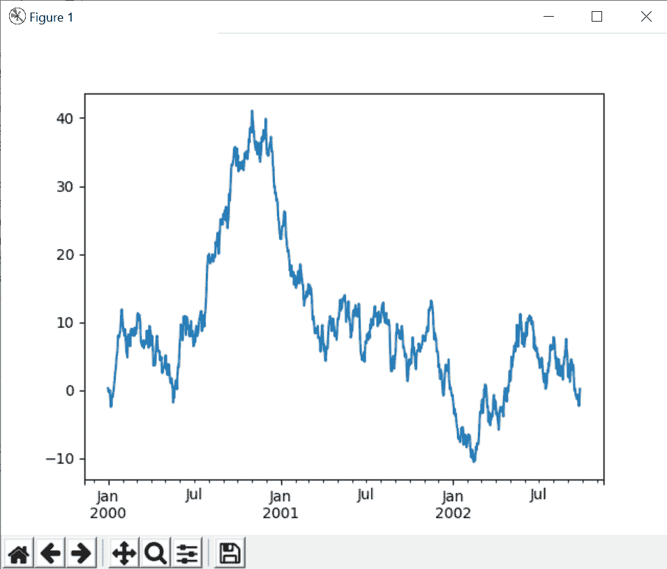
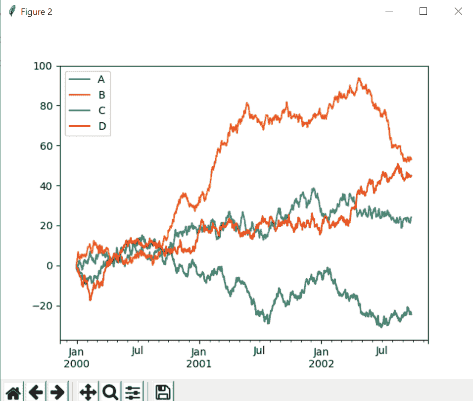
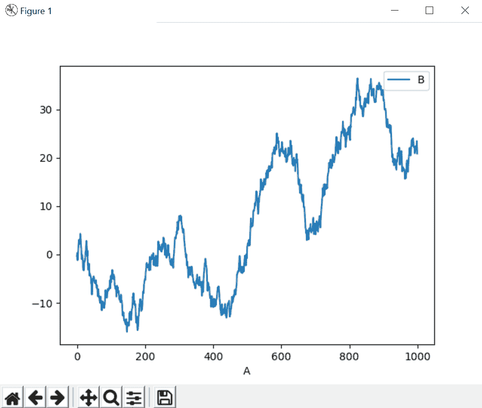
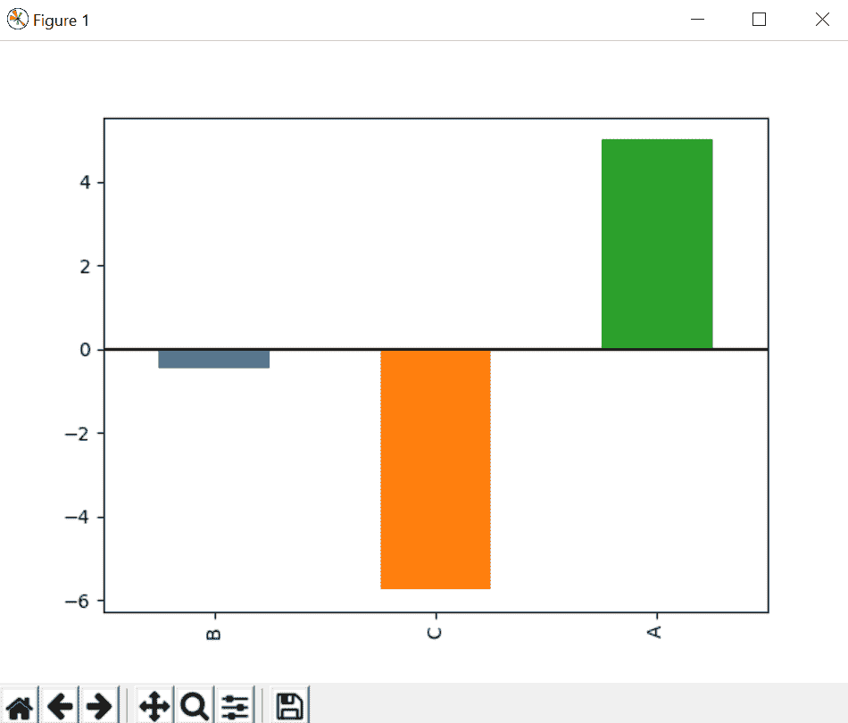
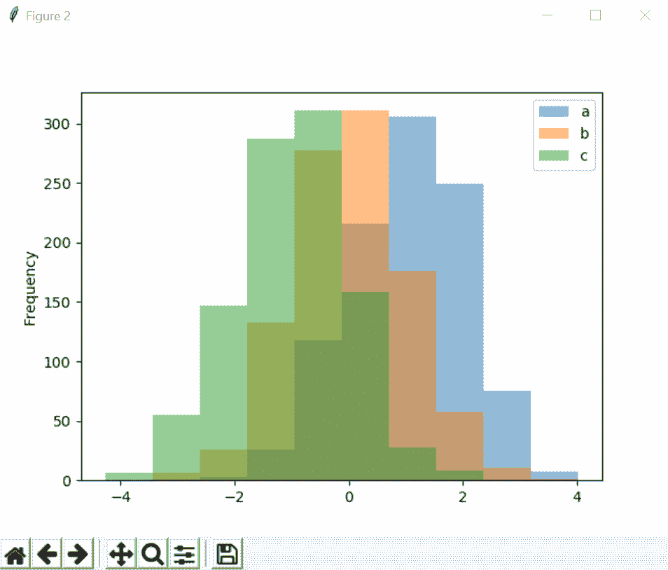
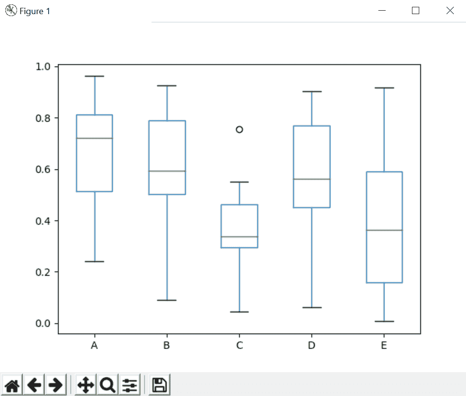

# 使用熊猫和 matplotlib 的不同绘图

> 原文:[https://www . geesforgeks . org/different-标绘-使用-pandas-and-matplotlib/](https://www.geeksforgeeks.org/different-plotting-using-pandas-and-matplotlib/)

matplotlib 库中有不同类型的图，可以帮助我们根据您的需要制作合适的图形。根据给定的数据，我们可以制作很多图表，在熊猫的帮助下，我们可以在绘制数据之前创建一个数据框架。让我们用熊猫来讨论 matplotlib 中不同类型的情节。

使用以下命令安装 matplotlib、pandas 和 numpy:

```py
pip install matplotlib
pip install pandas
pip install numpy 
```

### 地块类型:

*   **基本绘图:**在这个基本绘图中，我们可以使用随机生成的数据，使用数列和 matplotlib 绘制图形。

## 蟒蛇 3

```py
# import libraries
import matplotlib.pyplot as plt
import pandas as pd
import numpy as np

ts = pd.Series(np.random.randn(1000), index = pd.date_range(
                                '1/1/2000', periods = 1000))
ts = ts.cumsum()
ts.plot()

plt.show()
```

**输出:**



*   **不同数据的绘图:**在一个绘图中使用多个数据列表。

## 蟒蛇 3

```py
# importing libraries
import matplotlib.pyplot as plt
import pandas as pd
import numpy as np

ts = pd.Series(np.random.randn(1000), index = pd.date_range(
                                '1/1/2000', periods = 1000))

df = pd.DataFrame(np.random.randn(1000, 4),
   index = ts.index, columns = list('ABCD'))

df = df.cumsum()
plt.figure()
df.plot()
plt.show()
```

**输出:**



*   **在给定轴上绘制:**我们可以明确定义轴的名称，并在此轴的基础上绘制数据。

## 蟒蛇 3

```py
# importing libraries
import matplotlib.pyplot as plt
import pandas as pd
import numpy as np

ts = pd.Series(np.random.randn(1000), index = pd.date_range(
                                '1/1/2000', periods = 1000))

df = pd.DataFrame(np.random.randn(1000, 4), index = ts.index,
                                      columns = list('ABCD'))

df3 = pd.DataFrame(np.random.randn(1000, 2),
               columns =['B', 'C']).cumsum()

df3['A'] = pd.Series(list(range(len(df))))
df3.plot(x ='A', y ='B')
plt.show()
```

**输出:**



*   **使用 matplotlib 绘制条形图:**查找不同类型的条形图，以清楚地了解给定数据的行为。

## 蟒蛇 3

```py
# importing libraries
import matplotlib.pyplot as plt
import pandas as pd
import numpy as np

ts = pd.Series(np.random.randn(1000), index = pd.date_range(
                                '1/1/2000', periods = 1000))

df = pd.DataFrame(np.random.randn(1000, 4), index = ts.index,
                                      columns = list('ABCD'))

df3 = pd.DataFrame(np.random.randn(1000, 2),
               columns =['B', 'C']).cumsum()

df3['A'] = pd.Series(list(range(len(df))))
df3.iloc[5].plot.bar()
plt.axhline(0, color ='k')

plt.show()
```

**输出:**



*   **直方图:**

## 蟒蛇 3

```py
# importing libraries
import matplotlib.pyplot as plt
import pandas as pd
import numpy as np

df4 = pd.DataFrame({'a': np.random.randn(1000) + 1,
                    'b': np.random.randn(1000),
                    'c': np.random.randn(1000) - 1},
                           columns =['a', 'b', 'c'])
plt.figure()

df4.plot.hist(alpha = 0.5)
plt.show()
```

**输出:**



*   **使用 Series 和 matplotlib 绘制方框图:**使用方框图绘制数据框的数据。

## 蟒蛇 3

```py
# importing libraries
import matplotlib.pyplot as plt
import pandas as pd
import numpy as np

df = pd.DataFrame(np.random.rand(10, 5),
      columns =['A', 'B', 'C', 'D', 'E'])

df.plot.box()
plt.show()
```

**输出:**



*   **密度图:**

## 蟒蛇 3

```py
# importing libraries
import matplotlib.pyplot as plt
import pandas as pd
import numpy as np

df = pd.DataFrame(np.random.rand(10, 5),
      columns =['A', 'B', 'C', 'D', 'E'])

ser = pd.Series(np.random.randn(1000))
ser.plot.kde()

plt.show()
```