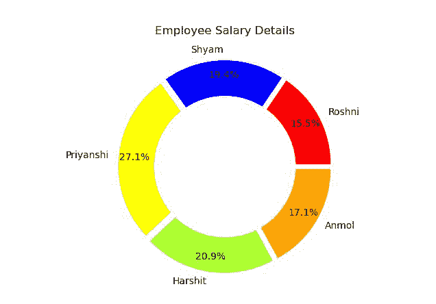
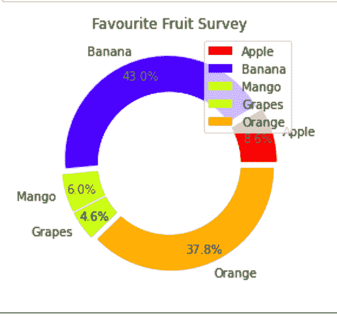
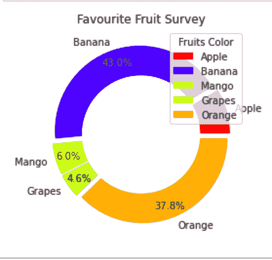

# Python 中使用 Matplotlib 的圆环图

> 原文:[https://www . geesforgeks . org/donut-chart-use-matplotlib-in-python/](https://www.geeksforgeeks.org/donut-chart-using-matplotlib-in-python/)

**前置图:**[**matplotlib 中的饼图**](https://www.geeksforgeeks.org/plot-a-pie-chart-in-python-using-matplotlib/)

圆环图是中间区域被切掉的饼图的修改版本。圆环图更关注使用弧的面积来以最有效的方式表示信息，而不是饼图，饼图更关注比较切片之间的比例面积。甜甜圈图在空间方面更有效，因为甜甜圈图内部的空白空间可以用来显示一些关于甜甜圈图的附加信息。

作为一个圆环图，它必须是一个饼图。如果我们看饼图，我们会关注图表的中心。另一方面，圆环图消除了比较切片大小或面积的需要，并将焦点转移到弧的长度上，这反过来又很容易测量。

## **创建一个简单的圆环图**

创建圆环图包括以下三个简单的步骤:

*   创建饼图
*   画一个合适尺寸的圆。
*   在饼图中心添加圆圈

## 蟒蛇 3

```
import matplotlib.pyplot as plt

# Setting labels for items in Chart
Employee = ['Roshni', 'Shyam', 'Priyanshi',
            'Harshit', 'Anmol']

# Setting size in Chart based on 
# given values
Salary = [40000, 50000, 70000, 54000, 44000]

# colors
colors = ['#FF0000', '#0000FF', '#FFFF00', 
          '#ADFF2F', '#FFA500']
# explosion
explode = (0.05, 0.05, 0.05, 0.05, 0.05)

# Pie Chart
plt.pie(Salary, colors=colors, labels=Employee,
        autopct='%1.1f%%', pctdistance=0.85,
        explode=explode)

# draw circle
centre_circle = plt.Circle((0, 0), 0.70, fc='white')
fig = plt.gcf()

# Adding Circle in Pie chart
fig.gca().add_artist(centre_circle)

# Adding Title of chart
plt.title('Employee Salary Details')

# Displaing Chart
plt.show()
```

**输出:**



## **自定义圆环图**

### **将图例添加到圆环图中**

图形图例通常以方框的形式出现在图形的右侧或左侧。它包含图表上每种颜色的小样本，以及图表中每种颜色含义的简短描述。

要添加图例，我们只需编写以下代码。

```
plt.legend(labels, loc = "upper right") 
```

这里 plt.legend()取两个参数，第一个是标签， **loc** 用来设置图例框的位置。

**示例:**

## 蟒蛇 3

```
import matplotlib.pyplot as plt

# Setting size in Chart based on 
# given values
sizes = [100, 500, 70, 54, 440]

# Setting labels for items in Chart
labels = ['Apple', 'Banana', 'Mango', 'Grapes', 'Orange']

# colors
colors = ['#FF0000', '#0000FF', '#FFFF00', '#ADFF2F', '#FFA500']

# explosion
explode = (0.05, 0.05, 0.05, 0.05, 0.05)

# Pie Chart
plt.pie(sizes, colors=colors, labels=labels,
        autopct='%1.1f%%', pctdistance=0.85, 
        explode=explode)

# draw circle
centre_circle = plt.Circle((0, 0), 0.70, fc='white')
fig = plt.gcf()

# Adding Circle in Pie chart
fig.gca().add_artist(centre_circle)

# Adding Title of chart
plt.title('Favourite Fruit Survey')

# Add Legends
plt.legend(labels, loc="upper right")

# Displaing Chart
plt.show()
```

**输出:**



### **在圆环图中的图例框中添加标题**

我们可以通过编写以下代码来为圆环图中的图例框添加标题:

```
plt.legend(labels, loc = "upper right",title="Fruits Color")
```

**示例:**

## 蟒蛇 3

```
import matplotlib.pyplot as plt

# Setting size in Chart based on 
# given values
sizes = [100, 500, 70, 54, 440]

# Setting labels for items in Chart
labels = ['Apple', 'Banana', 'Mango', 'Grapes',
          'Orange']

# colors
colors = ['#FF0000', '#0000FF', '#FFFF00', '#ADFF2F',
          '#FFA500']

# explosion
explode = (0.05, 0.05, 0.05, 0.05, 0.05)

# Pie Chart
plt.pie(sizes, colors=colors, labels=labels,
        autopct='%1.1f%%', pctdistance=0.85,
        explode=explode)

# draw circle
centre_circle = plt.Circle((0, 0), 0.70, fc='white')
fig = plt.gcf()

# Adding Circle in Pie chart
fig.gca().add_artist(centre_circle)

# Adding Title of chart
plt.title('Favourite Fruit Survey')

# Add Legends
plt.legend(labels, loc="upper right", title="Fruits Color")

# Displaing Chart
plt.show()
```

**输出:**



**例 2:** 考虑另一种情况，你必须准备一份不同学生在一次测试中获得的分数报告，并使用圆环图将他们的表现可视化。为了解决这个问题，我们将使用 python 的 matplotlib 库。这个想法是，我们将列出不同学生的名字和他们各自的分数，并使用这个列表制作一个圆环图。

## 蟒蛇 3

```
# library
import matplotlib.pyplot as plt

# list of name of students
names = ['Manish', 'Atul', 'Priya', 'Harshit']

# list of their respective marks
marks = [45, 66, 55, 77]

# Create a circle at the center of
# the plot
my_circle = plt.Circle((0, 0), 0.7, color='white')

# Give color names
plt.pie(marks, labels=names, autopct='%1.1f%%',
        colors=['red', 'green', 'blue', 'yellow'])

p = plt.gcf()
p.gca().add_artist(my_circle)

# Show the graph
plt.show()
```

**输出:**

