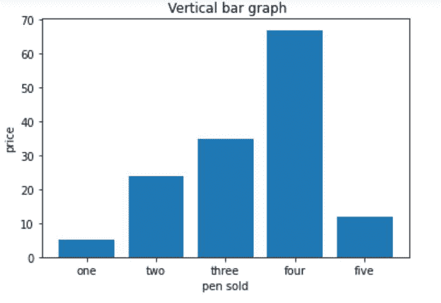

# 用 Matplotlib 绘制横条图

> 原文:[https://www . geesforgeks . org/draw-a-横条图-with-matplotlib/](https://www.geeksforgeeks.org/draw-a-horizontal-bar-chart-with-matplotlib/)

[**Matplotlib**](https://www.geeksforgeeks.org/python-introduction-matplotlib/) 是 python 中创建可视化的标准 Python 库。 [**Pyplot**](https://www.geeksforgeeks.org/pyplot-in-matplotlib/) 是 Matplotlib 库的一个模块，用于绘制图形和图表，也可以在其中进行更改。在本文中，我们将看到如何用 Matplotlib 绘制水平条形图。

### 创建垂直条形图

**进场:**

*   将 matplotlib.pyplot 导入为 plt
*   为 x 轴上的离散值创建列表 x
*   创建仅由 y 轴上离散值的数字数据组成的列表 y
*   调用 plt.bar()函数，参数 x，y 为 **plt.bar(x，y)**
*   设置 x_label()和 y_label()
*   为我们的条形图设置标题()
*   调用 plt.show()来可视化我们的图表

**下面是实现:**

## 蟒蛇 3

```py
import matplotlib.pyplot as plt

x=['one', 'two', 'three', 'four', 'five']

# giving the values against
# each value at x axis
y=[5, 24, 35, 67, 12]
plt.bar(x, y)

# setting x-label as pen sold
plt.xlabel("pen sold")

# setting y_label as price
plt.ylabel("price")  
plt.title(" Vertical bar graph")
plt.show()
```

**输出:**



### **创建水平条形图**

**进场:**

*   将 matplotlib.pyplot 导入为 plt
*   为 y 轴上的离散值创建列表 y
*   创建仅由 x 轴上离散值的数字数据组成的列表 x
*   调用 **plt.barh()** 函数，参数 y，x 为 **plt.barh(y，x)**
*   设置 x_label()和 y_label()
*   为我们的条形图设置标题()
*   调用 plt.show()来可视化我们的图表

**下面是实现:**

## 蟒蛇 3

```py
import matplotlib.pyplot as plt
y=['one', 'two', 'three', 'four', 'five']

# getting values against each value of y
x=[5,24,35,67,12]
plt.barh(y, x)

# setting label of y-axis
plt.ylabel("pen sold")

# setting label of x-axis
plt.xlabel("price")
plt.title("Horizontal bar graph")
plt.show()
```

**输出:**

