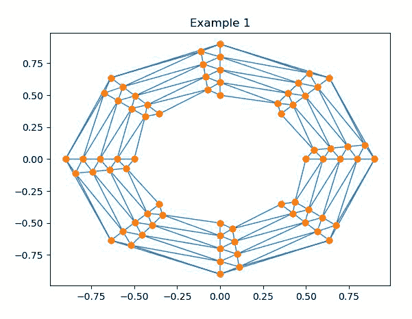
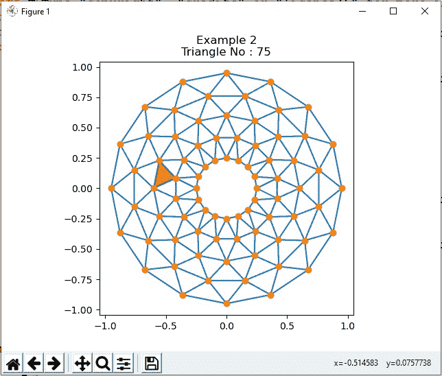
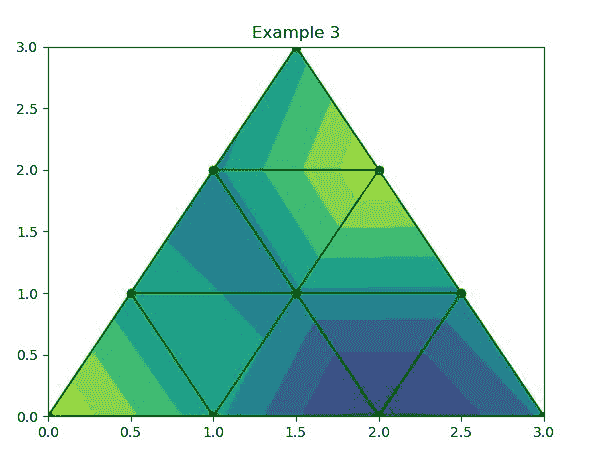

# 使用 Matplotlib

在 Python 中绘制非结构化三角形网格作为线条或标记

> 原文:[https://www . geeksforgeeks . org/draw-a-unstructured-triangle-grid-as-line-or-markers-in-python-using-matplotlib/](https://www.geeksforgeeks.org/draw-a-unstructured-triangular-grid-as-lines-or-markers-in-python-using-matplotlib/)

[**Matplotlib**](https://www.geeksforgeeks.org/python-matplotlib-an-overview/)是 Python 中一个惊人的可视化库，用于 2D 地块的数组。Matplotlib 是一个多平台数据可视化库，构建在 NumPy 数组上，旨在与更广泛的 SciPy 堆栈一起工作。

## 非结构化三角形网格

一个****网格** 可以定义为欧几里得平面或图的一部分，该部分可以 以两个 形状之间没有空格的模式拟合在一起。U 构造的  网格可以是不规则图案的 **三角形** 或**四面体**。 非结构化三角形网格可以使用鲁伯特算法从 不规则形状的多边形中绘制。**

**这里的任务是使用 Matplotlib 在 Python 中绘制一个非结构化的三角形网格作为线和/或标记。为了完成这个任务，你可以使用**三重()函数**，我们需要一些来自***【matplotlib】***和 ***numpy*** 库的模块。**

****示例 1:** 创建和绘制非结构化三角形网格。**

## **蟒蛇 3**

```py
# Importing modules
import matplotlib.pyplot as plt
import matplotlib.tri as tri
import numpy as np

n_angles = 24
n_radii = 9
min_radius = 0.5
radii = np.linspace(min_radius, 0.9,
                    n_radii)

angles = np.linspace(0, 6 * np.pi, n_angles,
                     endpoint=False)

angles = np.repeat(angles[..., np.newaxis],
                   n_radii, axis=1)

angles[:, 1::2] += np.pi / n_angles

x = (radii * np.cos(angles)).flatten()
y = (radii * np.sin(angles)).flatten()
triang = tri.Triangulation(x, y)

triang.set_mask(np.hypot(x[triang.triangles].mean(axis=1),
                         y[triang.triangles].mean(axis=1))
                < min_radius)

plt.triplot(triang, 'o-', lw=1)
plt.title('Example 1')
plt.show()
```

****输出:****

****

****示例 2:** 使用 TriFinder 对象突出显示非结构化三角形网格。**

## **蟒蛇 3**

```py
# Importing modules 
import matplotlib.pyplot as plt
from matplotlib.tri import Triangulation
from matplotlib.patches import Polygon
import numpy as np

def Trigolo1(tri):

    if tri == -1:
        points = [0, 0, 0]

    else:
        points = triang.triangles[tri]

    xs = triang.x[points]
    ys = triang.y[points]
    polygon.set_xy(np.column_stack([xs, ys]))

def Trigolo2(event):

    if event.inaxes is None:
        tri = -1

    else:
        tri = trifinder(event.xdata, event.ydata)

    Trigolo1(tri)
    plt.title('Example 2\nTriangle No : %i' % tri)
    event.canvas.draw()

# Create a Triangulation.
ang = 16
rad = 5
mrad = 0.25
radii = np.linspace(mrad, 0.95, rad)

angletri = np.linspace(0,
                       2 * np.pi, ang, 
                       endpoint=False)

angletri = np.repeat(angletri[..., np.newaxis], 
                     rad,
                     axis=1)

angletri[:, 1::2] += np.pi / ang

x = (radii*np.cos(angletri)).flatten()
y = (radii*np.sin(angletri)).flatten()

triang = Triangulation(x, y)
triang.set_mask(np.hypot(x[triang.triangles].mean(axis=1),
                         y[triang.triangles].mean(axis=1))
                < mrad)

# Use the triangulation's default TriFinder object.
trifinder = triang.get_trifinder()

# Setup plot and callbacks.
plt.subplot(111, aspect='equal')
plt.triplot(triang, 'o-')
polygon = Polygon([[0, 0], [0, 0]], facecolor='y')
Trigolo1(-1)
plt.gca().add_patch(polygon)
plt.gcf().canvas.mpl_connect('motion_notify_event', Trigolo2)

plt.show()
```

****输出:****

****

****示例 3:** 显示三角测量图的示例。**

## **蟒蛇 3**

```py
import matplotlib.pyplot as plt 
import matplotlib.tri as mtri 
import numpy as np 

# Create triangulation. 
x = np.asarray([0, 1, 2, 
                3, 0.5, 1.5, 
                2.5, 1, 2,
                1.5]) 

y = np.asarray([0, 0, 0, 
                0, 1.0, 1.0,
                1.0, 2, 2,
                3.0]) 

triangles = [[0, 1, 4], [1, 2, 5],  
             [2, 3, 6], [1, 5, 4],  
             [2, 6, 5], [4, 5, 7], 
             [5, 6, 8], [5, 8, 7], 
             [7, 8, 9]] 

triang = mtri.Triangulation(x, y, triangles) 
z = np.cos(1.5 * x) * np.cos(1.5 * y) 

plt.tricontourf(triang, z) 
plt.triplot(triang, 'go-') 

plt.title('Example 3') 

plt.show()
```

****输出:****

****