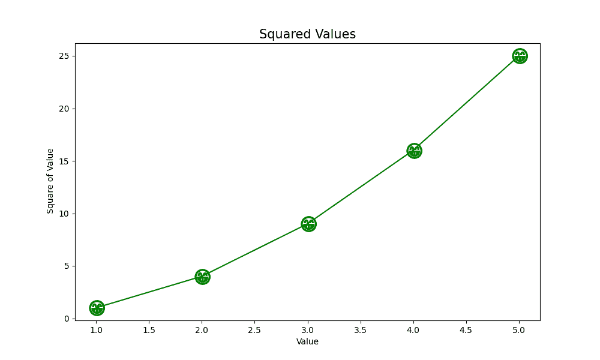
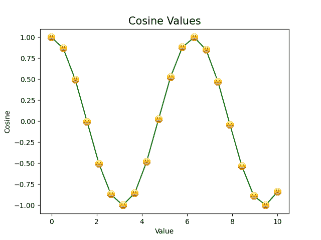

# 表情符号作为 Matplotlib 中的标记

> 原文:[https://www . geesforgeks . org/emo jis-as-markers-in-matplotlib/](https://www.geeksforgeeks.org/emojis-as-markers-in-matplotlib/)

**先决条件:**T2【马特洛特利

当我们绘制图表时，通常需要突出某些点并明确显示它们。这使得我们的演示更加精确和丰富。这可以通过使用标记来实现。Matplotlib 中的[标记](https://www.geeksforgeeks.org/how-to-add-markers-to-a-graph-plot-in-matplotlib-with-python/)是强调绘制的每个点的一种方式。它们只不过是“标绘点”，可用于曲线图、散点图等。有不同的颜色、形状和大小。我们将看到如何在图形中使用表情符号作为标记，而不是使用传统的标记。

我们将讨论以下两种用于添加表情符号作为标记的方法:

1.  使用 Unicode 字符
2.  在注释框中使用偏移图像

## **使用 Unicode 字符**

Unicode 是对文本、数字等进行一致编码和处理的标准。我们也可以通过 Unicode 字符来表示表情符号。例如，露齿而笑的脸可以通过 U+1F600 来表示。Unicode 可以通过不同的字符编码来实现，如 UTF-8、UTF-16 和 UTF-32。在这个例子中，我们使用 UTF-8 编码系统。

**进场:**

在下面给出的例子中，我们在图上画出给定数字列表的平方值。 *x_values* 是从 1 到 5 的数字列表， *y_values* 是由列表 *x_values 中每个数字的平方值组成的另一个列表。*

1.  matplotlib 库 pyplot 模块中的**matplotlib . py plot . subplots()**函数用于创建一个图形和一组 subplot。虽然它需要许多参数，但为了简单起见，我们只指定图形大小。它返回一个元组**(图，ax)** ，给出一个带有一组轴 *ax* 的单个图形*图*。
2.  **ax.plot()** 获取 x 和 y 值、标记、标记大小(毫秒)和颜色(c)的列表。请注意，在指定标记时，在 Unicode 字符的前后有一个 ***美元($)*** **符号。人们可以很容易地找到他们想要的表情符号的 Unicode 字符。**
3.  最后，使用 **ax.set()** ，我们设置标题、x 和 y 标签。
4.  **plt.show()** 在屏幕上显示图形。

**示例:**

## 蟒蛇 3

```py
# importing matplotlib module
import matplotlib.pyplot as plt

# defining a list of x and v values
x_values = [1, 2, 3, 4, 5]
y_values = [x*x for x in x_values]

# plotting the graph
fig, ax = plt.subplots(figsize=(10, 6))

# check that the marker value is given as
# '$U0001F601{content}apos;
ax.plot(x_values, y_values, marker='$\U0001F601{content}apos;, ms=20, c='green')
ax.set_title('Squared Values', fontsize=15)
ax.set_xlabel('Value')
ax.set_ylabel('Square of Value')
plt.show()
```

**输出:**



## 在注释框中使用偏移图像

在绘制图形时，经常使用带文本的点注释。但是，我们也可以使用图像来注释这些点。任何*表情图像*都可以使用 OffsetImage 和 AnnotationbBox 作为注释。在下面给出的例子中，我们已经在图上画出了余弦值。表情符号被用作每个点的标记。

#### 方法:

1.  像前面的例子一样，我们导入所有必要的库。
2.  **np.linspace()** 返回指定间隔内均匀分布的数字。它需要参数:*开始值、结束值*、*T5】和*T7*我们想要的值的总数*。这里我们得到 20 个介于 0 和 10 之间的值。**
3.  **np.cos()** 返回所有 x _ 值的余弦值。
4.  使用 **plt.imread()** ，将表情图像从文件读入数组。它采用*文件名*作为参数。
5.  通过 **matplotlib.offsetbox()** ，我们将我们的表情图像设置为 *offsetImage* 。获取的参数包括*图像*和*缩放*值。将缩放值设置为常数可确保即使图形被放大，表情符号的大小也保持不变。
6.  **np .至少 _1d()** 将提供的输入转换为至少一维的数组。传递 x 和 y 值会返回由它们的所有值组成的数组。
7.  **zip()** 函数迭代 x 和 y 值。我们遍历 x 的每个值及其对应的 y 值，并创建一个注释框。**注解 Bbox()** 函数取偏移框(*我们创建的 image_box* )和 *(x，y)* 值，在此绘制表情符号。保留*框*值*为假*，去掉表情符号周围的方框。
8.  [**Add _ artist()**](https://www.geeksforgeeks.org/matplotlib-axes-axes-add_artist-in-python/)**方法占用我们创建的注释框(ab)，然后返回这个添加的 artist。**
9.  **最后，我们使用 **ax.plot()** 绘制图表，并将颜色设置为绿色。**
10.  ****plt.show()** 在屏幕上显示图形。**

****示例:****

## **蟒蛇 3**

```py
# importing all important libraries
import matplotlib.pyplot as plt
from matplotlib.offsetbox import OffsetImage, AnnotationBbox
import numpy as np

# plotting the graph
fig, ax = plt.subplots()

x = np.linspace(0, 10, 20)
y = np.cos(x)
ax.set_title('Cosine Values', fontsize=15)
ax.set_xlabel('Value')
ax.set_ylabel('Cosine')

# reading the image
image = plt.imread('emoji.png')

# OffsetBox
image_box = OffsetImage(image, zoom=0.1)

# creating annotation for each point
# on the graph
x, y = np.atleast_1d(x, y)

# for each value of (x,y), we create
# an annotation
for x0, y0 in zip(x, y):
    ab = AnnotationBbox(image_box, (x0, y0), frameon=False)
    ax.add_artist(ab)

ax.plot(x,y, c='green')
plt.show()
```

****输出:****

****