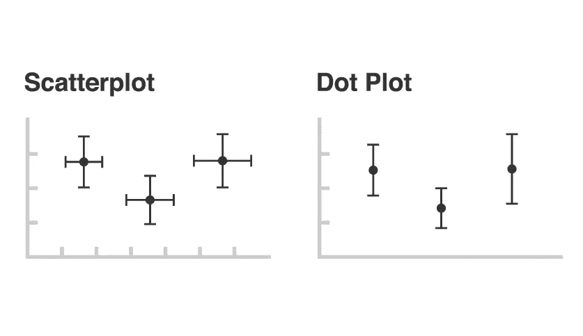
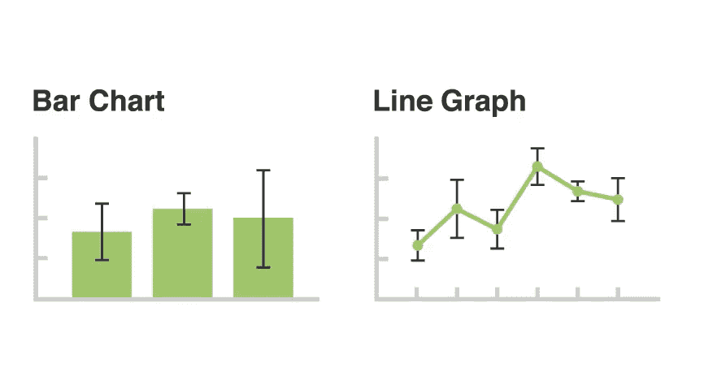
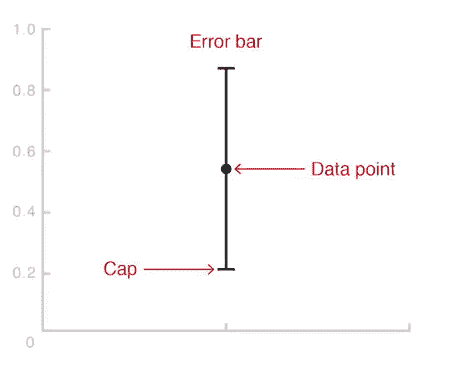
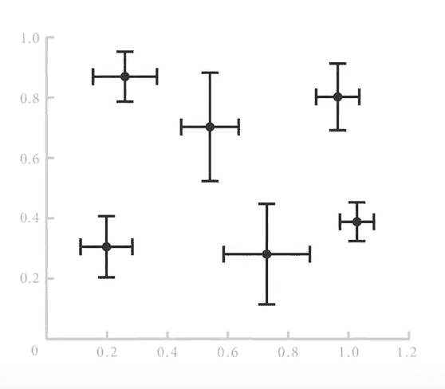
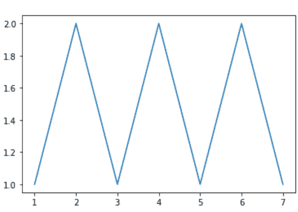
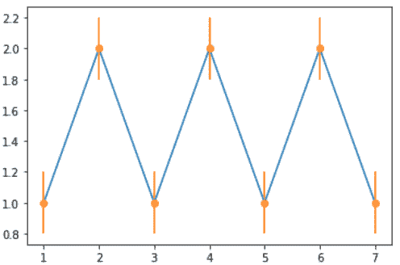
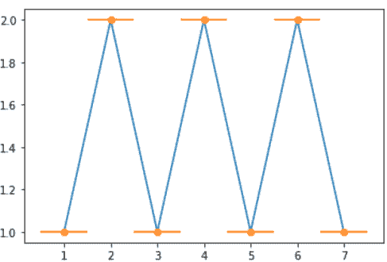
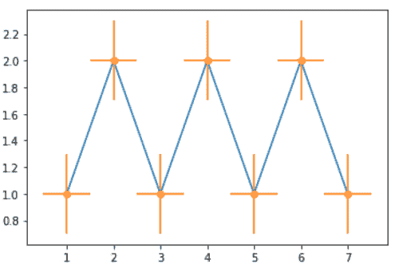
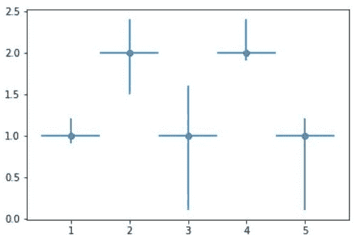
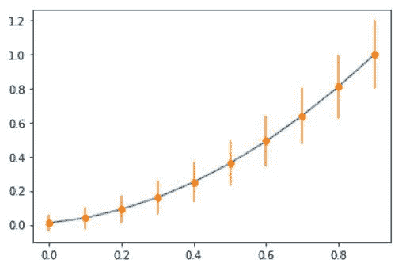

# 使用 Matplotlib 的 Python 中的误差条形图

> 原文:[https://www . geesforgeks . org/error bar-graph-in-python-using-matplotlib/](https://www.geeksforgeeks.org/errorbar-graph-in-python-using-matplotlib/)

误差线用作图形增强功能，可在笛卡尔图上可视化绘制数据的可变性。误差线可以应用于图表，为呈现的数据提供额外的细节层。如下图所示。

 

误差条有助于您指示估计误差或不确定性，从而大致了解测量的精度。这是通过在原始图形及其数据点上绘制标记来实现的。为了可视化这些信息，误差线的工作原理是用条形图绘制从绘制的数据点中心或边缘延伸的线。误差线的长度有助于揭示数据点的不确定性，如下图所示。短误差线表示数值集中，表明绘制的平均值更有可能，而长误差线表示数值更分散，不太可靠。也取决于数据的类型。每对误差线的长度在两边都是相等的，但是，如果数据是倾斜的，那么每一边的长度都是不平衡的。



误差线总是平行于一定数量的刻度轴，因此如果有两个刻度，它们可以垂直或水平显示，这取决于定量刻度是在 y 轴还是 x 轴上，并且两对箭头线可以用于两个轴。



让我们看一个 errorbar 如何工作的例子。

**创建简单图形。**

## 蟒蛇 3

```
# importing matplotlib
import matplotlib.pyplot as plt

# making a simple plot
x =[1, 2, 3, 4, 5, 6, 7]
y =[1, 2, 1, 2, 1, 2, 1]

# ploting graph
plt.plot(x, y)
```

**输出:**



**例 1:** 在 y 值中加入一些误差。

## 蟒蛇 3

```
# importing matplotlib
import matplotlib.pyplot as plt

# making a simple plot
x =[1, 2, 3, 4, 5, 6, 7]
y =[1, 2, 1, 2, 1, 2, 1]

# creating error
y_error = 0.2

# ploting graph
plt.plot(x, y)

plt.errorbar(x, y,
             yerr = y_error,
             fmt ='o')
```

**输出:**



**例 2:** 在 x 值中添加一些错误。

## 蟒蛇 3

```
# importing matplotlib
import matplotlib.pyplot as plt

# making a simple plot
x =[1, 2, 3, 4, 5, 6, 7]
y =[1, 2, 1, 2, 1, 2, 1]

# creating error
x_error = 0.5

# ploting graph
plt.plot(x, y)
plt.errorbar(x, y,
             xerr = x_error,
             fmt ='o')
```

**输出:**



**例 3:**x&y 相加错误

## 蟒蛇 3

```
# importing matplotlib
import matplotlib.pyplot as plt

# making a simple plot
x =[1, 2, 3, 4, 5, 6, 7]
y =[1, 2, 1, 2, 1, 2, 1]

# creating error
x_error = 0.5
y_error = 0.3

# ploting graph
plt.plot(x, y)
plt.errorbar(x, y,
             yerr = y_error,
             xerr = x_error,
             fmt ='o')
```

**输出:**



**示例 4:** 在 x 和 y 方向添加变量误差

## 蟒蛇 3

```
# importing matplotlib
import matplotlib.pyplot as plt

# making a simple plot
x =[1, 2, 3, 4, 5]
y =[1, 2, 1, 2, 1]

# creating error
y_errormin =[0.1, 0.5, 0.9,
             0.1, 0.9]
y_errormax =[0.2, 0.4, 0.6,
             0.4, 0.2]

x_error = 0.5
y_error =[y_errormin, y_errormax]

# ploting graph
# plt.plot(x, y)
plt.errorbar(x, y,
             yerr = y_error,
             xerr = x_error,
             fmt ='o')
```

**输出:**



**例 5:**

## 蟒蛇 3

```
# import require modules
import numpy as np
import matplotlib.pyplot as plt

# defining our function
x = np.arange(10)/10
y = (x + 0.1)**2

# defining our error
y_error = np.linspace(0.05, 0.2, 10)

# ploting our function and
# error bar
plt.plot(x, y)

plt.errorbar(x, y, yerr = y_error, fmt ='o')
```

**输出:**

