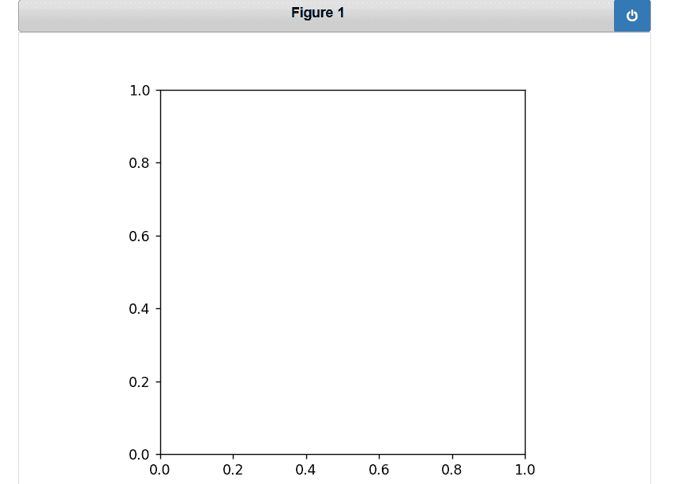
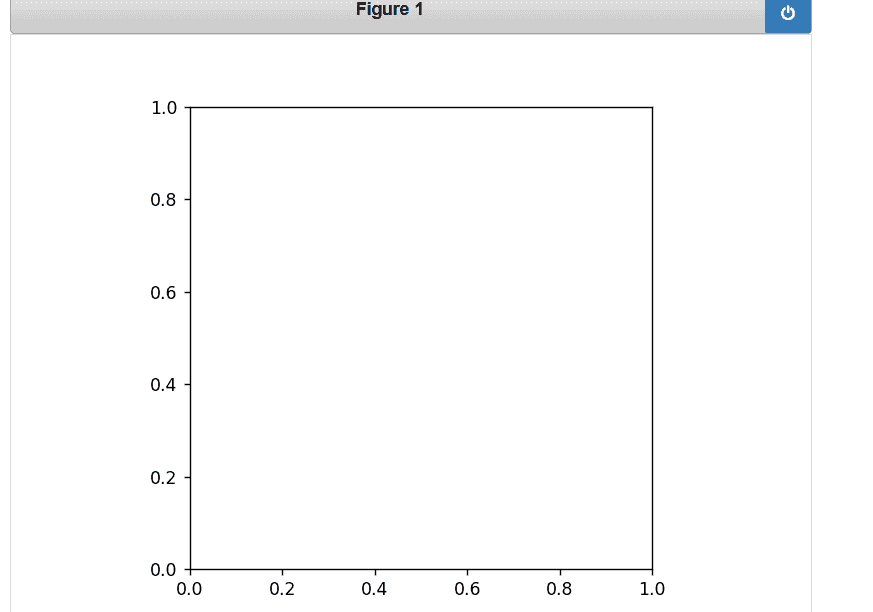

# Matplotlib 中的事件处理

> 原文:[https://www.geeksforgeeks.org/event-handling-in-matplotlib/](https://www.geeksforgeeks.org/event-handling-in-matplotlib/)

**基于事件的系统**通常是一组循环模式的一部分。通常，它们包括以下内容:

*   即将到来的事件
*   用于响应事件的机制
*   循环结构(例如 while 循环、侦听器和消息调度机制)

触发的事件也更加丰富，包括事件发生在哪个轴等信息。事件还理解 Matplotlib 坐标系，并以像素和数据坐标报告事件位置。

**语法:**

> 图. canvas.mpl_connect( Event_name，回调函数或方法)

**参数:**

*   **事件名称:**可以是下表中的任何一个
*   **回调 _ 函数:**将定义处理事件。

## 事件列表

<figure class="table">

| 

#### Event name

 | 

#### Class

 | 

#### Description

 |
| --- | --- | --- |
| 按钮 _ 按压 _ 事件 | 老鼠事件 | 鼠标按钮被按下 |
| 按钮 _ 释放 _ 事件 | 老鼠事件 | 鼠标按钮被释放 |
| 绘图事件 | 拖动事件 | 出现画布绘制 |
| 按键事件 | KeyEvent(密钥事件) | 一个键被按下 |
| 键 _ 释放 _ 事件 | KeyEvent(密钥事件) | 钥匙被释放 |
| 运动 _ 通知 _ 事件 | 老鼠事件 | 鼠标的运动 |
| 挑选事件 | PickEvent | 画布中的对象被选中 |
| 调整大小事件 | 调整事件大小 | 图形画布会调整大小 |
| 滚动事件 | 老鼠事件 | 鼠标的滚轮滚动 |
| 图 _ 输入 _ 事件 | LocationEvent | 鼠标进入一个图形 |
| axes_enter_event | LocationEvent | 鼠标进入轴对象 |
| axes_leave_event | LocationEvent | 鼠标离开一个轴对象 |
| 图 _ 离开 _ 事件 | LocationEvent | 老鼠留下了一个身影 |

</figure>

**注意**:类是在 matplotlib .后端 _ bases 中定义的

## 鼠标事件

*   **按钮按压事件:**该事件涉及鼠标按钮按压
*   **button_release_event:** 此事件涉及鼠标按钮的释放
*   **scroll_event:** 该事件涉及鼠标的滚动
*   **motion_notify_event:** 此事件涉及与鼠标移动相关的通知

**示例:**

我们使用了 mpl_connect 方法，如果您想在绘图的同时提供自定义的用户交互功能，则必须调用该方法。该方法将采用两个参数:

*   事件的字符串值，可以是上表的“事件名称”列中列出的任何值
*   回调函数或方法

## 蟒蛇 3

```py
# importing the necessary modules
from IPython.display import Image
import matplotlib.pyplot as plt
import matplotlib as mpl
import numpy as np
import time
import sys
import random
import matplotlib
matplotlib.use('nbagg')

class MouseEvent:

    # initialization
    def __init__(self):
        (figure, axes) = plt.subplots()
        axes.set_aspect(1)
        figure.canvas.mpl_connect('button_press_event', self.press)
        figure.canvas.mpl_connect('button_release_event', self.release)

    # start event to show the plot
    def start(self):
        plt.show()  # display the plot

    # press event will keep the starting time when u 
    # press mouse button
    def press(self, event):
        self.start_time = time.time()

    # release event will keep the track when you release
    # mouse button
    def release(self, event):
        self.end_time = time.time()
        self.draw_click(event)

    # drawing the plot
    def draw_click(self, event):
        # size = square (4 * duration of the time button 
        # is keep pressed )
        size = 4 * (self.end_time - self.start_time) ** 2

        # create a point of size=0.002 where mouse button 
        # clicked on the plot
        c1 = plt.Circle([event.xdata, event.ydata], 0.002,)

        # create a circle of radius 0.02*size
        c2 = plt.Circle([event.xdata, event.ydata], 0.02 * size, alpha=0.2)
        event.canvas.figure.gca().add_artist(c1)
        event.canvas.figure.gca().add_artist(c2)
        event.canvas.figure.show()

cbs = MouseEvent()

# start the event
cbs.start()
```

**输出:**



**例 2:**

我们将使用 draw_click 方法添加颜色

## 蟒蛇 3

```py
def draw_click(self, event):

    # you can specified your own color list
    col = ['magneta', 'lavender', 'salmon', 'yellow', 'orange']
    cn = random.randint(0, 5)

    # size = square (4 * duration of the time button 
    # is keep pressed )
    size = 4 * (self.end_time - self.start_time) ** 2

    # create a point of size=0.002 where mouse button 
    # clicked on the plot
    c1 = plt.Circle([event.xdata, event.ydata], 0.002,)

    # create a circle of radius 0.02*size
    c2 = plt.Circle([event.xdata, event.ydata], 0.02 *
                    size, alpha=0.2, color=col[cn])
    event.canvas.figure.gca().add_artist(c1)
    event.canvas.figure.gca().add_artist(c2)
    event.canvas.figure.show()
```

**输出:**

