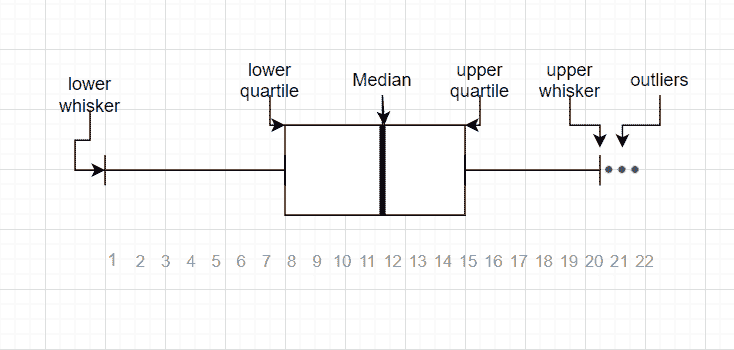
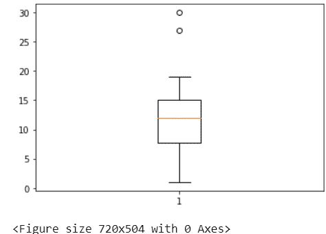

# 从 Matplotlib 中找到离群点

> 原文:[https://www . geeksforgeeks . org/从 matplotlib 中找出异常点/](https://www.geeksforgeeks.org/finding-the-outlier-points-from-matplotlib/)

**异常值**是指与其他观测值不同的数据点或与其他数据相距一定距离的数据点。它们主要是由于一些*实验误差*产生的，这可能会导致统计分析中的一些问题。而在大数据集中，很明显一些数据会离样本均值更远。这些异常值需要被发现并明智地处理。

必要时我们可以使用**方框图**。



上面是创建的箱线图，用于显示数据值的汇总及其*中值、第一个四分位数、* *第三个四分位数、最小值和最大值*。下胡须和上胡须的数据点是异常值。在晶须的第一个和第三个四分点之间是*四分点之间的区域*，在该区域上方有一条被称为中值的垂直线通过。更多细节请参考博客[使用 python 的方块图](https://www.geeksforgeeks.org/box-plot-in-python-using-matplotlib/)。以下是从箱线图中查找异常值的方法:

```py
1.Visualizing through matplotlib boxplot using *plt.boxplot().*
2.Using 1.5 IQR rule.
```

**示例:**

## 蟒蛇 3

```py
# Adding libraries
import numpy as np
import pandas as pd
import matplotlib.pyplot as plt

# random integers between 1 to 20
arr = np.random.randint(1, 20, size=30)

# two outliers taken
arr1 = np.append(arr, [27, 30])

print('Thus the array becomes{}'.format(arr1))
```

**输出:**

> 数组([4，12，15，7，13，2，12，11，10，12，15，5，9，16，17，2，10，15，4，16，14，19，12，8，13，3，16，10，1，13，27，30])

**使用 plt.boxplot()通过 matplotlib boxplot 可视化**

## 蟒蛇 3

```py
plt.boxplot(arr1)
fig = plt.figure(figsize =(10, 7))
plt.show()
```

**输出:**



所以从上图中，我们可以看到这两个异常值。

**1.5 IQR 规则**

1.5IQR 规则中的步骤:-

*   寻找中位数、四分位数和四分位数间的区域
*   计算第一个四分位数以下的 1.5*IQR，并检查低异常值。
*   计算第三个四分位数以上的 1.5*IQR，并检查异常值。

## 计算机编程语言

```py
# finding the 1st quartile
q1 = np.quantile(arr1, 0.25)

# finding the 3rd quartile
q3 = np.quantile(arr1, 0.75)
med = np.median(arr1)

# finding the iqr region
iqr = q3-q1

# finding upper and lower whiskers
upper_bound = q3+(1.5*iqr)
lower_bound = q1-(1.5*iqr)
print(iqr, upper_bound, lower_bound)
```