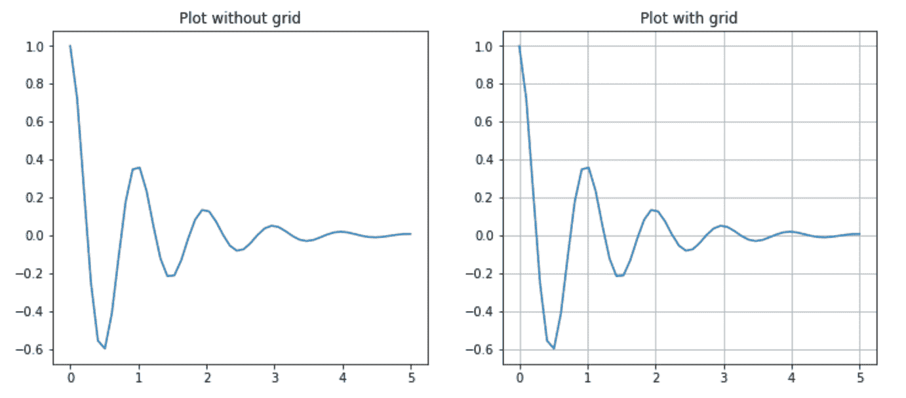
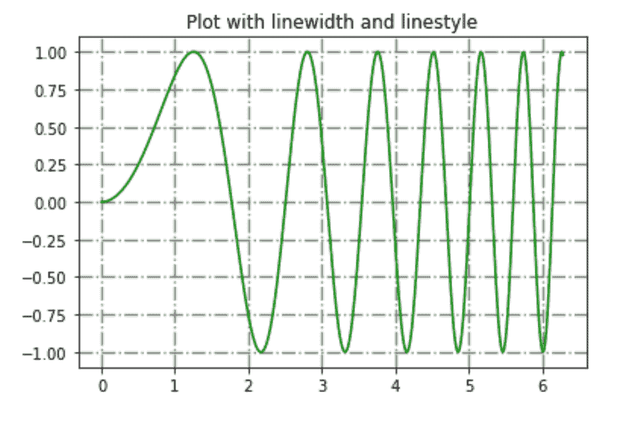

# Matplotlib 中的网格

> 原文:[https://www.geeksforgeeks.org/grids-in-matplotlib/](https://www.geeksforgeeks.org/grids-in-matplotlib/)

网格由相交的直线(垂直的、水平的和有角度的)或曲线组成，用来组织我们的内容。Matplotlib 帮助我们绘制简单的图形，但有时需要使用网格来更好地理解和获取数据点的参考。因此，Matplotlib 提供了一个`grid()`来轻松创建带有大量定制的网格线。

## matplotlib.pyplot.grid（）

> **语法:**matplotlib . pyplot . grid(b = None，其中='major '，axis='both '，**kwargs)
> 
> **参数:**
> **b:** bool 值指定是否显示网格线。默认值为真
> **，即:**应用更改的网格线。值:{ '主要'，'次要'，'两者' }
> **轴:**应用更改的轴。值:{'both '，' x '，' y'}
> ****kwargs:** 可选行属性
> 
> **返回:**这个函数不返回任何东西。

`grid()`通过指定布尔值(真/假)来设置网格的可见性。我们还可以选择显示次要或主要刻度，或者两者都显示。此外，颜色、线宽和线型可以作为附加参数进行更改。让我们看一些例子:

**示例#1:**

```py
# Implementation of matplotlib function
import matplotlib.pyplot as plt
import numpy as np

# dummy data
x1 = np.linspace(0.0, 5.0)
y1 = np.cos(2 * np.pi * x1) * np.exp(-x1)

# creates two subplots
fig, (ax1, ax2) = plt.subplots(1, 2, figsize = (12, 5))

# Plot without grid
ax1.plot(x1, y1)
ax1.set_title('Plot without grid')

# plot with grid
ax2.plot(x1, y1)
ax2.set_title("Plot with grid")

# draw gridlines
ax2.grid(True)

plt.show()
```

**输出:**


**示例#2:**
现在让我们使用额外的线条属性(如颜色、线型和线宽)绘制网格线。

```py
# Implementation of matplotlib function
import matplotlib.pyplot as plt
import numpy as np

# dummy data
x = np.linspace(0, 2 * np.pi, 400)
y = np.sin(x ** 2)

# set graph color
plt.plot(x, y, 'green')

# to set title
plt.title("Plot with linewidth and linestyle")

# draws gridlines of grey color using given 
# linewidth and linestyle
plt.grid(True, color = "grey", linewidth = "1.4", linestyle = "-.")

plt.show()
```

**输出:**
