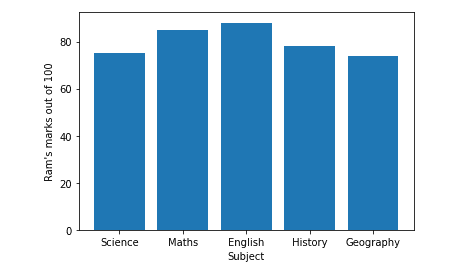
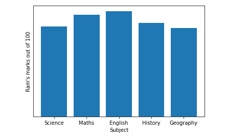

# 隐藏 Matplotlib 中的轴、边框和空白

> 原文:[https://www . geesforgeks . org/hide-axis-borders-and-white-spaces-in-matplotlib/](https://www.geeksforgeeks.org/hide-axis-borders-and-white-spaces-in-matplotlib/)

当我们使用 Matplotlib 绘制图时，也会沿着 x 轴和 y 轴绘制记号和标签。为了画出有创意的图形，很多时候我们会隐藏 x 轴和 y 轴。

## **如何在**[**matplotlib**](https://www.geeksforgeeks.org/python-introduction-matplotlib/)**图中隐藏轴？**

**matplotlib . pyplot . axis(' off ')**命令用于隐藏 matplotlib 图形中的轴(两个 x 轴& y 轴)。

**示例:**

让我们考虑下图，其中我们必须隐藏轴。

## 蟒蛇 3

```py
# code
import numpy as np
import matplotlib.pyplot as plt

# Marks of RAM in different subjects out of 100.
x = ['Science', 'Maths', 'English', 'History', 'Geography']
y = [75, 85, 88, 78, 74]

plt.bar(x, y)
plt.xlabel("Subject")
plt.ylabel("Ram's marks out of 100")
plt.show()
```

**输出:**



**示例:**

隐藏上图中的轴。

## 蟒蛇 3

```py
# code
import numpy as np
import matplotlib.pyplot as plt

# Marks of RAM in different subjects out of 100.
x = ['Science', 'Maths', 'English', 'History', 'Geography']
y = [75, 85, 88, 78, 74]

plt.xlabel("Subject")
plt.ylabel("Ram's marks out of 100")
plt.bar(x, y)
plt.axis('off')  # command for hiding the axis.

plt.show()
```

**输出:**


如果只是想关闭 X 轴或者 Y 轴，可以分别使用****PLT . xtpicks()或者 plt.yticks( )** 方法。**

****示例:****

**隐藏 Y 轴**

## **蟒蛇 3**

```py
# Hiding Y-axis label
import numpy as np
import matplotlib.pyplot as plt

# Marks of RAM in different subjects out of 100.
x = ['Science', 'Maths', 'English', 'History', 'Geography']
y = [75, 85, 88, 78, 74]

plt.bar(x, y)
plt.xlabel("Subject")
plt.ylabel("Ram's marks out of 100")
plt.yticks([])  # Command for hiding y-axis

plt.show()
```

****输出:****

****

****示例:****

**隐藏 X 轴**

## **蟒蛇 3**

```py
# Hiding X-axis
import numpy as np
import matplotlib.pyplot as plt

# Marks of RAM in different subjects out of 100.
x = ['Science', 'Maths', 'English', 'History', 'Geography']
y = [75, 85, 88, 78, 74]

plt.bar(x, y)
plt.xlabel("Subject")
plt.ylabel("Ram's marks out of 100")
plt.xticks([])  # Command for hiding x-axis

plt.show()
```