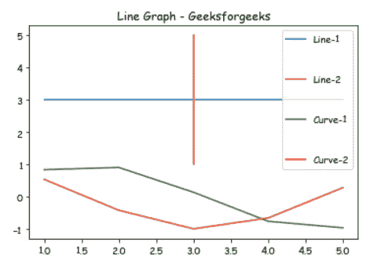
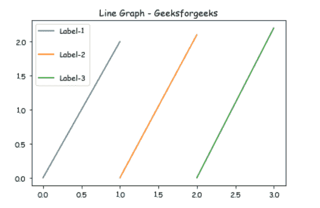

# 如何改变 Matplotlib 中图例条目之间的垂直间距？

> 原文:[https://www . geeksforgeeks . org/how-change-the-vertical-space-in-matplotlib/](https://www.geeksforgeeks.org/how-change-the-vertical-spacing-between-legend-entries-in-matplotlib/)

**先决条件:**T2【马特洛特利

在这篇文章中，我们将看到如何使用 matplotlib 改变图表中图例标签之间的垂直间距，这里我们将举两个不同的例子来展示我们的图表。

**进场:**

*   导入所需模块。
*   创建数据。
*   更改标签之间的垂直间距。
*   通常绘制数据。
*   显示图。

**实施:**

**例 1:**

在本例中，我们将借助 matplotlib 绘制不同的线条，并使用**标签间距参数**至 **plt.legend()** 来更改标签之间的垂直间距。

## 蟒蛇 3

```py
# importing package
import matplotlib.pyplot as plt
import numpy as np

# create data
X = [1, 2, 3, 4, 5]
Y = [3, 3, 3, 3, 3]

# plot lines
plt.plot(X, Y, label = "Line-1")
plt.plot(Y, X, label = "Line-2")
plt.plot(X, np.sin(X), label = "Curve-1")
plt.plot(X, np.cos(X), label = "Curve-2")

# Change the label spacing here
plt.legend(labelspacing = 3)
plt.title("Line Graph - Geeksforgeeks")

plt.show()
```

**输出:**



**例 2:**

在本例中，我们将在 matplotlib 的帮助下绘制一条垂直线，并使用 labelspacing 参数来更改标签之间的垂直间距。

## 蟒蛇 3

```py
# importing package
import matplotlib.pyplot as plt

#Create data and plot lines.
plt.plot([0, 1], [0, 2.0], label = 'Label-1')
plt.plot([1, 2], [0, 2.1], label = 'Label-2')
plt.plot([2, 3], [0, 2.2], label = 'Label-3')

# Change the label spacing here
plt.legend(labelspacing = 2)
plt.title("Line Graph - Geeksforgeeks")

plt.show()
```

**输出:**

