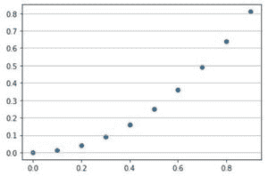
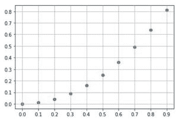
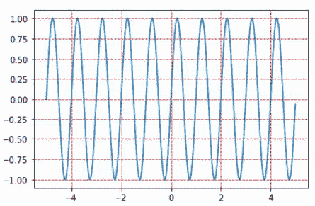

# 如何在 Matplotlib 中给图形添加网格？

> 原文:[https://www . geesforgeks . org/如何在 matplotlib 中添加网格图/](https://www.geeksforgeeks.org/how-to-add-a-grid-on-a-figure-in-matplotlib/)

[Matplotlib](https://www.geeksforgeeks.org/python-introduction-matplotlib/) 库广泛用于绘制图形。在许多图表中，我们需要有网格来提高可读性。使用 [pyplot](https://www.geeksforgeeks.org/pyplot-in-matplotlib/) 子库中的 grid()函数创建网格。

**网格():**配置网格线。

> **语法:**
> 
> matplotlib.pyplot.grid(b=None，其中='major '，axis='both '，**kwargs)
> 
> **参数:**
> 
> *   **b** :布尔或无，是否显示网格线的可选参数。
> *   **其中** : { '大调'，'小调'，'两者' }，可选。它指定要应用更改的网格线。
> *   **轴** : {'both '，' x '，' y'}，可选。要应用更改的轴。
> *   ****kwargs** :可选。指定线条属性，如颜色、线条样式、线条宽度等。

**步骤:**

*   绘制图表
*   使用 pyplot.grid()方法指定网格。

**例 1:**

## 蟒蛇 3

```
import matplotlib.pyplot as plt
import numpy

# Define x and y
x = numpy.arange(0, 1, 0.1)
y = numpy.power(x, 2)

# Plot graph
plt.scatter(x, y)

# Define grid with axis='y'
plt.grid(axis='y')
plt.show()

# Define a figure
fig = plt.figure()
ax = fig.gca()

# Set labels on x and y axis of figure
ax.set_xticks(numpy.arange(0, 1, 0.1))
ax.set_yticks(numpy.arange(0, 1, 0.1))

# Plot the graph
ax.scatter(x, y)

# Specify default grid on figure
ax.grid()
ax.show()
```

**输出:**

 

**例 2:**

## 蟒蛇 3

```
import matplotlib.pyplot as plt
import numpy as np

# Define x and y
x = np.arange(-5, 5, 0.01)
y = np.sin(2*np.pi*x)

# Plot line graph
plt.plot(x, y)

# Specify grid with line attributes
plt.grid(color='r', linestyle='--')

# Display the plot
plt.show()
```

**输出:**

