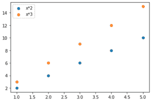
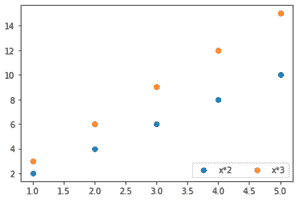
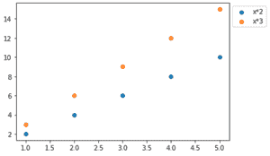
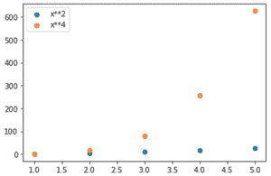

# 如何在 Matplotlib 中为散点图添加图例？

> 原文:[https://www . geesforgeks . org/如何将图例添加到散点图中 matplotlib/](https://www.geeksforgeeks.org/how-to-add-a-legend-to-a-scatter-plot-in-matplotlib/)

在本文中，我们将使用 *matplotlib* 模块为所描绘的图像添加一个图例。我们将使用[*matplotlib . pyplot . legend()*](https://www.geeksforgeeks.org/matplotlib-pyplot-legend-in-python/)方法来描述和标记图形的元素，并区分同一图形中的不同图形。

> **语法:***matplotlib . pyplot . legend([“Title _ 1”、“Title _ 2”]，ncol = 1，loc =“左上角”，bbox_to_anchor =(1，1) )*
> 
> **参数:**
> 
> *   **ncol:** 【取 int，可选参数】默认值为 1。它表示图例中的列数。
> *   **loc:** 【取字符串，可选参数】默认值为“最佳”，即“左上”。它表示图例的位置。其他选项可以是:“最佳”、“右上”、“左上”、“左下”、“右下”、“右下”、“中左”、“中右”、“中下”、“中上”、“中上”。
> *   **bbox_to_anchor:** 【取一个 2 int/float 的列表或元组，可选参数】。它代表图形上图例的坐标。x 和 y 坐标都必须给出。

**例 1:**

## 蟒蛇 3

```py
# import required modules
import matplotlib.pyplot as plt

# adjust coordinates
x =  [1,2,3,4,5]
y1 = [2,4,6,8,10]
y2 = [3,6,9,12,15]

# depict illustration
plt.scatter(x, y1)
plt.scatter(x,y2)

# apply legend()
plt.legend(["x*2" , "x*3"])
plt.show()
```

**输出:**



**例 2:**

## 蟒蛇 3

```py
# impoert required modules
import matplotlib.pyplot as plt

# adjust coordinates
x =  [1,2,3,4,5]
y1 = [2,4,6,8,10]
y2 = [3,6,9,12,15]

# depict illustration
plt.scatter(x, y1)
plt.scatter(x,y2)

# apply legend()
plt.legend(["x*2" , "x*3"], ncol = 2 , loc = "lower right")
plt.show()
```

**输出:**



**例 3:**

## 蟒蛇 3

```py
# import required modules
import matplotlib.pyplot as plt

# adjust coordinates
x =  [1,2,3,4,5]
y1 = [2,4,6,8,10]
y2 = [3,6,9,12,15]

# depict illustration
plt.scatter(x, y1)
plt.scatter(x,y2)

# apply legend()
plt.legend(["x*2" , "x*3"], bbox_to_anchor = (1 , 1))
plt.show()
```

**输出:**



**注意:**我们可以使用参数在 *matplotlib.pyplot .散点图()中标记地块的元素。然而，要显示它*必须写 matplotlib.pyplot.legend()* 。*

**例 4:**

## 蟒蛇 3

```py
# import required modules
import matplotlib.pyplot as plt
import numpy as np

# assign coordinates
x = np.arange(1, 6)
y1 = x**2
y2 = x**4

# depict illustration
plt.scatter(x, y1, label="x**2")
plt.scatter(x, y2, label="x**4")

# apply legend()
plt.legend()
plt.show()
```

**输出:**



**注意:**如果*不是用代码写的，那么标签就不会显示。*