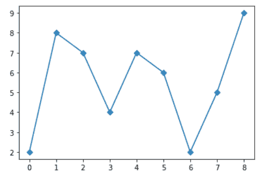
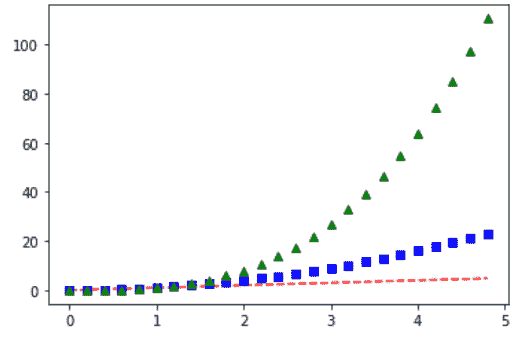
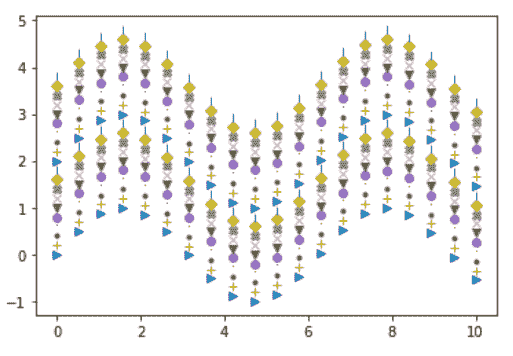

# 如何用 Python 在 Matplotlib 中给图形图添加标记？

> 原文:[https://www . geeksforgeeks . org/如何用 python 将标记添加到图形中绘图/](https://www.geeksforgeeks.org/how-to-add-markers-to-a-graph-plot-in-matplotlib-with-python/)

**先决条件:**T2【马特洛特利

在本文中，我们将学习如何用 Python 在 Matplotlib 中向图形图添加标记。为此，请看一些我们将在工作中使用的概念。

*   [**Matplotlib**](https://www.geeksforgeeks.org/python-introduction-matplotlib/)**:**Matplotlib 是一个巨大的 Python 可视化库，用于数组的 2D 图。Matplotlib 可能是一个多平台数据可视化库，构建在 NumPy 数组上，旨在与更广泛的 SciPy 堆栈一起工作。它是由约翰·亨特在 2002 年推出的。
*   [**曲线图**](https://www.geeksforgeeks.org/graph-plotting-in-python-set-1/) **:** 曲线图是一种表示数据集的图形技术，通常表现为显示两个或多个变量之间关系的曲线图。
*   **标记:**标记以不同的形状和颜色显示在图形中，以修改图形的含义。

### 方法

要生成具有修改的标记样式的图形，需要遵循以下步骤:

1.  导入包
2.  导入或创建一些数据
3.  画一个曲线图。
4.  使用标记功能设置标记。

**例 1:**

## 蟒蛇 3

```py
# importing packages
import matplotlib.pyplot as plt

# plot with marker
plt.plot([2, 8, 7, 4, 7, 6, 2, 5, 9], marker='D')
plt.show()
```

**输出:**



**例 2 :**

## 蟒蛇 3

```py
# importing packages
import matplotlib.pyplot as plt

# create data
t = np.arange(0., 5., 0.2)

# plot with marker
plt.plot(t, t, 'r--', t, t**2, 'bs', t, t**3, 'g^')
plt.show()
```

**输出:**



**例 3 :**

## 蟒蛇 3

```py
# importing packages
import matplotlib.pyplot as plt
import numpy as np

# create data
x_values = np.linspace(0, 10, 20)
y_values = np.sin(x_values)
markers = ['>', '+', '.', ',', 'o', 'v', 'x', 'X', 'D', '|']

# apply markers
for i in range(20):
    plt.plot(x_values, y_values + i*0.2, markers[i % 10])
plt.show()
```

**输出:**

