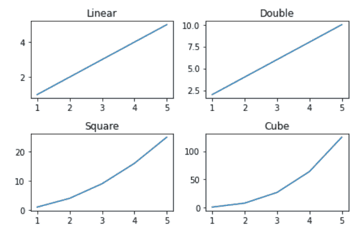

# 如何在 Matplotlib 中给支线剧情添加标题？

> 原文:[https://www . geesforgeks . org/如何将标题添加到 matplotlib 中的子情节/](https://www.geeksforgeeks.org/how-to-add-title-to-subplots-in-matplotlib/)

在本文中，我们将看到如何在 Matplotlib 中为支线剧情添加标题？让我们讨论一些概念:

*   **Matplotlib :** Matplotlib 是 Python 中一个惊人的可视化库，用于数组的 2D 图。Matplotlib 是一个多平台数据可视化库，构建在 NumPy 数组上，旨在与更广泛的 SciPy 堆栈一起工作。它是由约翰·亨特在 2002 年推出的。
*   **支线剧情:**matplotlib 库 pyplot 模块中的支线剧情()函数用于创建一个人物和一组支线剧情。当我们想在同一个图中显示两个或更多的情节时，需要支线剧情。
*   **图的标题:**matplotlib 模块中的 Title()方法用于指定所描绘的可视化的标题，并使用各种属性显示标题。

### 所需步骤

*   导入库
*   创建/加载数据
*   制作支线剧情
*   剧情支线剧情
*   给支线剧情设置标题。

**例 1:(使用 set_title()方法)**

我们使用 matplotlib.axes._axes。方法为当前子图设置标题(字符串标签)。

## 蟒蛇 3

```py
# importing packages
import numpy as np
import matplotlib.pyplot as plt

# create data
x=np.array([1, 2, 3, 4, 5])

# making subplots
fig, ax = plt.subplots(2, 2)

# set data with subplots and plot
ax[0, 0].plot(x, x)
ax[0, 1].plot(x, x*2)
ax[1, 0].plot(x, x*x)
ax[1, 1].plot(x, x*x*x)

# set the title to subplots
ax[0, 0].set_title("Linear")
ax[0, 1].set_title("Double")
ax[1, 0].set_title("Square")
ax[1, 1].set_title("Cube")

# set spacing
fig.tight_layout()
plt.show()
```

**输出:**



**示例 2:(使用 title.set_text()方法)**

我们也可以在 Matplotlib 中使用 title.set_text()方法给子剧情添加标题，类似于 set_title()方法。

## 蟒蛇 3

```py
# importing packages
import numpy as np
import matplotlib.pyplot as plt

# create data
x=np.array([1, 2, 3, 4, 5])

# making subplots
fig, ax = plt.subplots(2, 2)

# set data with subplots and plot
ax[0, 0].plot(x, x)
ax[0, 1].plot(x, x*2)
ax[1, 0].plot(x, x*x)
ax[1, 1].plot(x, x*x*x)

# set the title to subplots
ax[0, 0].title.set_text("Linear")
ax[0, 1].title.set_text("Double")
ax[1, 0].title.set_text("Square")
ax[1, 1].title.set_text("Cube")

# set spacing
fig.tight_layout()
plt.show()
```

**输出:**


**实施例 3:(使用 plt.gca()。set_title()方法)**

如果在交互式绘图中使用类似于 Matlab 的样式，那么可以使用 plt.gca()获取子图当前轴的引用，并结合 set_title()方法在 Matplotlib 中为子图设置标题。

## 蟒蛇 3

```py
# importing packages
import numpy as np
import matplotlib.pyplot as plt

# create data
x=np.array([1, 2, 3, 4, 5])

# making subplots
fig, ax = plt.subplots(2, 2)

# set data with subplots and plot
title = ["Linear", "Double", "Square", "Cube"]
y = [x, x*2, x*x, x*x*x]

for i in range(4):

    # subplots
    plt.subplot(2, 2, i+1) 

    # ploting (x,y)
    plt.plot(x, y[i]) 

    # set the title to subplots
    plt.gca().set_title(title[i]) 

# set spacing
fig.tight_layout()
plt.show()
```

**输出:**


**例 4:(使用 plt.gca().title.set_text()方法)**

如果在交互式绘图中使用类似于 Matlab 的样式，那么可以使用 plt.gca()获取子图当前轴的引用，并结合 title.set_text()方法在 Matplotlib 中为子图设置标题。

## 蟒蛇 3

```py
# importing packages
import numpy as np
import matplotlib.pyplot as plt

# create data
x=np.array([1, 2, 3, 4, 5])

# making subplots
fig, ax = plt.subplots(2, 2)

# set data with subplots and plot
title = ["Linear","Double","Square","Cube"]
y = [x, x*2, x*x, x*x*x]

for i in range(4):

    # subplots
    plt.subplot(2, 2, i+1)

    # ploting (x,y)
    plt.plot(x, y[i])

    # set the title to subplots
    plt.gca().title.set_text(title[i]) 

# set spacing
fig.tight_layout()
plt.show()
```

**输出:**

