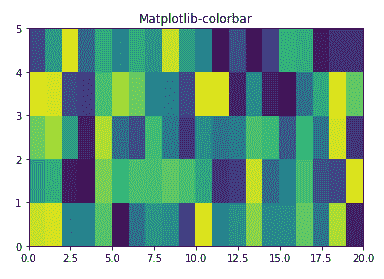
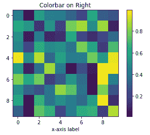
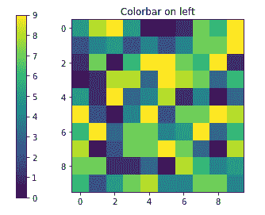
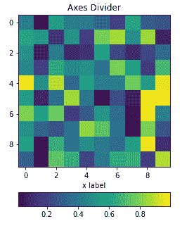
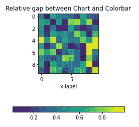
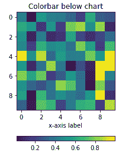
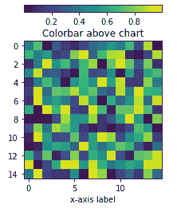

# 如何调整 Matplotlib 颜色条的位置？

> 原文:[https://www . geeksforgeeks . org/如何调整 matplotlib-colorbar/](https://www.geeksforgeeks.org/how-to-adjust-the-position-of-a-matplotlib-colorbar/)

一个**颜色条**是一个有各种颜色的条，沿着****Matplotlib 图表的边放置。**是图表中显示的颜色图例。默认情况下，Matplotlib 颜色条的位置在右侧。通过使用 **Matplotlib AxesGrid 工具包中的功能，可以根据我们的选择改变 Matplotlib 颜色条的位置。**嵌入轴的放置类似于图例，通过提供关于父框的位置选项来修改位置。**

> ****语法:** fig.colorbar(cm。ScalarMappable(norm=norm，cmap=cmap)，ax=ax)**

<figure class="table">

| **属性** | **描述** |
| --- | --- |
| **cax** | 将绘制颜色条的轴。 |
| ax | 新彩条轴的空间被盗的父轴。如果给定了轴的列表，它们将被调整大小，以便为 colorbar 轴腾出空间。 |
| 着色 | 使用 **set_label** 将标签设置到颜色条 |
| 垫 | 彩色条和新图像轴之间原始轴的相对子图间隙或分数 |
| **日志规范** | 将数字参数或颜色转换为 RGBA |
| **菲格兹** | 二元浮点数组。图尺寸(宽度、高度)单位为英寸 |
| **添加 _ 子剧情** | 将轴添加到图形中，作为子图排列的一部分 |
| **添加 _ 轴** | 呈现在 matplotlib 库的图形模块中，用于向图形添加轴 |
| im how | 图像处理中使用的惯例:原点在左上角。 |
| **pcolor** | 用不规则的矩形网格创建伪彩色图。 |

</figure>

### **Matplotlib colorbar 安装**

**要直接安装 matplotlib colorbar，请在 Jupyter 笔记本或 Visual Studio Code 上执行以下命令以获取结果，Matplotlib-colorbar 包是为了使用 colorbar 参数生成而安装的。这里 **matplotlib.pyplot** 用于以更简单的方式创建一个 colorbar。**

```
pip install matplotlib-colorbar
```

**

Matplotlib Colorbar 安装** 

**使用 matplotlib 创建 colorbar 的另一种方法是导入 Matplotlib 包，然后创建 colorbar。**

## **蟒蛇 3**

```
# Implementation of matplotlib function
import matplotlib.pyplot as plt
import numpy as np
from matplotlib.colors import LogNorm

# specify dimensions of colorbar using random module
Z = np.random.rand(5, 20)

fig, ax0 = plt.subplots()
ax0.pcolor(Z)

ax0.set_title('Matplotlib-colorbar')
plt.show()
```

****输出:****

****

****示例 1:** 右侧 Matplotlib 颜色条的位置**

**生成 matplotlib 图表，其中颜色条位于图表的右侧。**

## **蟒蛇 3**

```
# Import packages necessary to create colorbar
import numpy as np
import matplotlib.pyplot as plt
from mpl_toolkits.axes_grid1 import make_axes_locatable

# make this example reproducible
np.random.seed(2)

#create chart
fig, ax = plt.subplots()
im = ax.imshow(np.random.rand(10,10))
ax.set_xlabel('x-axis label')

#add color bar
fig.colorbar(im)

plt.show()
```

****输出:****

****

****例 2:** 左侧 Matplotlib 颜色条的位置**

**生成 Matplotlib 图表，其中颜色条位于图表的左侧。这里，**轴位置**是手动设置的**，颜色条使用关键字“位置”链接到现有的绘图轴。**位置参数**用于颜色条**引用列表**中的多个轴，如果您将一个轴放在列表中，则此处可以使用该参数。****

## ****蟒蛇 3****

```
**#import matplotlib.pyplot to create chart
import matplotlib.pyplot as plt
import numpy as np

#create subplot
fig = plt.figure()
ax = fig.add_subplot(111)
axp = ax.imshow(np.random.randint(0, 10,( 10, 10)))
ax.set_title('Colorbar on left')

#adding colorbar and its position
cb = plt.colorbar(axp ,ax = [ax], location = 'left')
plt.show()**
```

******输出:******

********

****这是一种生成彩条并确保它位于自己的轴上的简单方法。然后使用**“CAX”参数**指定彩条的位置，其中为要绘制的彩条给出了轴。****

## ****蟒蛇 3****

```
**import numpy as np
import matplotlib.pyplot as plt
from mpl_toolkits.axes_grid1 import make_axes_locatable

# make this example reproducible
np.random.seed(1)

# create chart
fig = plt.figure()
ax = fig.add_subplot(111)
axp = ax.imshow(np.random.randint(0, 10, (10, 10)))
ax.set_title('Colorbar on left')

# Adding the colorbar
cbaxes = fig.add_axes([0.1, 0.1, 0.03, 0.8]) 

# position for the colorbar
cb = plt.colorbar(axp, cax = cbaxes)
plt.show()**
```

******输出:******

********

******示例 3:**Matplotlib 颜色条在图表下方的位置****

****要定位，请单击图表下方的 Matplotlib 颜色条，然后执行以下命令:****

## ****蟒蛇 3****

```
**import numpy as np
import matplotlib.pyplot as plt
from mpl_toolkits.axes_grid1 import make_axes_locatable

# make this reproducible
np.random.seed(2)

# create chart
fig, ax = plt.subplots()
im = ax.imshow(np.random.rand(10,10))
ax.set_xlabel('x-axis label')

# add color bar below chart
divider = make_axes_locatable(ax)
cax = divider.new_vertical(size='5%', pad=0.6, pack_start = True)
fig.add_axes(cax)
fig.colorbar(im, cax = cax, orientation = 'horizontal')

plt.show()**
```

******输出:****** 

********

******填充参数**在图表的 x 轴和颜色条之间创建填充。**高于**垫**的值，**彩条远离**x 轴。要相对于子图移动颜色条，使用 pad 参数**图颜色条********

## **蟒蛇 3**

```
# import matplotlib packages
import matplotlib.pyplot as plt
import numpy as np; np.random.seed(1)

# create chart
fig, ax = plt.subplots(figsize=(4,4))
im = ax.imshow(np.random.rand(11,16))
ax.set_xlabel("x label")

# pad argument to set colorbar away from x-axis
fig.colorbar(im, orientation="horizontal", pad = 0.4)
plt.show()
```

****输出:****

****

**使用**make _ axes _ located**实例来划分轴并创建与图像图对齐的新轴。 **Pad** 参数将允许在两个轴之间设置空间:**

## **蟒蛇 3**

```
# import matplotlib packages
import matplotlib.pyplot as plt
from mpl_toolkits.axes_grid1 import make_axes_locatable
import numpy as np; np.random.seed(1)

fig, ax = plt.subplots(figsize = (4,4))
im = ax.imshow(np.random.rand(11,16))
ax.set_xlabel("x label")

# instance is used to divide axes
divider = make_axes_locatable(ax)
cax = divider.new_vertical(size = "5%",
                           pad = 0.7,
                           pack_start = True)
fig.add_axes(cax)

# creating colorbar
fig.colorbar(im, cax = cax, orientation = "horizontal")

plt.show()
```

****输出:****

****

****示例 4:** 图表上方颜色条的位置**

**要定位，请单击图表下方的 Matplotlib 颜色条，然后执行以下命令:**

## **蟒蛇 3**

```
import numpy as np
import matplotlib.pyplot as plt
from mpl_toolkits.axes_grid1 import make_axes_locatable

# make this example reproducible
np.random.seed(1)

# create chart
fig, ax = plt.subplots()
im = ax.imshow(np.random.rand(15, 15))
ax.set_xlabel('x-axis label')
ax.set_title('Colorbar above chart')

# add color bar below chart
divider = make_axes_locatable(ax)
cax = divider.new_vertical(size = '5%', pad = 0.5)
fig.add_axes(cax)
fig.colorbar(im, cax = cax, orientation = 'horizontal')

plt.show()
```

****输出:**** 

****