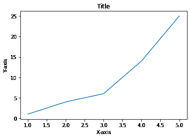
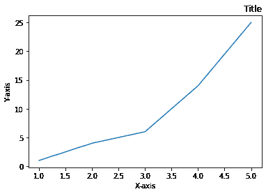
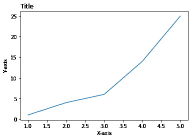
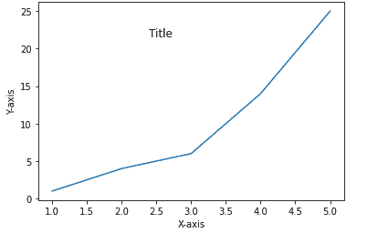
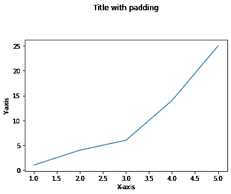

# 如何在 Matplotlib 中调整标题位置？

> 原文:[https://www . geesforgeks . org/如何调整-title-in-matplotlib/](https://www.geeksforgeeks.org/how-to-adjust-title-position-in-matplotlib/)

在本文中，您将学习如何在 Python 中修改 matplotlib 中的 Title 位置。

## **方法一:使用** [**功能**](https://www.geeksforgeeks.org/matplotlib-pyplot-title-in-python/)

matplotlib 模块中的 title()方法用于指定所描绘的可视化的标题，并使用各种属性显示标题。

> **语法:**
> 
> matplotlib.pyplot.title(label，fontdict=None，loc='center '，pad=None，**kwargs)

**例 1:**

在这个例子中，我们将看看如何给一个标题，Matplotlib 提供了一个函数 title()，用于给地块一个标题。

## 蟒蛇 3

```
#import matplotlib
import matplotlib.pyplot as plt

# Points to mark
plt.plot([1, 2, 3, 4, 5], [1, 4, 6, 14, 25])

# X label
plt.xlabel('X-axis')

# Y label
plt.ylabel('Y-axis')

# Title
plt.title('Title')
```

**输出:**



默认情况下，TitleTitle 位于中间；改变它们非常简单。

**例 2:**

在这个例子中，我们使用 matplotlib.pyplot.Title()函数，通过将参数初始化为 right，在图的右边放置了一个 title。

## 蟒蛇 3

```
#import matplotlib
import matplotlib.pyplot as plt

# Points to mark
plt.plot([1, 2, 3, 4, 5], [1, 4, 6, 14, 25])

# X label
plt.xlabel('X-axis')

# Y label
plt.ylabel('Y-axis')

# Title
plt.title('Title', loc='right')
```

**输出:**



正确

**例 3:**

在这个例子中，我们使用 matplotlib.pyplot.Title()函数，通过将参数初始化为 left，在图的左边放置了一个 title。

## 蟒蛇 3

```
#import matplotlib
import matplotlib.pyplot as plt

# Points to mark
plt.plot([1, 2, 3, 4, 5], [1, 4, 6, 14, 25])

# X label
plt.xlabel('X-axis')

# Y label
plt.ylabel('Y-axis')

# Title
plt.title('Title', loc='left')
```

**输出:**



## **方法二:用 x、y 坐标改变标题位置**

在这种方法中，我们将标题放在情节中。我们不在“loc”参数中给出位置，而是使用 X 和 Y 坐标给出它应该放置的确切位置。

**语法:**

```
 matplotlib.pyplot.title('Title', x=value, y=value)
```

**示例:**

在这个例子中，我们将在 python 编程语言中的标题位置分配 x 和 y 的值。

## 蟒蛇 3

```
#import matplotlib
import matplotlib.pyplot as plt

# Points to mark
plt.plot([1, 2, 3, 4, 5], [1, 4, 6, 14, 25])

# X label
plt.xlabel('X-axis')

# Y label
plt.ylabel('Y-axis')

# Title
plt.title('Title', x=0.4, y=0.8)
```

**输出:**



## **方法三:用 pad 参数改变标题位置**

在这个方法中，我们将使用 title()函数的 pad 参数来更改 python 编程语言中给定图中的标题位置。

**语法:**

```
matplotlib.pyplot.title('Title', pad=value)
```

**示例:**

在本例中，我们将使用“pad”参数提升标题。标题相对于坐标轴顶部的偏移量，以磅为单位。默认值为无。

## 蟒蛇 3

```
#import matplotlib
import matplotlib.pyplot as plt

# Points to mark
plt.plot([1, 2, 3, 4, 5], [1, 4, 6, 14, 25])

# X label
plt.xlabel('X-axis')

# Y label
plt.ylabel('Y-axis')

# Title with pad
plt.title('Title', pad=50)
```

**输出:**

