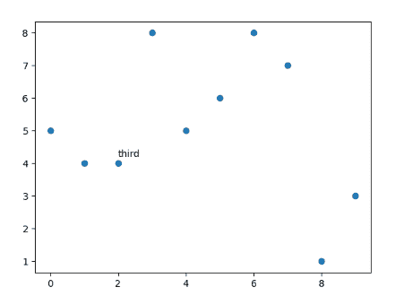
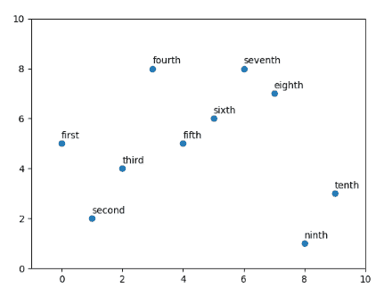

# 如何标注 Matplotlib 散点图？

> 原文:[https://www . geeksforgeeks . org/如何注释-matplotlib-散点图/](https://www.geeksforgeeks.org/how-to-annotate-matplotlib-scatter-plots/)

散点图使用点来表示两个不同数值变量的值。在 Python 中，我们有一个 matplotlib 库，其中有一个名为散点图的函数，可以帮助我们创建散点图。在这里，我们将使用 matplotlib.pyplot .散点()方法来绘制。

> **语法:** matplotlib.pyplot.scatter(x，y)
> 
> **参数:**
> 
> *   x 和 y 是浮点值，是创建散点图的必要参数
> *   标记:标记样式，默认:rcParams["散点.标记"](默认:' o ')
> *   cmap : cmapstr 或 Colormap，默认:rcParams["image.cmap"](默认:' viridis ')
> *   线宽:浮点或类似数组，默认值:rcParams[" line . line width "](默认值:1.5)
> *   alpha:浮动，默认:无→表示透明度

matplotlib 的注释意味着我们想要在散点旁边放置一段文本。根据我们需要注释的点的数量，可能有两种情况:

1.  单点注释
2.  所有点注释

### 单点注释

在单点注释中，我们可以使用 matplotlib.pyplot.text，并提到散点的 x 坐标和 y 坐标+一些因子，这样文本就可以从图中清晰可见，然后我们必须提到文本。

> **语法:** matplotlib.pyplot.text( x，y，s)
> 
> **参数:**
> 
> *   x，y:标量—放置文本的位置。默认情况下，这是在数据坐标中。可以使用变换参数更改坐标系。
> *   字符串—文本。
> *   字体大小—这是一个可选参数，用于设置要显示的字体大小。

**进场:**

1.  导入库。
2.  创建数据。
3.  制作散点图。
4.  应用 plt.text()方法。

**实施:**

## 蟒蛇 3

```py
# Importing libraries
import matplotlib.pyplot as plt

# Preparing dataset
x = [x for x in range(10)]
y = [5, 4, 4, 8, 5, 6, 8, 7, 1, 3]

# plotting scatter plot
plt.scatter(x, y)

# annotation of the third point
plt.text(2,4.2,"third")
plt.show()
```

**输出:**



### 所有点注释

如果我们想要注释散点图中的所有点，那么 matplotlib.pyplot 有一个内置的函数注释，它获取点的文本、x 和 y 坐标。

> **语法：** matplotlib.pyplot.annotate（ text， xy ）
> 
> **参数:**
> 
> *   文本:字符串—注释的文本。s 是此参数的弃用同义词。
> *   xy:(浮点，浮点)-要注释的点(x，y)。坐标系由 xy 坐标决定。

**进场:**

1.  导入库。
2.  创建数据。
3.  按照要显示的点的顺序，将所有注释存储在列表中。
4.  画散点图。
5.  使用 for 循环注释每个点。

**实施:**

## 蟒蛇 3

```py
# Importing libraries
import matplotlib.pyplot as plt

# Preparing dataset
x = [x for x in range(10)]
y = [5, 2, 4, 8, 5, 6, 8, 7, 1, 3]
text = ["first", "second", "third", "fourth", "fifth",
        "sixth", "seventh", "eighth", "ninth", "tenth"]

# plotting scatter plot
plt.scatter(x, y)

# Loop for annotation of all points
for i in range(len(x)):
    plt.annotate(text[i], (x[i], y[i] + 0.2))

# adjusting the scale of the axes
plt.xlim((-1, 10))
plt.ylim((0, 10))
plt.show()
```

**输出:**
