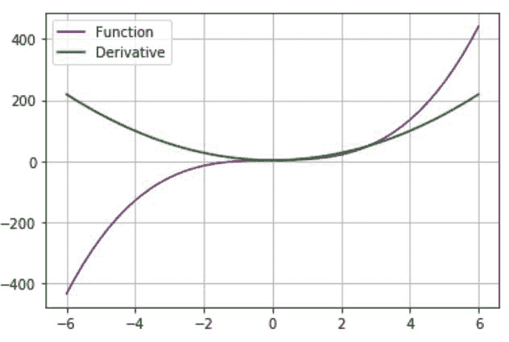
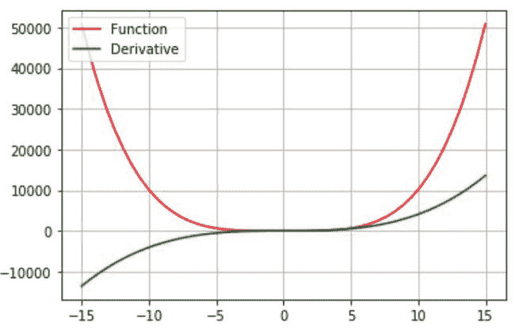
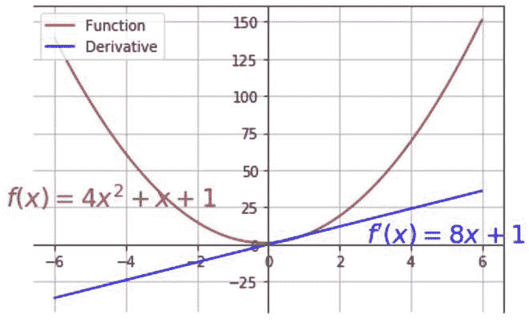

# 如何使用 Python–Matplotlib 计算并绘制函数的导数？

> 原文:[https://www . geeksforgeeks . org/如何使用 python-matplotlib/](https://www.geeksforgeeks.org/how-to-calculate-and-plot-the-derivative-of-a-function-using-python-matplotlib/) 计算和绘制函数的导数

在本文中，我们将使用 matplotlib 和 python 绘制函数的导数。为此，我们使用 python 中的一些模块，如下所示:

*   [**Matplotlib:**](https://www.geeksforgeeks.org/python-introduction-matplotlib/)**Matplotlib 是最流行的用于数据可视化的 Python 包之一。这是一个跨平台的库，用于从数组中的数据制作 2D 图。**
*   **[**NumPy:**](https://www.geeksforgeeks.org/python-numpy/) 它是一个用于处理数组的 python 库，它还支持大型多维数组和矩阵，它还有几个数学函数。**
*   **[**【SciPy:**](https://www.geeksforgeeks.org/data-analysis-with-scipy/)**Python 有一个名为 SciPy 的库，用于数学、科学和工程计算。这个库依赖于 NumPy，提供各种数值运算。****

****要先画出一个函数的导数，我们必须计算它。scipy.misc 库有一个**导数()**函数，该函数接受一个参数作为函数，另一个参数是变量 w.r.t，我们将对该函数进行微分。因此，我们将创建一个名为 function()的方法，该方法将返回原始函数，并创建第二个名为 deriv()的方法，该方法将返回该函数的导数。****

****计算完输入函数的导数后，我们将使用 NumPy **linspace()** 函数来设置 x 轴的范围。绘图()函数将用于绘制函数以及该函数的导数。****

******进场:******

*   ****导入所需的模块。****
*   ****定义函数及其导数的方法****
*   ****使用 NumPy linspace 函数制作 x 轴间距。****
*   ****绘制函数及其导数****
*   ****使用 gca()函数更改轴的限制****
*   ****使用 text()函数绘制文本****

******例 1:(三次导数)******

****在这个例子中，我们将给出函数 f(x)=2x <sup>3</sup> +x+3 作为输入，然后计算导数并绘制函数及其导数。****

## ****蟒蛇 3****

```
**# importing the library
import matplotlib.pyplot as plt
from scipy.misc import derivative
import numpy as np

# defining the function
def function(x):
    return 2*x*x*x+x+3

# calculating its derivative
def deriv(x):
    return derivative(function, x)

# defininf x-axis intervals
y = np.linspace(-6, 6)

# plotting the function
plt.plot(y, function(y), color='purple', label='Function')

# plotting its derivative
plt.plot(y, deriv(y), color='green', label='Derivative')

# formatting
plt.legend(loc='upper left')
plt.grid(True)**
```

******输出:******

********

******例 2:(多次多项式的导数)******

****在这个例子中，我们将给出函数 f(x)=x <sup>4</sup> +x <sup>2</sup> +5 作为输入，然后计算导数并绘制函数及其导数。****

## ****蟒蛇 3****

```
**# importing the library
import matplotlib.pyplot as plt
from scipy.misc import derivative
import numpy as np

# defining the function
def function(x):
    return x*x*x*x+x*x+5

# calculating its derivative
def deriv(x):
    return derivative(function, x)

# defininf x-axis intervals
y = np.linspace(-15, 15)

# plotting the function
plt.plot(y, function(y), color='red', label='Function')

# plotting its derivative
plt.plot(y, deriv(y), color='green', label='Derivative')

# formatting
plt.legend(loc='upper left')
plt.grid(True)**
```

******输出:******

********

******例 3:(带文本格式的二次导数)******

****在这个例子中，我们将绘制 f(x)=4x <sup>2</sup> +x+1 的导数。此外，我们将使用 **gca()** 函数来改变轴的限制，使 x 轴和 y 轴在原点相交。matplotlib 库下的 **text()** 函数将文本绘制在图形上，并将参数作为(x，y)坐标。我们也会做一些格式化。****

## ****蟒蛇 3****

```
**# importing modules
import matplotlib.pyplot as plt
from scipy.misc import derivative
import numpy as np

# method to return function
def function(x):
    return 4*x**2+x+1

# method to return its derivative
def deriv(x):
    return derivative(function, x)

#range in x-axis
y = np.linspace(-6, 6)

# plotting function
plt.plot(y, function(y), color='brown', label='Function')

# plotting its derivative
plt.plot(y, deriv(y), color='blue', label='Derivative')

# changing limits of y-axis
plt.gca().spines['left'].set_position('zero',)

# changing limits of x-axis
plt.gca().spines['bottom'].set_position('zero',)
plt.legend(loc='upper left')

# plotting text in the graph
plt.text(5.0, 1.0, r"$f'(x)=8x+1{content}quot;, horizontalalignment='center',
         fontsize=18, color='blue')

plt.text(-4.4, 25.0, r'$f(x)=4x^2+x+1{content}apos;, horizontalalignment='center',
         fontsize=18, color='brown')
plt.grid(True)**
```

******输出:******

********