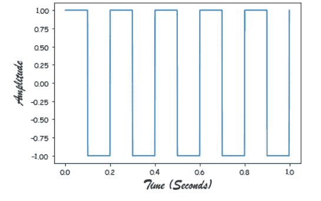
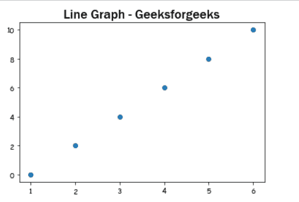
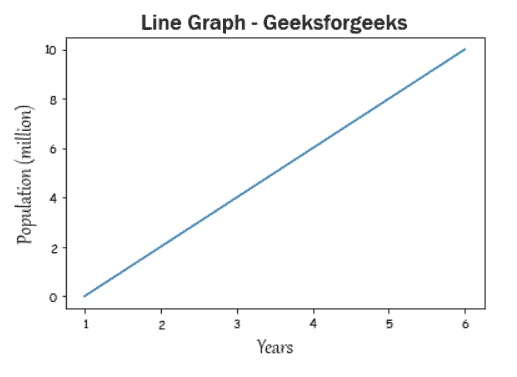

# 如何在 matplotlib 中更改字体？

> 原文:[https://www . geesforgeks . org/如何更改 matplotlib 中的字体/](https://www.geeksforgeeks.org/how-to-change-fonts-in-matplotlib/)

**先决条件:**T2【马特洛特利

在本文中，我们将了解如何使用 matplotlib 更改图形的字体系列。matplotlib 实际上支持多种字体，单独为了实现所要做的就是将名称作为值传递给 fontname 参数。

**进场:**

*   导入所需的库。
*   创建数据
*   设置已更改的字体
*   通常绘制数据
*   显示图

**示例 1:** 仅更改轴标签的字体。

## 蟒蛇 3

```py
from scipy import signal
import matplotlib.pyplot as plot
import numpy as np
# %matplotlib inline

# Plot the square wave
t = np.linspace(0, 1, 1000, endpoint=True)
plot.plot(t, signal.square(2 * np.pi * 5 * t))

# Change the x, y axis label to "Brush Script MT" font style.
plot.xlabel("Time (Seconds)", fontname="Brush Script MT", fontsize=18)
plot.ylabel("Amplitude", fontname="Brush Script MT", fontsize=18)

plot.show()
```

**输出:**



**例 2:** 仅更改标题的字体。

## 蟒蛇 3

```py
import matplotlib.pyplot as plot

x = [1, 2, 3, 4, 5, 6]
y = [0, 2, 4, 6, 8, 10]

# plotting a plot
plot.scatter(x, y)

# Set the title to 'Franklin Gothic Medium' style.
plot.title("Line Graph - Geeksforgeeks",
           fontname='Franklin Gothic Medium', fontsize=18)

plot.show()
```

**输出:**



**示例 3:** 仅更改标题和轴标签的字体。

## 蟒蛇 3

```py
import matplotlib.pyplot as plot

x = [1, 2, 3, 4, 5, 6]
y = [0, 2, 4, 6, 8, 10]

# plotting a plot
plot.plot(x, y)

# Change the x, y axis label to 'Gabriola' style.
plot.xlabel("Years", fontname="Gabriola", fontsize=18)
plot.ylabel("Population (million)", fontname="Gabriola", fontsize=18)

# Set the title to 'Franklin Gothic Medium' style.
plot.title("Line Graph - Geeksforgeeks",
           fontname='Franklin Gothic Medium', fontsize=18)

plot.show()
```

**输出:**

