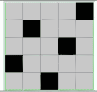
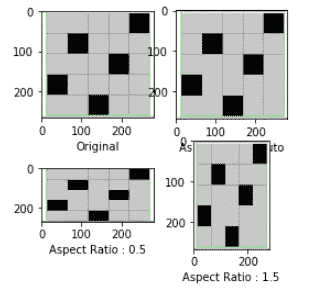

# 如何在 Matplotlib 中更改 imshow 纵横比？

> 原文:[https://www . geesforgeks . org/how-change-imshow-纵横比 in-matplotlib/](https://www.geeksforgeeks.org/how-to-change-imshow-aspect-ratio-in-matplotlib/)

纵横比是我们想要显示的图像的高度与宽度的比率。 [Matplotlib](https://www.geeksforgeeks.org/python-introduction-matplotlib/) 通过为图像绘图指定可选纵横比属性的值，为我们提供了修改图像纵横比的功能。

> **语法:** pyplot.imshow(图像、外观=‘值’)

我们可以用“等于”、“自动”或任何代表所需纵横比的浮点值来替换纵横比的值。在这篇文章中，我们使用下面的图片来演示使用 Matplotlib 时长宽比的变化。



原象

**示例:**

## 蟒蛇 3

```py
import matplotlib.pyplot as plt
import cv2

# reading image from directory
im = cv2.imread("C://Users/User/Downloads/chess5.png")

# plotting a figure for showing all 
# images in a single plot
fig = plt.figure(figsize=(4, 4))

# plotting each matplot image with
# different aspect ratio parameter values
# in a seperate subplot
ax1 = fig.add_subplot(2, 2, 1)
ax1.set_xlabel('Original')

# plot the initial image as the first image
plt.imshow(im)

ax2 = fig.add_subplot(2, 2, 2)
ax2.set_xlabel('Aspect Ratio : Auto')

# plot the image with "auto" aspect ratio
# as the second image
plt.imshow(im, aspect='auto')

ax3 = fig.add_subplot(2, 2, 3)
ax3.set_xlabel('Aspect Ratio : 0.5')

# plot the image with "0.5" aspect ratio 
# as the third image
plt.imshow(im, aspect='0.5')

ax4 = fig.add_subplot(2, 2, 4)
ax4.set_xlabel('Aspect Ratio : 1.5')

# plot the image with "1.5" aspect ratio
# as the fourth image
plt.imshow(im, aspect='1.5')

# display the plot
plt.show()
```

**输出:**

