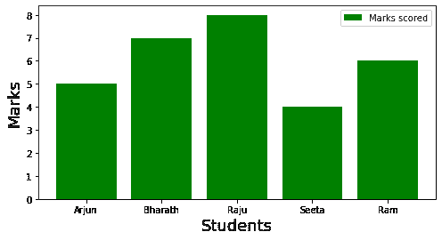

# 如何在 Matplotlib 中更改图例字号？

> 原文:[https://www . geesforgeks . org/how-change-legend-font-size-in-matplotlib/](https://www.geeksforgeeks.org/how-to-change-legend-font-size-in-matplotlib/)

Matplotlib 是一个用 Python 创建交互式可视化的库。matplotlib 中的函数使它像 MATLAB 软件一样工作。matplotlib 中的 legend()方法描述了图中的元素。在本文中，我们将在 Matplotlib 中更改图例字体大小。

**语法:**

```
matplotlib.pyplot.legend(*args, **kwargs)
```

**可以通过不同的方式完成:**

*   使用字体大小作为参数。
*   使用 prop 关键字更改图例中的字体大小。
*   使用参数方法。

**方法 1:**

示例 1 和示例 2 清楚地区分了默认字体大小的变化和图例中字体大小的变化。

**示例 1:** 图例中文本的默认字体大小

## 蟒蛇 3

```
import matplotlib.pyplot as plt
import numpy as np

plt.figure(figsize = (8, 4))

x = ['Arjun', 'Bharath', 'Raju', 'Seeta', 'Ram']
y = [5, 7, 8, 4, 6]

plt.bar(x, y, color = 'g')

plt.xlabel('Students', fontsize = 18)
plt.ylabel('Marks', fontsize = 18)

#Default fontsize of text using legend
plt.legend(['Marks scored'])

plt.show()
```

**输出:**



**示例 2:** 更改图例中文本的字体大小

## 蟒蛇 3

```
import matplotlib.pyplot as plt
import numpy as np

plt.figure(figsize = (8, 4))

x = ['Arjun', 'Bharath', 'Raju', 'Seeta', 'Ram']

y = [5, 7, 8, 4, 6]

plt.bar(x, y, color = 'g')

plt.xlabel('Students', fontsize = 18)
plt.ylabel('Marks', fontsize = 18)

#Changing text fontsize in legend 
plt.legend(['Marks scored'], fontsize = 17)

plt.show()
```