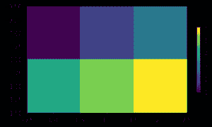
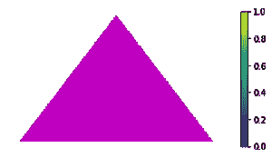
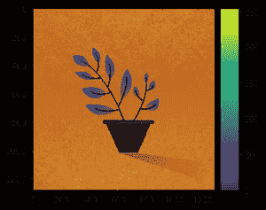

# 如何在 Python 中更改 Matplotlib 颜色条大小？

> 原文:[https://www . geesforgeks . org/how-change-matplotlib-color-bar-size-in-python/](https://www.geeksforgeeks.org/how-to-change-matplotlib-color-bar-size-in-python/)

Colorbar 是一个单独的轴，它提供了一个当前的 colormap，指示数据点到颜色的映射。在本文中，我们将在 Python 中更改 [Matplotlib](https://www.geeksforgeeks.org/python-introduction-matplotlib/) 颜色条的大小。有几种方法可以调整颜色条的大小或位置。让我们一个一个来看。

**方法 1:使用收缩关键字参数**调整颜色条的大小

使用 colorbar()函数的收缩属性，我们可以缩放 colorbar 的大小。

> **语法:** matplotlib.pyplot.colorbar(可映射=无，收缩=缩放)

基本上，我们是乘以某个因子到颜色条的原始大小。在下面的例子中，通过使用 0.5 作为因子，我们得到了原始的颜色条大小。

**例 1:**

## 蟒蛇 3

```
# importing library
import matplotlib.pyplot as plt

# Some data to show as an image
data = [[1, 2, 3],
        [4, 5, 6]]

# Call imshow() to display 2-D data as an image
img = plt.imshow(data)

# Scaling colorbar by factor 0.5
plt.colorbar(shrink=0.5)
plt.show()
```

**输出:**



使用收缩属性

**例 2:** 在本例中，我们使用的是因子 0.75。同样，您可以使用任何因素来更改颜色条的大小。收缩属性的默认值是 1。

## 蟒蛇 3

```
import matplotlib.pyplot as plt
import matplotlib.image as mpimg
fig, ax = plt.subplots()

# getting rid of axis
plt.axis('off')

# Reading saved image from folder
img = mpimg.imread(r'img.jpg')

# displaying image
plt.imshow(img)

# Scaling by factor 0.75
plt.colorbar(shrink=0.75)
plt.show()
```

**输出:**



使用收缩属性

**方法二:使用 AxesDivider 类**

使用此类，您可以更改颜色条轴的大小，但高度将与当前轴相同。这里我们使用**axes _ divider . make _ axes _ located 函数**，该函数返回显示图像的当前轴的 AxisDivider 对象。

**示例:**

## 蟒蛇 3

```
# importing libraries
import matplotlib.pyplot as plt
from mpl_toolkits.axes_grid1 import make_axes_locatable

fig, ax = plt.subplots()
# Reading image from folder

img = mpimg.imread(r'img.jpg')
image = plt.imshow(img)

# Locating current axes
divider = make_axes_locatable(ax)

# creating new axes on the right
# side of current axes(ax).
# The width of cax will be 5% of ax
# and the padding between cax and ax
# will be fixed at 0.05 inch.
colorbar_axes = divider.append_axes("right",
                                    size="10%",
                                    pad=0.1)
# Using new axes for colorbar
plt.colorbar(image, cax=colorbar_axes)
plt.show()
```

**输出:**



使用 _ AxisDivider