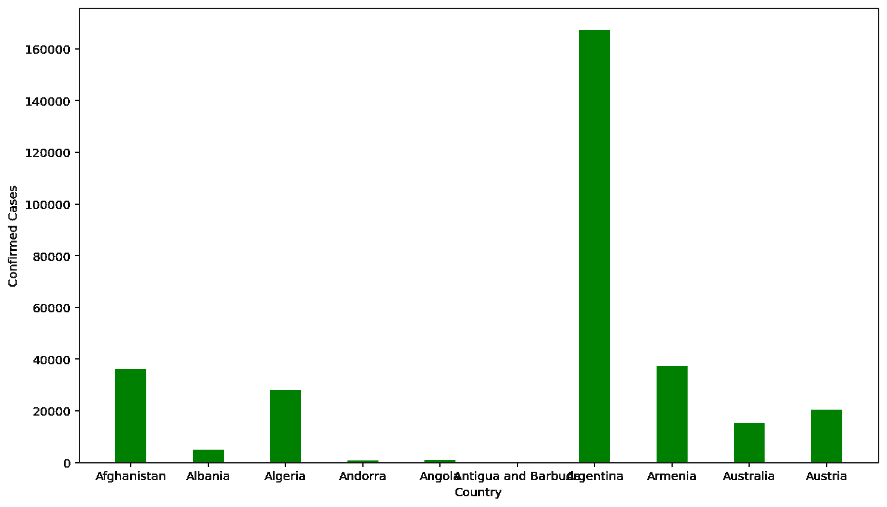
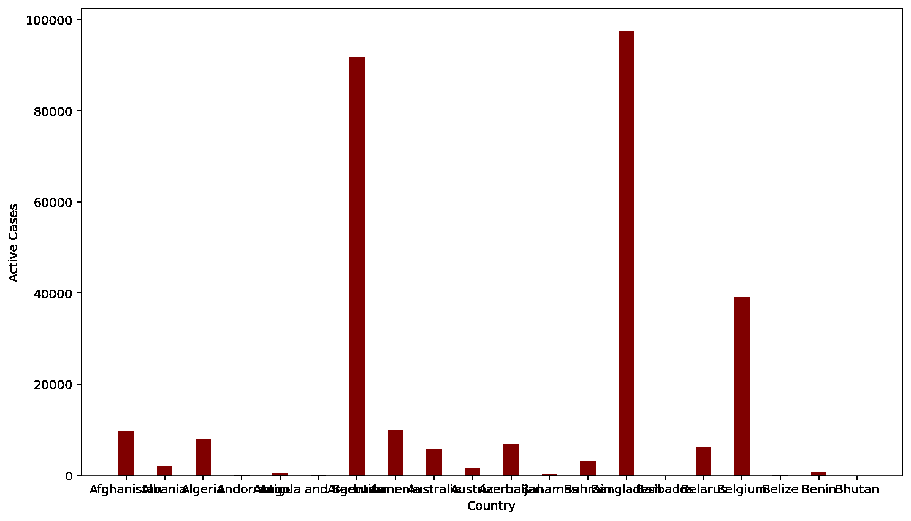

# 如何用 Python 在 Matplotlib 中更改图形图的颜色？

> 原文:[https://www . geeksforgeeks . org/如何用 python 更改图形中的绘图颜色/](https://www.geeksforgeeks.org/how-to-change-the-color-of-a-graph-plot-in-matplotlib-with-python/)

**先决条件:**T2【马特洛特利

Python 提供了大量用于绘制图形的库，Matplotlib 就是其中之一。Matplotlib 是一个简单易用的库，用于创建高质量的图形。matplotlib 的 [pyplot](https://www.geeksforgeeks.org/pyplot-in-matplotlib/) 库包含使 matplotlib 像 matlab 一样工作的命令和方法。pyplot 模块用于设置图表标签、图表类型和图表颜色。以下方法用于创建图形和相应的图形颜色变化。

> **语法:** matplotlib.pyplot.bar(x，高度，宽度，底部，对齐，**kwargs)
> 
> **参数:**
> 
> *   **x :** 沿 x 轴的缩放器序列
> *   **高度:**定标器确定杆即 y 轴高度的顺序
> *   **宽度:**各条的宽度
> *   **底部:**用于指定沿 Y 轴的起始值。(可选)
> *   **对齐:**条的对齐
> *   ****kwargs :** 其他参数，其中一个是颜色，明显指定了图形的颜色。
> 
> **返回值:**返回从数据集的指定列绘制的图形。

在本文中，我们使用从 kaggel.com 下载的数据集作为下面给出的例子。所使用的数据集代表了各国的新冠肺炎确诊病例数。数据集可以从给定的链接下载:

**链接到数据集:** [冠状病毒报告](https://www.kaggle.com/imdevskp/corona-virus-report)

**例 1:**

## 蟒蛇 3

```py
# import packages
import pandas as pd
import matplotlib
import matplotlib.pyplot as plt

# import dataset
df = pd.read_csv('country_wise_latest.csv')

# select required columns
country = df['Country/Region'].head(10)
confirmed = df['Confirmed'].head(10)

# plotting graph
plt.xlabel('Country')
plt.ylabel('Confirmed Cases')
plt.bar(country, confirmed, color='green', width=0.4)

# display plot
plt.show()
```

**输出**



**例 2:**

## 蟒蛇 3

```py
# import packages
import pandas as pd
import matplotlib
import matplotlib.pyplot as plt

# import dataset
df = pd.read_csv('country_wise_latest.csv')

# select required data
country = df['Country/Region'].head(20)
confirmed = df['Active'].head(20)

# plot graph
plt.xlabel('Country')
plt.ylabel('Active Cases')
plt.bar(country, confirmed, color='maroon', width=0.4)

# display plot
plt.show()
```

**输出**

