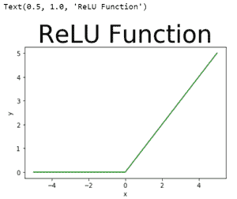
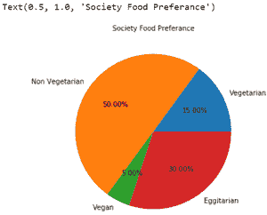
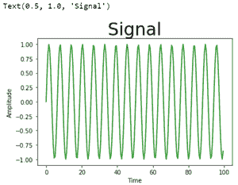

# 如何改变 Matplotlib 图中标题的字体大小？

> 原文:[https://www . geesforgeks . org/如何更改 matplotlib-figure 中标题的字体大小/](https://www.geeksforgeeks.org/how-to-change-the-font-size-of-the-title-in-a-matplotlib-figure/)

在本文中，我们将讨论如何使用[*matplotlib*](https://www.geeksforgeeks.org/python-introduction-matplotlib/)*模块更改图中标题的字体大小。*

*由于我们使用[*matplotlib . pyplot . title()*](https://www.geeksforgeeks.org/matplotlib-pyplot-title-in-python/)*方法为一个图分配一个标题，因此为了更改字体大小，我们将使用 *matplotlib* 模块中[*pyplot . title()*](https://www.geeksforgeeks.org/matplotlib-pyplot-title-in-python/)*方法的 *fontsize* 参数。***

**下面是一些描述如何在 *matplotlib* 图中改变标题字体大小的程序:**

****例 1:****

## **蟒蛇 3**

```py
**# importing module
import matplotlib.pyplot as plt

# assigning x and y coordinates
x = [-5, -4, -3, -2, -1, 0, 1, 2, 3, 4, 5]
y = []

for i in range(len(x)):
    y.append(max(0, x[i]))

# depicting the visualization
plt.plot(x, y, color='green')
plt.xlabel('x')
plt.ylabel('y')

# displaying the title
plt.title("ReLU Function",
          fontsize = 40)**
```

****输出:****

****

****例 2:****

## **蟒蛇 3**

```py
**# importing modules
from matplotlib import pyplot as plt

# assigning x and y coordinates
foodPreference = ['Vegetarian', 'Non Vegetarian',
                                'Vegan', 'Eggitarian']

consumers = [30, 100, 10, 60]

# depicting the visualization
fig = plt.figure()
ax = fig.add_axes([0, 0, 1, 1])
ax.axis('equal')
ax.pie(consumers, labels = foodPreference,
       autopct='%1.2f%%')

# displaying the title
plt.title("Society Food Preference",
          fontsize = 10)**
```

****输出:****

****

****例 3:****

## **蟒蛇 3**

```py
**# importing modules
from matplotlib import pyplot
import numpy

# assigning time values of the signal
# initial time period, final time period
# and phase angle
signalTime = numpy.arange(0, 100, 0.5)

# getting the amplitude of the signal
signalAmplitude = numpy.sin(signalTime)

# depicting the visualization
pyplot.plot(signalTime, signalAmplitude,
            color = 'green')

pyplot.xlabel('Time')
pyplot.ylabel('Amplitude')

# displaying the title
pyplot.title("Signal",
             fontsize = 30)**
```

****输出:****

****