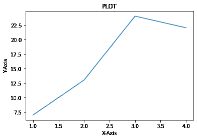
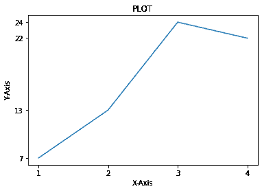

# 如何更改 Matplotlib 中的刻度数？

> 原文:[https://www . geeksforgeeks . org/如何更改 matplotlib 中的刻度数/](https://www.geeksforgeeks.org/how-to-change-the-number-of-ticks-in-matplotlib/)

在本文中，我们将看到如何在 Python 的 matplotlib 中更改图上的刻度数。

## **方法一:使用**[**xtpicks()**](https://www.geeksforgeeks.org/matplotlib-pyplot-xticks-in-python/)**和** [**yticks()**](https://www.geeksforgeeks.org/matplotlib-pyplot-yticks-in-python/)

XT picks()和 yticks()是一个函数，它允许我们通过以列表的形式给出值来定制 x 刻度和 y 刻度，我们还可以为刻度、事件给出标签，并且作为**kwargs，我们可以在刻度标签上应用文本效果。

> **语法:**matplotlib . pyplot . xtpicks(ticks =无，标签=无，**kwargs)
> 
> **参数:**
> 
> *   **蜱–**x 蜱的列表。
> *   **标签–**刻度标签列表
> *   **kwargs–**标签上的文本效果
> 
> **返回:**
> 
> *   **locas–**x 蜱列表。
> *   **标签–**刻度文本标签列表

**示例:**

在这个例子中，我们将使用“内联”后端。Matplotlib 图表将包含在笔记本中，在代码旁边。然后我们给出 x 和 y 值来绘图，并取简单的值，因为这样更容易抓住概念。我们提供标题，x 标签，y 标签来显示在剧情中。

## 蟒蛇 3

```py
# Importing the libraries
import pandas as pd
import numpy as np
from matplotlib import pyplot as plt
# %matplotlib inline

# Setting x and y values for the plot
x = [1, 2, 3, 4]
y = [7, 13, 24, 22]

# Initiating the plot
plt.plot(x, y)
plt.title("PLOT")

# Setting the x and y labels
plt.xlabel("X-Axis")
plt.ylabel("Y-Axis")

# Showing the plot
plt.show()
```

**输出:**



现在，我们只需要 x 轴和 y 轴上的四个刻度；我们需要用 xticks()和 yticks()函数来列出我们需要的记号。所以在这段代码中，我们建立了相同的绘制步骤。然后使用 xticks()，函数我们提到了值(1，2，3，4)，通过 yticks()，我们提到了值(7，13，24，22)。输出中显示相同数量的刻度。

## 蟒蛇 3

```py
# Setting x and y values for the plot
x = [1, 2, 3, 4]
y = [7, 13, 24, 22]

# Initiating the plot
plt.plot(x, y)
plt.title("PLOT")

# Setting the x and y labels
plt.xlabel("X-Axis")
plt.ylabel("Y-Axis")

# Setting the number of ticks
plt.xticks([1, 2, 3, 4])
plt.yticks([7, 13, 24, 22])

# Showing the plot
plt.show()
```

**输出:**



## **方法二:使用** [**定位器 _param()**](https://www.geeksforgeeks.org/matplotlib-pyplot-locator_params-in-python/)

[Locator_params()](https://www.geeksforgeeks.org/matplotlib-pyplot-locator_params-in-python/) 功能，可让我们更改图中刻度的紧密度和数量。这是为定制 matplotlib 中的子场景而做的，在这里我们需要将记号打包得更紧一些，并加以限制。因此，我们可以使用这个函数来控制图上的刻度数。

> **语法:**matplotlib . pyplot . locator _ params(axis = ' both '，tight = None，nbins=None **kwargs)
> 
> **参数:**
> 
> *   **轴–**我们需要更改刻度数或拧紧刻度的轴。
> *   **收紧–**无论刻度是否应该收紧，都接受一个布尔值
> *   **nbins–**我们应该在坐标轴上的刻度数。

现在，我们将两个轴上的刻度数限制为 4

**示例:**

在这个例子中，我们实现了相同的步骤来制作一个图，我们只需要两边有四个记号。我们可以调用 locate_params()函数，并提及轴，它既是 x 轴也是 y 轴，然后传入一个名为 nbins 的参数，以提及我们希望每个轴上的刻度数。

## 蟒蛇 3

```py
# Setting x and y values for the plot
x = [1, 2, 3, 4]
y = [7, 13, 24, 22]

# Initiating the plot
plt.plot(x, y, color='Red')
plt.title("PLOT")

# Setting the x and y labels
plt.xlabel("X-Axis")
plt.ylabel("Y-Axis")

# Setting the number of ticks
plt.locator_params(axis='both', nbins=4)

# Showing the plot
plt.show()
```