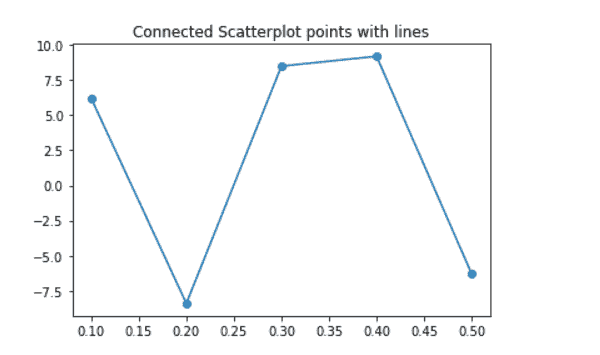
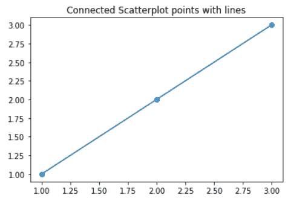
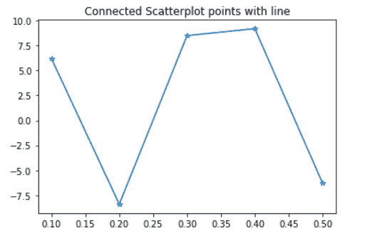

# Matplotlib 中如何用线连接散点图点？

> 原文:[https://www . geeksforgeeks . org/如何连接-散点图-点与线在 matplotlib/](https://www.geeksforgeeks.org/how-to-connect-scatterplot-points-with-line-in-matplotlib/)

**先决条件:** [使用 Python 中的 Seaborn 进行散点图](https://www.geeksforgeeks.org/scatterplot-using-seaborn-in-python/)

**散点图**可以与几个语义分组一起使用，这有助于很好地理解图形。他们可以绘制二维图形，在使用色调、大小和样式参数的语义时，通过映射多达三个额外的变量可以增强二维图形。matplotlib 对于从数组中的数据制作 2D 图非常有效。在本文中，我们将看到如何在 matplotlib 中将散点图点与线连接起来。

**进场:**

*   导入模块。
*   已确定散点图点的 X 和 Y 坐标。
*   绘制散点图。
*   用相同的 X 和 Y 坐标绘制 matplotlib.pyplot。

**下面是实现:**

**例 1:**

## 蟒蛇 3

```
# import module
import numpy as np
import matplotlib.pyplot as plt

# initialize x and y coordinates
x = [0.1, 0.2, 0.3, 0.4, 0.5]
y = [6.2, -8.4, 8.5, 9.2, -6.3]

# set the title of a plot
plt.title("Connected Scatterplot points with lines")

# plot scatter plot with x and y data
plt.scatter(x, y)

# plot with x and y data
plt.plot(x, y)
```

**输出:**



**例 2:**

## 蟒蛇 3

```
# import module
import numpy as np
import matplotlib.pyplot as plt

# initialize x and y coordinates
x = [1, 2, 3]
y = [1, 2, 3]

# set the title of a plot
plt.title("Connected Scatterplot points with lines")

# plotting scatter and pyplot
plt.scatter(x, y)
plt.plot(x, y)
```

**输出:**



**例 3:**

我们也可以用线连接散点图点，而不使用 seaborn .散点图。我们将只使用 pyplot 将散点图点与线连接起来。

## 蟒蛇 3

```
# import module
import numpy as np
import matplotlib.pyplot as plt

# initialize x and y coordinates
x = [0.1, 0.2, 0.3, 0.4, 0.5]
y = [6.2, -8.4, 8.5, 9.2, -6.3]

plt.title("Connected Scatterplot points with line")
plt.plot(x, y, marker="*")
plt.show()
```

**输出:**

