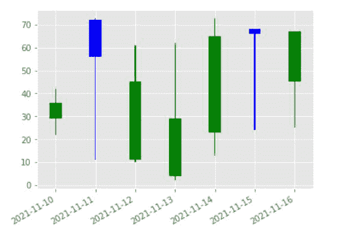
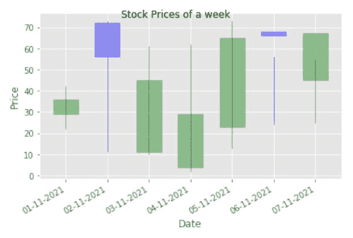
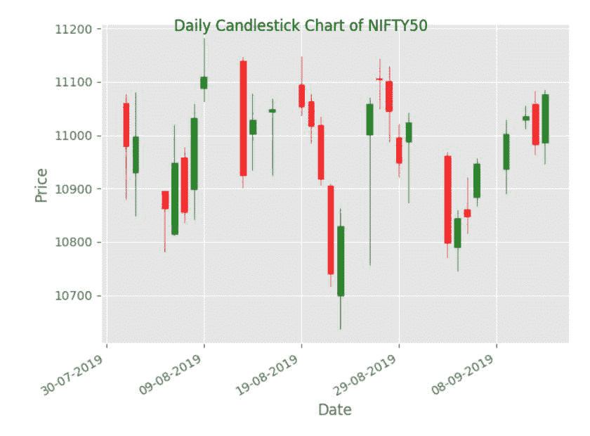

# 如何在 Matplotlib 中创建烛台图？

> 原文:[https://www . geesforgeks . org/如何创建烛台-matplotlib 中的图表/](https://www.geeksforgeeks.org/how-to-create-a-candlestick-chart-in-matplotlib/)

烛台图，通常被称为日本烛台图，是一种实时显示股票、衍生品和其他金融工具价格变动的金融图表，有四个基本组成部分必须进行检查。开仓、高仓、低仓和收盘是四个关键要素，烛台图已经使用过了。这是世界上最古老的图表之一。

制作烛台图表的语法如下。这里我们使用了 plt.bar 方法来构建烛台图表。

**语法**:

> plt.bar(up.index，up .特写. open，bottom=up.open，color)
> 
> 哪里，
> 
> *   当收盘股价大于或等于开盘股价时，“向上”数据框将存储 stock_prices
> 
> plt.bar(down.index，down.close-down.open，bottom=down.open，color)
> 
> 哪里，
> 
> *   当收盘价低于开盘价时,“向下”数据框将存储股票价格

**示例 1:** Python 程序，使用上下标尺绘制 4 列

## 蟒蛇 3

```py
import pandas as pd
import matplotlib.pyplot as plt

# DataFrame to represent opening , closing, high 
# and low prices of a stock for a week
stock_prices = pd.DataFrame({'open': [36, 56, 45, 29, 65, 66, 67],
                             'close': [29, 72, 11, 4, 23, 68, 45],
                             'high': [42, 73, 61, 62, 73, 56, 55],
                             'low': [22, 11, 10, 2, 13, 24, 25]},
                            index=pd.date_range(
                              "2021-11-10", periods=7, freq="d"))

plt.figure()

# "up" dataframe will store the stock_prices 
# when the closing stock price is greater
# than or equal to the opening stock prices
up = stock_prices[stock_prices.close >= stock_prices.open]

# "down" dataframe will store the stock_prices
# when the closing stock price is
# lesser than the opening stock prices
down = stock_prices[stock_prices.close < stock_prices.open]

# When the stock prices have decreased, then it
# will be represented by blue color candlestick
col1 = 'blue'

# When the stock prices have increased, then it 
# will be represented by green color candlestick
col2 = 'green'

# Setting width of candlestick elements
width = .3
width2 = .03

# Plotting up prices of the stock
plt.bar(up.index, up.close-up.open, width, bottom=up.open, color=col1)
plt.bar(up.index, up.high-up.close, width2, bottom=up.close, color=col1)
plt.bar(up.index, up.low-up.open, width2, bottom=up.open, color=col1)

# Plotting down prices of the stock
plt.bar(down.index, down.close-down.open, width, bottom=down.open, color=col2)
plt.bar(down.index, down.high-down.open, width2, bottom=down.open, color=col2)
plt.bar(down.index, down.low-down.close, width2, bottom=down.close, color=col2)

# rotating the x-axis tick labels at 30degree 
# towards right
plt.xticks(rotation=30, ha='right')

# displaying candlestick chart of stock data 
# of a week
plt.show()
```

**输出**:



我们还可以使用 mpl_finance 模块制作一个烛台图。要使用 mpl_finance，我们需要先安装它，这可以通过使用代码来完成。我们必须安装 mpl_finance。

```py
pip install mpl_finance
```

**语法**:

> 烛台 _ohlc(ax，ohlc.values，width，colorup，colordown)
> 
> 在哪里
> 
> *   交流是轴
> *   值是输入值
> *   宽度是每根蜡烛的宽度
> *   颜色是向上棒的颜色
> *   彩色羽绒是羽绒棒的颜色

**示例 2:** 在这里，我们定义了一个包含 5 个参数的股票价格数据集，即开盘价、收盘价、高、低和指数(即日期)，之后，我们使用 pandas.to DateTime 转换日期，然后[pandas . a type](https://www.geeksforgeeks.org/python-pandas-dataframe-astype/)将所有数据转换为 float()。

## 蟒蛇 3

```py
# Importing all the required libraries

import matplotlib.pyplot as plt
from mpl_finance import candlestick_ohlc
import pandas as pd
import matplotlib.dates as mpl_dates
import numpy as np
import datetime

# Defining a dataframe showing stock prices 
# of a week
stock_prices = pd.DataFrame({'date': np.array([datetime.datetime(2021, 11, i+1)
                                               for i in range(7)]),
                             'open': [36, 56, 45, 29, 65, 66, 67],
                             'close': [29, 72, 11, 4, 23, 68, 45],
                             'high': [42, 73, 61, 62, 73, 56, 55],
                             'low': [22, 11, 10, 2, 13, 24, 25]})

ohlc = stock_prices.loc[:, ['date', 'open', 'high', 'low', 'close']]
ohlc['date'] = pd.to_datetime(ohlc['date'])
ohlc['date'] = ohlc['date'].apply(mpl_dates.date2num)
ohlc = ohlc.astype(float)

# Creating Subplots
fig, ax = plt.subplots()

candlestick_ohlc(ax, ohlc.values, width=0.6, colorup='blue',
                 colordown='green', alpha=0.4)

# Setting labels & titles
ax.set_xlabel('Date')
ax.set_ylabel('Price')
fig.suptitle('Stock Prices of a week')

# Formatting Date
date_format = mpl_dates.DateFormatter('%d-%m-%Y')
ax.xaxis.set_major_formatter(date_format)
fig.autofmt_xdate()

fig.tight_layout()

plt.show()
```

**输出**:



我们也可以使用数据框架，而不是自己定义它。点击这里的可以下载数据集。

**例 3:**

## 蟒蛇 3

```py
import matplotlib.pyplot as plt
from mpl_finance import candlestick_ohlc
import pandas as pd
import matplotlib.dates as mpl_dates
import numpy as np
import datetime

# Extracting Data for plotting
data = pd.read_csv("C:/Users/aparn/Desktop/data.csv")
ohlc = data.loc[:, ['Date', 'Open', 'High', 'Low', 'Close']]

# Converting date into datetime format
ohlc['Date'] = pd.to_datetime(ohlc['Date'])
ohlc['Date'] = ohlc['Date'].apply(mpl_dates.date2num)
ohlc = ohlc.astype(float)

# Creating Subplots
fig, ax = plt.subplots()

candlestick_ohlc(ax, ohlc.values, width=0.6,
                 colorup='green', colordown='red', alpha=0.8)

# Setting labels & titles
ax.set_xlabel('Date')
ax.set_ylabel('Price')
fig.suptitle('Daily Candlestick Chart of NIFTY50')

# Formatting Date
date_format = mpl_dates.DateFormatter('%d-%m-%Y')
ax.xaxis.set_major_formatter(date_format)
fig.autofmt_xdate()

fig.tight_layout()

plt.show()
```

**输出**:

