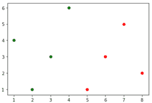
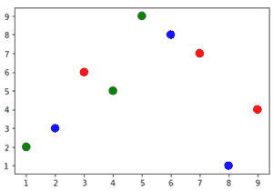

# 如何在 Matplotlib 中创建多种颜色的散点图？

> 原文:[https://www . geeksforgeeks . org/如何创建 matplotlib 中几种颜色的散点图/](https://www.geeksforgeeks.org/how-to-create-a-scatter-plot-with-several-colors-in-matplotlib/)

[Matplotlib](https://www.geeksforgeeks.org/pyplot-in-matplotlib/) 是一个绘图库，用于在 Python 中创建静态、动画和交互式可视化。 *Matplotlib* 可以用在 Python 脚本、Python 和 IPython shell、web 应用服务器以及各种图形用户界面工具包中，如 Tkinter、awxPython 等。

为了在 *matplotlib* 中创建具有多种颜色的散点图，我们可以使用各种方法:

**方法#1** :使用参数标记颜色，即 *c*

> 标记颜色的可能值有:
> 
> *   单一颜色格式字符串。
> *   一种二维阵列，其中的行是 RGB 或 RGBA。

**示例:**

使用 *c* 参数以不同的颜色描绘散点图。

## 蟒蛇 3

```
# import required module
import matplotlib.pyplot as plt

# first data point
x = [1, 2, 3, 4]
y = [4, 1, 3, 6]

# depict first scatted plot
plt.scatter(x, y, c='green')

# second data point
x = [5, 6, 7, 8]
y = [1, 3, 5, 2]

# depict second scatted plot
plt.scatter(x, y, c='red')

# depict illustrattion
plt.show()
```

**输出:**



**方法 2** :使用*色图*

颜色映射实例用于将数据值(浮动)从间隔[0，1]转换为 RGBA 颜色。

**例 1:**

使用*色图*用 RGB 颜色描绘散点图。

## 蟒蛇 3

```
# import required modules
import matplotlib.pyplot as plt
import numpy

# assign data points
a = numpy.array([[9, 1, 2, 7, 5, 8, 3, 4, 6],
                 [4, 2, 3, 7, 9, 1, 6, 5, 8]])

# assign categories
categories = numpy.array([0, 1, 2, 0, 1, 2, 0, 1, 2])

# use colormap
colormap = numpy.array(['r', 'g', 'b'])

# depict illustration
plt.scatter(a[0], a[1], s=100, c=colormap[categories])
plt.show()
```

**输出:**



**例 2:**

这里，我们使用颜色代码手动分配*色图*。

## 蟒蛇 3

```
# import required modules
import matplotlib.pyplot as plt
import numpy

# assign data points
a = numpy.array([[1, 2, 3, 4, 5, 6, 7, 8, 9],
                 [9, 8, 7, 6, 5, 4, 3, 2, 1]])

# assign categories
categories = numpy.array([0, 1, 1, 0, 0, 1, 1, 0, 1])

# assign colors using color codes
color1 = (0.69411766529083252, 0.3490196168422699,
          0.15686275064945221, 1.0)
color2 = (0.65098041296005249, 0.80784314870834351,
          0.89019608497619629, 1.0)

# assign colormap
colormap = numpy.array([color1, color2])

# depict illustration
plt.scatter(a[0], a[1], s=500, c=colormap[categories])
plt.show()
```

**输出:**

